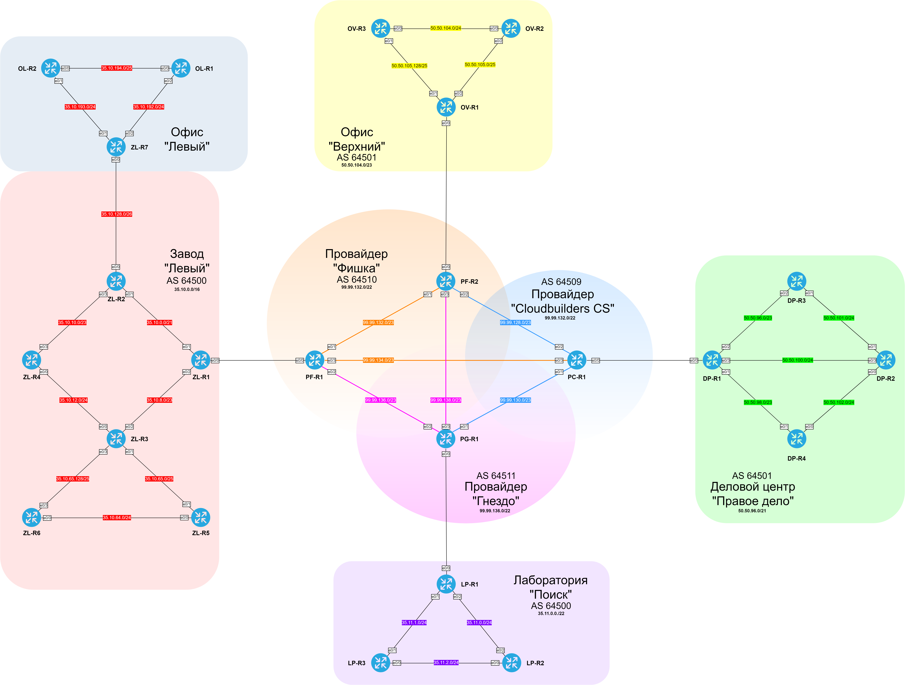
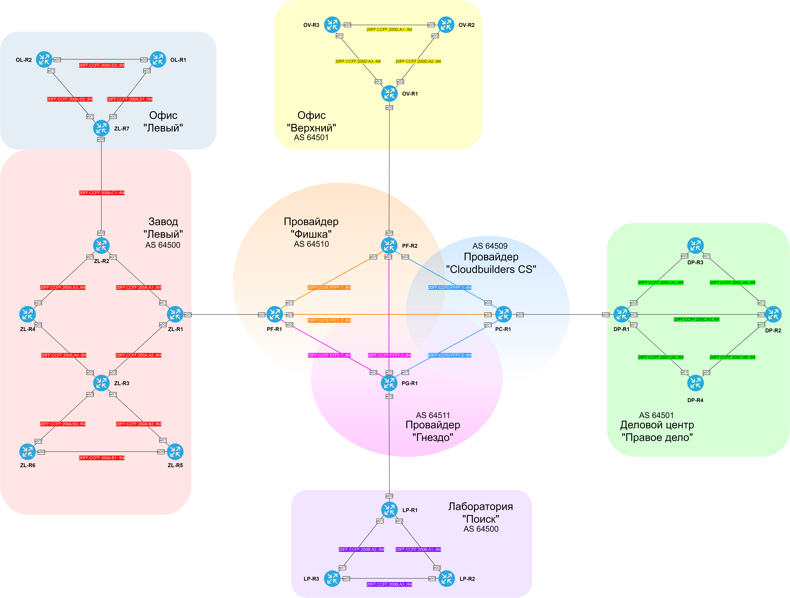
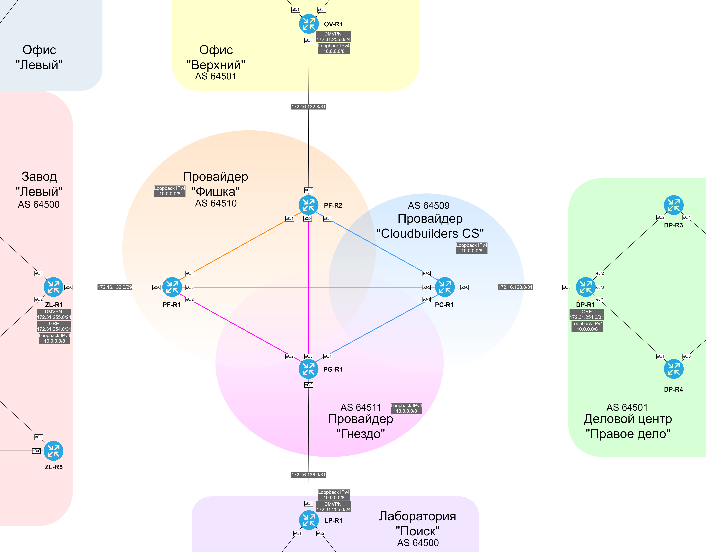
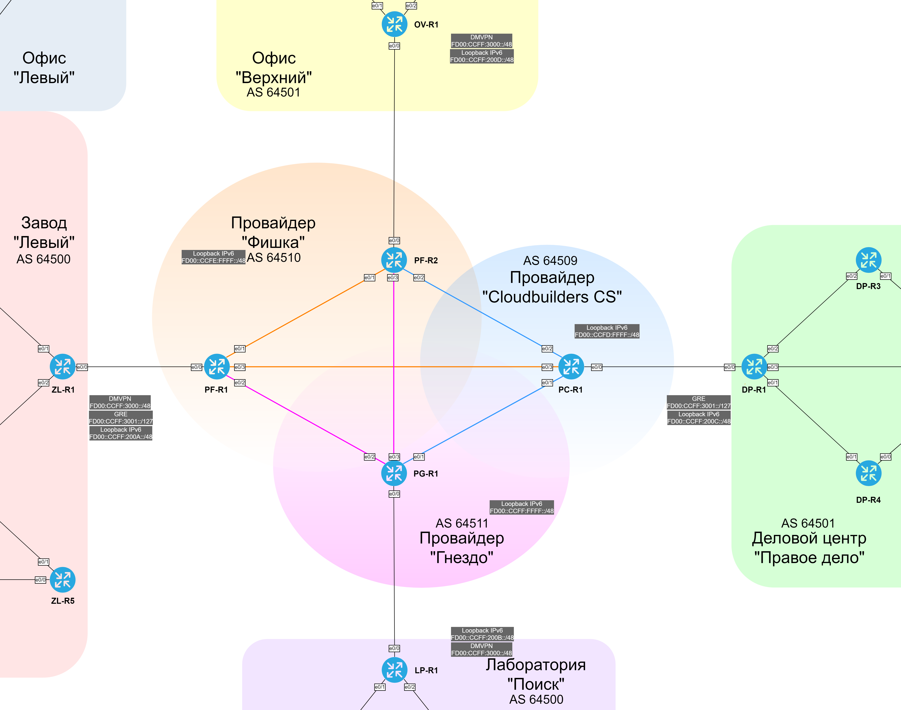

### Проектная работа:
### Комплексная реализация слияния геораспределённых сетей предприятий через сеть провайдера.

#### Задание:

  1. Распределить адресное пространство;
  2. Реализовать нескольких видов статической маршрутизации;
  3. Настроить VPN-туннели (статические и динамические);
  4. Настроить протоколы маршрутизации OSPF и EIGRP внутри локальных сетей;
  5. Настроить протокол маршрутизации BGP;
  6. Оптимизировать основные параметры и метрики протоколов IGP;
  7. Оптимизировать работу протокола BGP;
  8. Обеспечить безопасность и мониторинг сетевой инфраструктуры;
  9. Обеспечить шифрование VPN-туннелей;
  10. Настроить инфраструктурные сервисы (DHCP, DNS, NTP и т.п.);
  11. Задокументировать все выполненные действия.

###  1. Задокументируем общее адресное пространство IPv4/IPv6.

#### Автономные системы и принадлежащие им публичные адреса сетей IPv4.

| ASN | Company | Summary IPv4 | Addresses |
|-----|---------|--------------|-----------|
| 64500 | Завод "Левый" | 35.10.0.0/16 | 35.10.0.0 - 35.10.255.255 |
| 64500 | Лаборатория "Поиск" | 35.11.0.0/22 | 35.11.0.0 - 35.11.3.255 |
| 64501 | ДЦ "Правое дело" | 50.50.96.0/21 | 50.50.96.0 - 50.50.103.255 |
| 64501 | Офис "Верхний" | 50.50.104.0/23 | 50.50.104.0 - 50.50.105.255 |
| 64509 | Cloudbuilders CS ISP | 99.99.128.0/22 | 99.99.128.0 - 99.99.131.255 |
| 64510 | Фишка ISP | 99.99.132.0/22 | 99.99.132.0 - 99.99.135.255 |
| 64511 | Гнездо ISP | 99.99.136.0/22 | 99.99.136.0 - 99.99.139.255 |

#### Автономные системы и принадлежащие им публичные адреса сетей IPv6.

| ASN | Company | Summary IPv6 |
|-----|--------------|--------------|
| 64500 | Завод "Левый" | 20FF:CCFF:**200A**::/48 |
| 64500 | Лаборатория "Поиск" | 20FF:CCFF:**200B**::/48 |
| 64501 | ДЦ "Правое дело" | 20FF:CCFF:**200C**::/48 |
| 64501 | Офис "Верхний" | 20FF:CCFF:**200D**::/48 |
| 64509 | Cloudbuilders CS ISP | 20FF:**CCFD**::/32 |
| 64510 | Фишка ISP | 20FF:**CCFE**::/32 |
| 64511 | Гнездо ISP | 20FF:**CCFF**::/32 |

#### Базовая схема.

###  2. Задокументируем используемые подсети IPv4/IPv6.

#### Таблица используемых подсетей IPv4.

| ASN | Summary IPv4 | Network IPv4 | Local summ | Site | Equip |
|-------|--------------|--------------|--------------|--------|------------------|
| 64500 | 35.10.0.0/16 | 35.10.0.0/21 | 35.10.0.0/18 | Завод "Левый" | ZL-R1 <> ZL-R2 |
| 64500 | 35.10.0.0/16 | 35.10.8.0/23 | 35.10.0.0/18 | Завод "Левый" | ZL-R1 <> ZL-R3 |
| 64500 | 35.10.0.0/16 | 35.10.10.0/23 | 35.10.0.0/18 | Завод "Левый" | ZL-R2 <> ZL-R4 |
| 64500 | 35.10.0.0/16 | 35.10.12.0/24 | 35.10.0.0/18 | Завод "Левый" | ZL-R3 <> ZL-R4 |
| 64500 | 35.10.0.0/16 | 35.10.64.0/24 | 35.10.0.0/18 | Завод "Левый" | ZL-R5 <> ZL-R6 |
| 64500 | 35.10.0.0/16 | 35.10.65.0/25 | 35.10.0.0/18 | Завод "Левый" | ZL-R3 <> ZL-R5 |
| 64500 | 35.10.0.0/16 | 35.10.65.128/21 | 35.10.0.0/18 | Завод "Левый" | ZL-R3 <> ZL-R6 |
| 64500 | 35.10.0.0/16 | 35.10.128.0/26 | 35.10.128.0/18 | Завод "Левый" | ZL-R2 <> ZL-R7 |
| 64500 | 35.10.0.0/16 | 35.10.192.0/24 | 35.10.192.0/18 | Офис "Левый" | ZL-R7 <> OL-R1 |
| 64500 | 35.10.0.0/16 | 35.10.193.0/24 | 35.10.192.0/18 | Офис "Левый" | ZL-R7 <> OL-R2 |
| 64500 | 35.10.0.0/16 | 35.10.194.0/25 | 35.10.192.0/18 | Офис "Левый" | OL-R1 <> OL-R2 |
| 64500 | 35.11.0.0/22 | 35.11.0.0/24 | | Лаборатория "Поиск" | LP-R1 <> LP-R2 |
| 64500 | 35.11.0.0/22 | 35.11.1.0/24 | | Лаборатория "Поиск" | LP-R1 <> LP-R3 |
| 64500 | 35.11.0.0/22 | 35.11.2.0/24 | | Лаборатория "Поиск" | LP-R2 <> LP-R3 |
| 64501 | 50.50.96.0/21 | 50.50.96.0/23 | | ДЦ "Правое дело" | DP-R1 <> DP-R3 |
| 64501 | 50.50.96.0/21 | 50.50.98.0/23 | | ДЦ "Правое дело" | DP-R1 <> DP-R4 |
| 64501 | 50.50.96.0/21 | 50.50.100.0/24 | | ДЦ "Правое дело" | DP-R1 <> DP-R2 |
| 64501 | 50.50.96.0/21 | 50.50.101.0/24 | | ДЦ "Правое дело" | DP-R2 <> DP-R3 |
| 64501 | 50.50.96.0/21 | 50.50.102.0/24 | | ДЦ "Правое дело" | DP-R2 <> DP-R4 |
| 64501 | 50.50.104.0/23 | 50.50.104.0/24 | | Офис "Верхний" | OV-R2 <> DP-R3 |
| 64501 | 50.50.104.0/23 | 50.50.105.0/25 | | Офис "Верхний" | OV-R1 <> DP-R2 |
| 64501 | 50.50.104.0/23 | 50.50.105.128/25 | | Офис "Верхний" | OV-R1 <> DP-R3 |
| 64509 | 99.99.128.0/22 | 99.99.128.0/23 | | Cloudbuilders CS ISP | PC-R1 <> PF-R2 |
| 64509 | 99.99.128.0/22 | 99.99.130.0/23 | | Cloudbuilders CS ISP | PC-R1 <> PG-R1 |
| 64509 | 99.99.140.0/22 | 99.99.140.0/31 | | Cloudbuilders CS ISP clients | PC-R1 <> DP-R1 |
| 64510 | 99.99.132.0/22 | 99.99.132.0/23 | | Фишка ISP | PF-R1 <> PF-R2 | 
| 64510 | 99.99.132.0/22 | 99.99.134.0/23 | | Фишка ISP | PF-R1 <> PC-R1 |
| 64510 | 99.99.144.0/22 | 99.99.144.0/31 | | Фишка ISP clients | PF-R1 <> ZL-R1 | 
| 64510 | 99.99.144.0/22 | 99.99.144.2/31 | | Фишка ISP clients | PF-R2 <> OV-R1 | 
| 64511 | 99.99.136.0/22 | 99.99.136.0/23 | | Гнездо ISP | PG-R1 <> PF-R1 |
| 64511 | 99.99.136.0/22 | 99.99.138.0/23 | | Гнездо ISP | PG-R1 <> PF-R2 |
| 64511 | 99.99.148.0/22 | 99.99.148.0/31 | | Гнездо ISP clients | PG-R1 <> LP-R1 |

#### Cхема используемых подсетей IPv4.

#### Таблица используемых подсетей IPv6.

| ASN | Summary IPv6 | Network IPv6 | Site | Equip |
|-------|------------|--------------|--------|-------|
| 64500 | 20FF:CCFF:200A::/48 | 20FF:CCFF:200A:A1::/64 | Завод "Левый" | ZL-R1 <> ZL-R2 |
| 64500 | 20FF:CCFF:200A::/48 | 20FF:CCFF:200A:A2::/64 | Завод "Левый" | ZL-R1 <> ZL-R3 |
| 64500 | 20FF:CCFF:200A::/48 | 20FF:CCFF:200A:A3::/64 | Завод "Левый" | ZL-R2 <> ZL-R4 |
| 64500 | 20FF:CCFF:200A::/48 | 20FF:CCFF:200A:A4::/64 | Завод "Левый" | ZL-R3 <> ZL-R4 |
| 64500 | 20FF:CCFF:200A::/48 | 20FF:CCFF:200A:B1::/64 | Завод "Левый" | ZL-R5 <> ZL-R6 |
| 64500 | 20FF:CCFF:200A::/48 | 20FF:CCFF:200A:B2::/64 | Завод "Левый" | ZL-R3 <> ZL-R5 |
| 64500 | 20FF:CCFF:200A::/48 | 20FF:CCFF:200A:B3::/64 | Завод "Левый" | ZL-R3 <> ZL-R6 |
| 64500 | 20FF:CCFF:200A::/48 | 20FF:CCFF:200A:C1::/64 | Завод "Левый" | ZL-R2 <> ZL-R7 |
| 64500 | 20FF:CCFF:200A::/48 | 20FF:CCFF:200A:D1::/64 | Офис "Левый" | ZL-R7 <> OL-R1 |
| 64500 | 20FF:CCFF:200A::/48 | 20FF:CCFF:200A:D2::/64 | Офис "Левый" | ZL-R7 <> OL-R2 |
| 64500 | 20FF:CCFF:200A::/48 | 20FF:CCFF:200A:D3::/64 | Офис "Левый" | OL-R1 <> OL-R2 |
| 64500 | 20FF:CCFF:200B::/48 | 20FF:CCFF:200B:A1::/64 | Лаборатория "Поиск" | LP-R1 <> LP-R2 |
| 64500 | 20FF:CCFF:200B::/48 | 20FF:CCFF:200B:A2::/64 | Лаборатория "Поиск" | LP-R1 <> LP-R3 |
| 64500 | 20FF:CCFF:200B::/48 | 20FF:CCFF:200B:A3::/64 | Лаборатория "Поиск" | LP-R2 <> LP-R3 |
| 64501 | 20FF:CCFF:200C::/48 | 20FF:CCFF:200C:A1::/64 | ДЦ "Правое дело" | DP-R1 <> DP-R3 |
| 64501 | 20FF:CCFF:200C::/48 | 20FF:CCFF:200C:A2::/64 | ДЦ "Правое дело" | DP-R1 <> DP-R4 |
| 64501 | 20FF:CCFF:200C::/48 | 20FF:CCFF:200C:A3::/64 | ДЦ "Правое дело" | DP-R1 <> DP-R2 |
| 64501 | 20FF:CCFF:200C::/48 | 20FF:CCFF:200C:A4::/64 | ДЦ "Правое дело" | DP-R2 <> DP-R3 |
| 64501 | 20FF:CCFF:200C::/48 | 20FF:CCFF:200C:A5::/64 | ДЦ "Правое дело" | DP-R2 <> DP-R4 |
| 64501 | 20FF:CCFF:200D::/48 | 20FF:CCFF:200D:A1::/64 | Офис "Верхний" | OV-R2 <> DP-R3 |
| 64501 | 20FF:CCFF:200D::/48 | 20FF:CCFF:200D:A2::/64 | Офис "Верхний" | OV-R1 <> DP-R2 |
| 64501 | 20FF:CCFF:200D::/48 | 20FF:CCFF:200D:A3::/64 | Офис "Верхний" | OV-R1 <> DP-R3 |
| 64509 | 20FF:CCFD::/32 | 20FF:CCFD:FFFF:1::/64 | Cloudbuilders CS ISP | PC-R1 <> PF-R2 |
| 64509 | 20FF:CCFD::/32 | 20FF:CCFD:FFFF:2::/64 | Cloudbuilders CS ISP | PC-R1 <> PG-R1 |
| 64509 | 20FF:CCFD::/32 | 20FF:CCFD:FFFF:3::/127 | Cloudbuilders CS ISP clients | PC-R1 <> DP-R1 |
| 64510 | 20FF:CCFE::/32 | 20FF:CCFE:FFFF:1::/64 | Фишка ISP | PF-R1 <> PF-R2 | 
| 64510 | 20FF:CCFE::/32 | 20FF:CCFE:FFFF:2::/64 | Фишка ISP | PF-R1 <> PC-R1 | 
| 64510 | 20FF:CCFD::/32 | 20FF:CCFD:FFFF:3::/127 | Фишка ISP clients | PC-R1 <> ZL-R1 |
| 64510 | 20FF:CCFD::/32 | 20FF:CCFD:FFFF:3::2/127 | Фишка ISP clients | PC-R1 <> OV-R1 |
| 64511 | 20FF:CCFF::/32 | 20FF:CCFF:FFFF:1::/64 | Гнездо ISP | PG-R1 <> PF-R1 |
| 64511 | 20FF:CCFF::/32 | 20FF:CCFF:FFFF:2::/64 | Гнездо ISP | PG-R1 <> PF-R2 |
| 64511 | 20FF:CCFF::/32 | 20FF:CCFF:FFFF:3::/127 | Гнездо ISP clients | PG-R1 <> LP-R1 |

#### Cхема используемых подсетей IPv4.

#### Таблица приватных сетей IPv4, их местоположение и назначение.

| Network IPv4 | Site & Description |
|--------------|--------------------|
| 10.0.0.0/8   | Используем везде для loopback, маршрутизируется только в пределах каждой AS |
| 172.31.255.0/24 | Для сети DMVPN. Hub на заводе "Левый" (ZL-R1), Spoke: Лаборатория "Поиск" (LP-R1), Офис "Верхний" (OV-R1) |
| 172.31.254.0/31 | Для GRE-туннеля между заводом "Левый" (ZL-R1) и ДЦ "Правое дело" (DP-R1) |

#### Cхема используемых приватных подсетей IPv4.

#### Таблица служебных сетей IPv6, их местоположение и назначение.

| Network IPv6 | Site & Description |
|--------------|--------------------|
| FD00:CCFF:200A::/48 | Loopback-адреса на заводе "Левый" и в офисе "Верхний" (AS 64500) |
| FD00:CCFF:200B::/48 | Loopback-адреса в лаборатории "Поиск" (AS 64500) |
| FD00:CCFF:200C::/48 | Loopback-адреса в ДЦ "Правое дело" (AS 64501) |
| FD00:CCFF:200D::/48 | Loopback-адреса в офисе "Верхний" (AS 64501) |
| FD00:CCFD:FFFF::/48 | Loopback-адреса Cloudbuilders CS ISP (AS 64509) |
| FD00:CCFE:FFFF::/48 | Loopback-адреса Фишка ISP (AS 64510) |
| FD00:CCFF:FFFF::/48 | Loopback-адреса Гнездо ISP (AS 64511) |
| FD00:CCFF:3000::/48 | Для сети DMVPN. Hub на заводе "Левый" (ZL-R1), Spoke: Лаборатория "Поиск" (LP-R1), Офис "Верхний" (OV-R1) |
| FD00:CCFF:3001::/127 | Для GRE-туннеля между заводом "Левый" (ZL-R1) и ДЦ "Правое дело" (DP-R1) |

#### Cхема используемых служебных сетей IPv6.

###  3. Задокументируем выделенные для маршрутизаторов IP-адреса.

####  Таблица назначенных сетевых адресов на интерфейсах маршрутизаторов.

| Equip | Port | AddrTyp | Address | Network | Description |
|-------|------|---------|---------|---------|-------------|
| ZL-R1 | e0/0 | IPv4 | 99.99.144.1 | 99.99.144.0/31 | to ISP |
| ZL-R1 | e0/0 | IPv6 | 20FF:CCFE:FFFF:3::1 | 20FF:CCFE:FFFF:3::/127 | to ISP |   
| ZL-R1 | e0/0 | IPv6 LL | FE80::2 | FE80::/10 | link-local |
| ZL-R1 | e0/1 | IPv4 | 35.10.0.1 | 35.10.0.0/21 | to ZL-R2 |
| ZL-R1 | e0/1 | IPv6 | 20FF:CCFF:200A:A1::1 | 20FF:CCFF:200A:A1::/64 | to ISP |   
| ZL-R1 | e0/1 | IPv6 LL | FE80::1 | FE80::/10 | link-local |
| ZL-R1 | e0/2 | IPv4 | 35.10.8.1 | 35.10.8.0/23 | to ISP |
| ZL-R1 | e0/2 | IPv6 | 20FF:CCFF:200A:A2::1 | 20FF:CCFF:200A:A2::/64 | to ISP |   
| ZL-R1 | e0/2 | IPv6 LL | FE80::1 | FE80::/10 | link-local |
| ZL-R1 | Loopback64500 | IPv4 | 10.0.0.1 | 10.0.0.1/32 | for iBGP |
| ZL-R1 | Loopback64500 | IPv6 | FD00:CCFF:200A::1 | FD00:CCFF:200A::/128 | for iBGP |
| ZL-R1 | Loopback64500 | IPv6 LL | FE80::1 | FE80::/10 | link-local |
| ZL-R1 | tunnel0 | IPv4 | 172.31.255.1 | 172.31.255.0/24 | DMVPN hub |
| ZL-R1 | tunnel0 | IPv6 | FD00:CCFF:3000::1 | FD00:CCFF:3000::/48 | DMVPN hub |
| ZL-R1 | tunnel0 | IPv6 LL | FE80::1  | FE80::/10 | link-local |
| ZL-R1 | tunnel1 | IPv4 | 172.31.254.0 | 172.31.254.0/31 | DMVPN hub |
| ZL-R1 | tunnel2 | IPv6 | FD00:CCFF:3001::0 | FD00:CCFF:3001::/127 | DMVPN hub |
| ZL-R1 | tunnel2 | IPv6 LL | FE80::1  | FE80::/10 | link-local |
| PF-R1 | e0/0 | IPv4 | 99.99.144.0 | 99.99.144.0/31 | to ZL-R1 |
| PF-R1 | e0/0 | IPv6 | 20FF:CCFE:FFFF:3::0 | 20FF:CCFE:FFFF:3::/127 | to ZL-R1 |   
| PF-R1 | e0/0 | IPv6 LL | FE80::1 | FE80::/10 | link-local |
| PF-R1 | e0/1 | IPv4 | 99.99.132.1 | 99.99.132.0/23 | to PF-R2 |
| PF-R1 | e0/1 | IPv6 | 20FF:CCFE:FFFF:1::1 | 20FF:CCFE:FFFF:1::/64 | to PF-R2 |   
| PF-R1 | e0/1 | IPv6 LL | FE80::1 | FE80::/10 | link-local |
| PF-R1 | e0/2 | IPv4 | 99.99.136.2 | 99.99.136.0/23 | to PG-R1 |
| PF-R1 | e0/2 | IPv6 | 20FF:CCFF:FFFF:1::2 | 20FF:CCFF:FFFF:1::/64 | to PG-R1 |   
| PF-R1 | e0/2 | IPv6 LL | FE80::2 | FE80::/10 | link-local |
| PF-R1 | e0/3 | IPv4 | 99.99.134.1 | 99.99.134.0/23 | to PF-R2 |
| PF-R1 | e0/3 | IPv6 | 20FF:CCFE:FFFF:2::1 | 20FF:CCFE:FFFF:2::/64 | to PC-R1 |   
| PF-R1 | e0/3 | IPv6 LL | FE80::1 | FE80::/10 | link-local |
| PF-R1 | Loopback64510 | IPv4 | 10.0.0.1 | 10.0.0.1/32 | for iBGP |
| PF-R1 | Loopback64510 | IPv6 | FD00:CCFE:FFFF::1 | FD00:CCFD:FFFF::/128 | for iBGP |
| PF-R1 | Loopback64510 | IPv6 LL | FE80::1 | FE80::/10 | link-local |
| PF-R2 | e0/0 | IPv4 | 99.99.144.2 | 99.99.144.2/31 | to OV-R1 |
| PF-R2 | e0/0 | IPv6 | 20FF:CCFE:FFFF:3::2 | 20FF:CCFE:FFFF:3::2/127 | to OV-R1 |   
| PF-R2 | e0/0 | IPv6 LL | FE80::1 | FE80::/10 | link-local |
| PF-R2 | e0/1 | IPv4 | 99.99.132.2 | 99.99.132.0/23 | to PF-R1 |
| PF-R2 | e0/1 | IPv6 | 20FF:CCFE:FFFF:1::2 | 20FF:CCFE:FFFF:1::/64 | to PF-R1 |   
| PF-R2 | e0/1 | IPv6 LL | FE80::2 | FE80::/10 | link-local |
| PF-R2 | e0/2 | IPv4 | 99.99.128.2 | 99.99.128.0/23 | to PC-R1 |
| PF-R2 | e0/2 | IPv6 | 20FF:CCFD:FFFF:1::2 | 20FF:CCFD:FFFF:1::/64 | to PC-R1 |   
| PF-R2 | e0/2 | IPv6 LL | FE80::2 | FE80::/10 | link-local |
| PF-R2 | e0/3 | IPv4 | 99.99.138.2 | 99.99.138.0/23 | to PG-R1 |
| PF-R2 | e0/3 | IPv6 | 20FF:CCFF:FFFF:2::2 | 20FF:CCFF:FFFF:2::/64 | to PC-R1 |   
| PF-R2 | e0/3 | IPv6 LL | FE80::2 | FE80::/10 | link-local |
| PF-R2 | Loopback64510 | IPv4 | 10.0.0.2 | 10.0.0.2/32 | for iBGP |
| PF-R2 | Loopback64510 | IPv6 | FD00:CCFE:FFFF::2 | FD00:CCFD:FFFF::/128 | for iBGP |
| PF-R2 | Loopback64510 | IPv6 LL | FE80::2 | FE80::/10 | link-local |
| PC-R1 | e0/0 | IPv4 | 99.99.140.0 | 99.99.140.0/31 | to DP-R1 |
| PC-R1 | e0/0 | IPv6 | 20FF:CCFD:FFFF:3::0 | 20FF:CCFD:FFFF:3::/127 | to DP-R1 |
| PC-R1 | e0/0 | IPv6 LL | FE80::1 | FE80::/10 | link-local |
| PC-R1 | e0/1 | IPv4 | 99.99.130.1 | 99.99.130.0/23 | to PG-R1 |
| PC-R1 | e0/1 | IPv6 | 20FF:CCFD:FFFF:2::1 | 20FF:CCFD:FFFF:2::/64 | to PG-R1 |
| PC-R1 | e0/1 | IPv6 LL | FE80::1 | FE80::/10 | link-local |
| PC-R1 | e0/2 | IPv4 | 99.99.128.1 | 99.99.128.0/23 | to PF-R2 |
| PC-R1 | e0/2 | IPv6 | 20FF:CCFD:FFFF:1::1 | 20FF:CCFD:FFFF:1::/64 | to PF-R2 |
| PC-R1 | e0/2 | IPv6 LL | FE80::1 | FE80::/10 | link-local |
| PC-R1 | e0/3 | IPv4 | 99.99.134.2 | 99.99.134.0/23 | to PF-R1 |
| PC-R1 | e0/3 | IPv6 | 20FF:CCFE:FFFF:2::2 | 20FF:CCFE:FFFF:2::/64 | to PF-R1 |
| PC-R1 | e0/3 | IPv6 LL | FE80::2 | FE80::/10 | link-local |
| PC-R1 | Loopback64509 | IPv4 | 10.0.0.1 | 10.0.0.1/32 | loopback |
| PC-R1 | Loopback64509 | IPv6 | FD00:CCFD:FFFF::1 | FD00:CCFD:FFFF::/128 | loopback |
| PC-R1 | Loopback64509 | IPv6 LL | FE80::1 | FE80::/10 | link-local |
| PG-R1 | e0/0 | IPv4 | 99.99.148.0 | 99.99.148.0/31 | to LP-R1 |
| PG-R1 | e0/0 | IPv6 | 20FF:CCFF:FFFF:3::0 | 20FF:CCFF:FFFF:3::/127 | to LP-R1 |
| PG-R1 | e0/0 | IPv6 LL | FE80::1 | FE80::/10 | link-local |
| PG-R1 | e0/1 | IPv4 | 99.99.130.2 | 99.99.130.0/23 | to PC-R1 |
| PG-R1 | e0/1 | IPv6 | 20FF:CCFD:FFFF:2::2 | 20FF:CCFD:FFFF:2::/64 | to PC-R1 |
| PG-R1 | e0/1 | IPv6 LL | FE80::2 | FE80::/10 | link-local |
| PG-R1 | e0/2 | IPv4 | 99.99.136.1 | 99.99.136.0/23 | to PF-R1 |
| PG-R1 | e0/2 | IPv6 | 20FF:CCFF:FFFF:1::1 | 20FF:CCFF:FFFF:1::/64 | to PF-R1 |
| PG-R1 | e0/2 | IPv6 LL | FE80::1 | FE80::/10 | link-local |
| PG-R1 | e0/2 | IPv4 | 99.99.138.1 | 99.99.138.0/23 | to PF-R2 |
| PG-R1 | e0/2 | IPv6 | 20FF:CCFF:FFFF:2::1 | 20FF:CCFF:FFFF:2::/64 | to PF-R2 |
| PG-R1 | e0/2 | IPv6 LL | FE80::1 | FE80::/10 | link-local |
| PG-R1 | Loopback64511 | IPv4 | 10.0.0.1 | 10.0.0.1/32 | loopback |
| PG-R1 | Loopback64511 | IPv6 | FD00:CCFF:FFFF::1 | FD00:CCFF:FFFF::/128 | loopback |
| PG-R1 | Loopback64511 | IPv6 LL | FE80::1 | FE80::/10 | link-local |
| DP-R1 | e0/0 | IPv4 | 99.99.140.1 | 99.99.140.0/31 | to PC-R1 |
| DP-R1 | e0/0 | IPv6 | 20FF:CCFD:FFFF:3::1 | 20FF:CCFD:FFFF:3::/127 | to PC-R1 |
| DP-R1 | e0/0 | IPv6 LL | Fe80::1 | FE80::/10 | link-local |
| DP-R1 | e0/1 | IPv4 | 50.50.98.1 | 50.50.98.0/23 | to DP-R4 |
| DP-R1 | e0/1 | IPv6 | 20FF:CCFF:200C:A2::1 | 20FF:CCFF:200C:A2::/64 | to DP-R4 |
| DP-R1 | e0/1 | IPv6 LL | FE80::1 | FE80::/10 | link-local |
| DP-R1 | e0/2 | IPv4 | 50.50.96.1 | 50.50.96.0/23 | to DP-R4 |
| DP-R1 | e0/2 | IPv6 | 20FF:CCFF:200C:A1::1 | 20FF:CCFF:200C:A1::/64 | to DP-R2 |
| DP-R1 | e0/2 | IPv6 LL | FE80::1 | FE80::/10 | link-local |
| DP-R1 | e0/3 | IPv4 | 50.50.100.1 | 50.50.100.0/24 | to DP-R3 |
| DP-R1 | e0/3 | IPv6 | 20FF:CCFF:200C:A3::1 | 20FF:CCFF:200C:A3::/64 | to DP-R3 |
| DP-R1 | e0/3 | IPv6 LL | FE80::1 | FE80::/10 | link-local |
| DP-R1 | Loopback64501 | IPv4 | 10.0.0.1 | 10.0.0.1/32 | for iBGP |
| DP-R1 | Loopback64501 | IPv6 | FD00:CCFF:200C::1 | FD00:CCFF:200C::/128 | for iBGP |
| DP-R1 | Loopback64501 | IPv6 LL | FE80::1 | FE80::/10 | link-local |
| LP-R1 | e0/0 | IPv4 | 99.99.148.1 | 99.99.148/31 | to PG-R1 |
| LP-R1 | e0/0 | IPv6 | 20FF:CCFF:FFFF:3::1 | 20FF:CCFF:FFFF:3::/127 | to PG-R1 |
| LP-R1 | e0/0 | IPv6 LL | FE80::2 | FE80::/10 | link-local |
| LP-R1 | e0/1 | IPv4 | 35.11.1.1 | 35.11.1.0/24 | to LP-R3 |
| LP-R1 | e0/1 | IPv6 | 20FF:CCFF:200B:A2::1 | 20FF:CCFF:200B:A2::/64 | to LP-R3 |
| LP-R1 | e0/1 | IPv6 LL | FE80::1 | FE80::/10 | link-local |
| LP-R1 | e0/2 | IPv4 | 35.11.0.1 | 35.11.0.0/24 | to LP-R2 |
| LP-R1 | e0/2 | IPv6 | 20FF:CCFF:200B:A1::1 | 20FF:CCFF:200B:A1::/64 | to LP-R2 |
| LP-R1 | e0/2 | IPv6 LL | FE80::1 | FE80::/10 | link-local |
| LP-R1 | Loopback64501 | IPv4 | 10.0.0.1 | 10.0.0.1/32 | loopback |
| LP-R1 | Loopback64501 | IPv6 | FD00:CCFF:200B::1 | FD00:CCFF:200B::/128 | loopback |
| LP-R1 | Loopback64501 | IPv6 LL | FE80::1 | FE80::/10 | link-local |
| OV-R1 | e0/0 | IPv4 | 99.99.144.3 | 99.99.144.2/31 | to PF-R2 |
| OV-R1 | e0/0 | IPv6 | 20FF:CCFE:FFFF:3::3 | 20FF:CCFE:FFFF:3::/127 | to PF-R2 |
| OV-R1 | e0/0 | IPv6 LL | FE80::2 | FE80::/10 | link-local |
| OV-R1 | e0/1 | IPv4 | 50.50.105.129 | 50.50.105.128/25 | to OV-R3 |
| OV-R1 | e0/1 | IPv6 | 20FF:CCFF:200D:A3::1 | 20FF:CCFF:200D:A3::/64 | to OV-R3 |
| OV-R1 | e0/1 | IPv6 LL | FE80::1 | FE80::/10 | link-local |
| OV-R1 | e0/2 | IPv4 | 50.50.105.1 | 50.50.105.0/25 | to OV-R2 |
| OV-R1 | e0/2 | IPv6 | 20FF:CCFF:200D:A2::1 | 20FF:CCFF:200D:A2::/64 | to OV-R2 |
| OV-R1 | e0/2 | IPv6 LL | FE80::1 | FE80::/10 | link-local |
| OV-R1 | Loopback64501 | IPv4 | 10.0.0.1 | 10.0.0.1/32 | loopback |
| OV-R1 | Loopback64501 | IPv6 | FD00:CCFF:200D::1 | FD00:CCFF:200D::1/128 | loopback |
| OV-R1 | Loopback64501 | IPv6 LL | FE80::1 | FE80::/10 | link-local |
