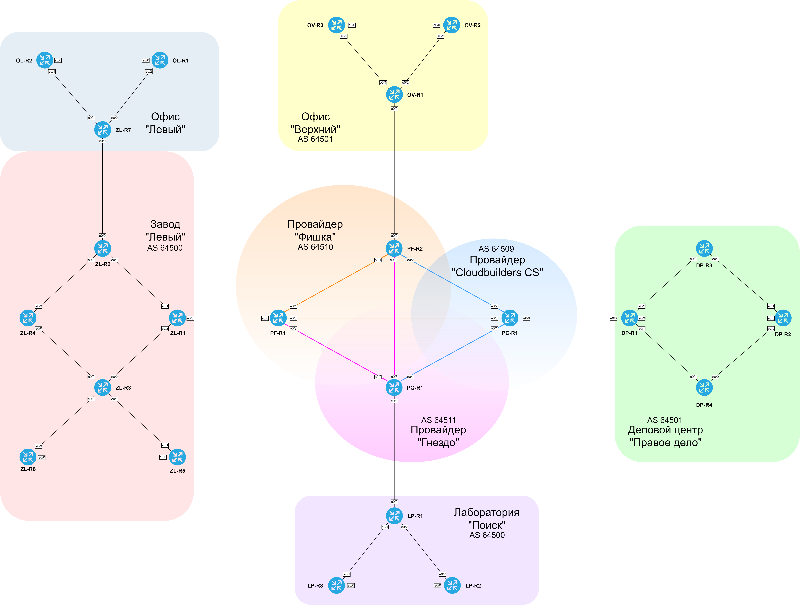

### Проектная работа:
### Комплексная реализация слияния геораспределённых сетей предприятий через сеть провайдера.

#### Задание:

v  1. Распределить адресное пространство;
v  2. Реализовать нескольких видов статической маршрутизации;
v  3. Настроить VPN-туннели (статические и динамические);
v  4. Настроить протоколы маршрутизации OSPF и EIGRP внутри локальных сетей;
v  5. Настроить протокол маршрутизации BGP;
v  6. Оптимизировать основные параметры и метрики протоколов IGP;
v  7. Оптимизировать работу протокола BGP;
  8. Обеспечить безопасность и мониторинг сетевой инфраструктуры;
  9. Обеспечить шифрование VPN-туннелей;
  10. Настроить инфраструктурные сервисы (DHCP, DNS, NTP и т.п.);
  11. Задокументировать все выполненные действия.

###  1. Задокументируем общее адресное пространство IPv4/IPv6.

#### Автономные системы и принадлежащие им публичные адреса сетей IPv4.

| ASN | Company | Summary IPv4 | Addresses |
|-----|---------|--------------|-----------|
| 64500 | Завод "Левый" | 35.10.0.0/16 | 35.10.0.0 - 35.10.255.255 |
| 64500 | Лаборатория "Поиск" | 35.11.0.0/22 | 35.11.0.0 - 35.11.3.255 |
| 64501 | ДЦ "Правое дело" | 50.50.96.0/21 | 50.50.96.0 - 50.50.103.255 |
| 64501 | Офис "Верхний" | 50.50.104.0/23 | 50.50.104.0 - 50.50.105.255 |
| 64509 | Cloudbuilders CS ISP | 99.99.128.0/22 | 99.99.128.0 - 99.99.131.255 |
| 64510 | Фишка ISP | 99.99.132.0/22 | 99.99.132.0 - 99.99.135.255 |
| 64511 | Гнездо ISP | 99.99.136.0/22 | 99.99.136.0 - 99.99.139.255 |

#### Автономные системы и принадлежащие им публичные адреса сетей IPv6.

| ASN | Company | Summary IPv6 |
|-----|--------------|--------------|
| 64500 | Завод "Левый" | 20FF:CCFF:**200A**::/48 |
| 64500 | Лаборатория "Поиск" | 20FF:CCFF:**200B**::/48 |
| 64501 | ДЦ "Правое дело" | 20FF:CCFF:**200C**::/48 |
| 64501 | Офис "Верхний" | 20FF:CCFF:**200D**::/48 |
| 64509 | Cloudbuilders CS ISP | 20FF:**CCFD**::/32 |
| 64510 | Фишка ISP | 20FF:**CCFE**::/32 |
| 64511 | Гнездо ISP | 20FF:**CCFF**::/32 |

#### Базовая схема.

###  2. Задокументируем используемые подсети IPv4/IPv6.

[Таблица используемых подсетей IPv4.](docs/subnets_ipv4.md)
[Таблица используемых подсетей IPv6.](docs/subnets_ipv6.md)

###  3. Задокументируем выделенные для маршрутизаторов IP-адреса.

[Таблица назначенных сетевых адресов на интерфейсах маршрутизаторов.](docs/addresses.md)
