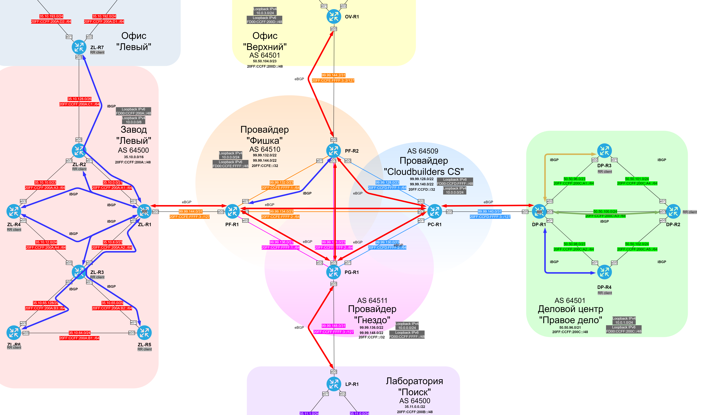

### BGP (Border Gateway Protocol)

#### Автономные системы и принадлежащие им публичные адреса сетей IPv4.

| ASN | Company | Summary IPv4 | Addresses |
|-----|---------|--------------|-----------|
| 64500 | Завод "Левый" | 35.10.0.0/16 | 35.10.0.0 - 35.10.255.255 |
| 64500 | Лаборатория "Поиск" | 35.11.0.0/22 | 35.11.0.0 - 35.11.3.255 |
| 64501 | ДЦ "Правое дело" | 50.50.96.0/21 | 50.50.96.0 - 50.50.103.255 |
| 64501 | Офис "Верхний" | 50.50.104.0/23 | 50.50.104.0 - 50.50.105.255 |
| 64509 | Cloudbuilders CS ISP | 99.99.128.0/22 | 99.99.128.0 - 99.99.131.255 |
| 64509 | Cloudbuilders CS ISP | 99.99.140.0/22 | 99.99.140.0 - 99.99.143.255 |
| 64510 | Фишка ISP | 99.99.132.0/22 | 99.99.132.0 - 99.99.135.255 |
| 64510 | Фишка ISP | 99.99.144.0/22 | 99.99.144.0 - 99.99.147.255 |
| 64511 | Гнездо ISP | 99.99.136.0/22 | 99.99.136.0 - 99.99.139.255 |
| 64511 | Гнездо ISP | 99.99.148.0/22 | 99.99.148.0 - 99.99.151.255 |

#### Автономные системы и принадлежащие им публичные адреса сетей IPv6.

| ASN | Company | Summary IPv6 |
|-----|--------------|--------------|
| 64500 | Завод "Левый" | 20FF:CCFF:**200A**::/48 |
| 64500 | Лаборатория "Поиск" | 20FF:CCFF:**200B**::/48 |
| 64501 | ДЦ "Правое дело" | 20FF:CCFF:**200C**::/48 |
| 64501 | Офис "Верхний" | 20FF:CCFF:**200D**::/48 |
| 64509 | Cloudbuilders CS ISP | 20FF:**CCFD**::/32 |
| 64510 | Фишка ISP | 20FF:**CCFE**::/32 |
| 64511 | Гнездо ISP | 20FF:**CCFF**::/32 |

#### Общая схема BGP соединений

### eBGP (Exterior Border Gateway Protocol)

  [Настройка на PC-R1](../configs/PC-R1#L61-L123)

#### Таблица соединений eBGP

| ASN   | Eq    | RouterID    | Nbr ASN | Nbr RouterID | Neighbor IP         |
|:------|:------|-------------|:--------|--------------|:--------------------|
| 64509 | PC-R1 | 99.99.128.1 | 64501   | 10.0.1.1     | 99.99.140.1         |
| 64509 | PC-R1 | 99.99.128.1 | 64511   | 99.99.136.1  | 99.99.130.2         |
| 64509 | PC-R1 | 99.99.128.1 | 64510   | 99.99.132.2  | 99.99.128.2         |
| 64509 | PC-R1 | 99.99.128.1 | 64510   | 99.99.132.1  | 99.99.134.1         |
| 64511 | PG-R1 | 99.99.136.1 | 64500   | 99.99.148.1  | 99.99.148.1         |
| 64511 | PG-R1 | 99.99.136.1 | 64509   | 99.99.128.1  | 99.99.130.1         |
| 64511 | PG-R1 | 99.99.136.1 | 64510   | 99.99.132.1  | 99.99.138.2         |
| 64511 | PG-R1 | 99.99.136.1 | 64510   | 99.99.132.2  | 99.99.136.2         |
| 64510 | PF-R1 | 99.99.132.1 | 64500   | 10.0.0.1     | 99.99.144.1         |
| 64510 | PF-R1 | 99.99.132.1 | 64511   | 99.99.136.1  | 99.99.136.1         |
| 64510 | PF-R1 | 99.99.132.1 | 64509   | 99.99.128.1  | 99.99.134.2         |
| 64510 | PF-R2 | 99.99.132.2 | 64501   | 99.99.144.3  | 99.99.144.3         |
| 64510 | PF-R2 | 99.99.132.2 | 64511   | 99.99.136.1  | 99.99.138.1         |
| 64510 | PF-R2 | 99.99.132.2 | 64509   | 99.99.132.1  | 99.99.128.1         |
| 64500 | ZL-R1 | 99.99.144.1 | 64510   | 99.99.132.1  | 99.99.144.0         |
| 64501 | OV-R1 | 99.99.144.3 | 64510   | 99.99.132.2  | 99.99.144.2         |
| 64501 | DP-R1 | 99.99.140.1 | 64509   | 99.99.128.1  | 99.99.140.1         |
| 64500 | LP-R1 | 99.99.148.1 | 64511   | 99.99.136.1  | 99.99.148.0         |
| 64509 | PC-R1 | 99.99.128.1 | 64501   | 10.0.1.1     | 20FF:CCFD:FFFF:3::1 |
| 64509 | PC-R1 | 99.99.128.1 | 64511   | 99.99.136.1  | 20FF:CCFD:FFFF:2::2 |
| 64509 | PC-R1 | 99.99.128.1 | 64510   | 99.99.132.2  | 20FF:CCFD:FFFF:1::2 |
| 64509 | PC-R1 | 99.99.128.1 | 64510   | 99.99.132.1  | 20FF:CCFE:FFFF:2::1 |
| 64511 | PG-R1 | 99.99.136.1 | 64500   | 99.99.148.1  | 20FF:CCFF:FFFF:3::1 |
| 64511 | PG-R1 | 99.99.136.1 | 64509   | 99.99.128.1  | 20FF:CCFD:FFFF:2::1 |
| 64511 | PG-R1 | 99.99.136.1 | 64510   | 99.99.132.1  | 20FF:CCFF:FFFF:2::2 |
| 64511 | PG-R1 | 99.99.136.1 | 64510   | 99.99.132.2  | 20FF:CCFF:FFFF:1::2 |
| 64510 | PF-R1 | 99.99.132.1 | 64500   | 10.0.0.1     | 20FF:CCFE:FFFF:3::1 |
| 64510 | PF-R1 | 99.99.132.1 | 64511   | 99.99.136.1  | 20FF:CCFF:FFFF:1::1 |
| 64510 | PF-R1 | 99.99.132.1 | 64509   | 99.99.128.1  | 20FF:CCFE:FFFF:2::1 |
| 64510 | PF-R2 | 99.99.132.2 | 64501   | 99.99.144.3  | 20FF:CCFE:FFFF:3::3 |
| 64510 | PF-R2 | 99.99.132.2 | 64511   | 99.99.136.1  | 20FF:CCFF:FFFF:2::1 |
| 64510 | PF-R2 | 99.99.132.2 | 64509   | 99.99.132.1  | 20FF:CCFD:FFFF:1::1 |
| 64500 | ZL-R1 | 99.99.144.1 | 64510   | 99.99.132.1  | 20FF:CCFE:FFFF:3::0 |
| 64501 | OV-R1 | 99.99.144.3 | 64510   | 99.99.132.2  | 20FF:CCFE:FFFF:3::2 |
| 64501 | DP-R1 | 99.99.140.1 | 64509   | 99.99.128.1  | 20FF:CCFD:FFFF:3::0 |
| 64500 | LP-R1 | 99.99.148.1 | 64511   | 99.99.136.1  | 20FF:CCFF:FFFF:3::0 |

#### Таблица фильтрации eBGP

| ASN   | Eq    | Nbr ASN | Neighbor IP         | Filters |
|:------|:------|:--------|:--------------------|:--------|
| 64509 | PC-R1 | 64501   | 99.99.140.1         | send default & prefix from 64501 |
| 64509 | PC-R1 | 64511   | 99.99.130.2         | |
| 64509 | PC-R1 | 64510   | 99.99.128.2         | |
| 64509 | PC-R1 | 64510   | 99.99.134.1         | |
| 64511 | PG-R1 | 64500   | 99.99.148.1         | send only default |
| 64511 | PG-R1 | 64509   | 99.99.130.1         | send all except prefixes from 64510 |
| 64511 | PG-R1 | 64510   | 99.99.138.2         | send all except prefixes from 64509 |
| 64511 | PG-R1 | 64510   | 99.99.136.2         | |
| 64510 | PF-R1 | 64500   | 99.99.144.1         | send only default |
| 64510 | PF-R1 | 64511   | 99.99.136.1         | |
| 64510 | PF-R1 | 64509   | 99.99.134.2         | |
| 64510 | PF-R2 | 64501   | 99.99.144.3         | send only default |
| 64510 | PF-R2 | 64511   | 99.99.138.1         | |
| 64510 | PF-R2 | 64509   | 99.99.128.1         | |
| 64500 | ZL-R1 | 64510   | 99.99.144.0         | receive only default |
| 64501 | OV-R1 | 64510   | 99.99.144.2         | receive only default |
| 64501 | DP-R1 | 64509   | 99.99.140.1         | receive default & prefix from 64501 |
| 64500 | LP-R1 | 64511   | 99.99.148.0         | receive only default |
| 64509 | PC-R1 | 64501   | 20FF:CCFD:FFFF:3::1 | send default & prefix from 64501 |
| 64509 | PC-R1 | 64511   | 20FF:CCFD:FFFF:2::2 | |
| 64509 | PC-R1 | 64510   | 20FF:CCFD:FFFF:1::2 | |
| 64509 | PC-R1 | 64510   | 20FF:CCFE:FFFF:2::1 | |
| 64511 | PG-R1 | 64500   | 20FF:CCFF:FFFF:3::1 | send only default |
| 64511 | PG-R1 | 64509   | 20FF:CCFD:FFFF:2::1 | send all except prefixes from 64510 |
| 64511 | PG-R1 | 64510   | 20FF:CCFF:FFFF:2::2 | send all except prefixes from 64509 |
| 64511 | PG-R1 | 64510   | 20FF:CCFF:FFFF:1::2 | |
| 64510 | PF-R1 | 64500   | 20FF:CCFE:FFFF:3::1 | send only default |
| 64510 | PF-R1 | 64511   | 20FF:CCFF:FFFF:1::1 | |
| 64510 | PF-R1 | 64509   | 20FF:CCFE:FFFF:2::1 | |
| 64510 | PF-R2 | 64501   | 20FF:CCFE:FFFF:3::3 | send only default |
| 64510 | PF-R2 | 64511   | 20FF:CCFF:FFFF:2::1 | |
| 64510 | PF-R2 | 64509   | 20FF:CCFD:FFFF:1::1 | |
| 64500 | ZL-R1 | 64510   | 20FF:CCFE:FFFF:3::0 | receive only default |
| 64501 | OV-R1 | 64510   | 20FF:CCFE:FFFF:3::2 | receive only default |
| 64501 | DP-R1 | 64509   | 20FF:CCFD:FFFF:3::0 | receive default & prefix from 64501 |
| 64500 | LP-R1 | 64511   | 20FF:CCFF:FFFF:3::0 | receive only default |

#### Атрибуты BGP

| Eq   | Rule | Tools |
|------|------|-------|
| PC-R1 | all prefixes from 64511 - set local-preference 80 | as-path access-list 1, as-path access-list 500, router-map SET_LP_80_FROM_64511 |

### iBGP (Interior Border Gateway Protocol)

  [Настройка RR на DP-R1](../configs/DP-R1#L223-L284)

  Для стабильной работы iBGP поднят на Loopback-интерфейсах, котороые распространены через имеющиеся протоколы IGP.
  Адреса для Loopback возьмем из служебного адресного пространства исходя из логики **10.0.{номер офиса}.{номер маршрутизатора}** для IPv4. 

  | Office | Number | Equip |
  |--------|--------|-------|
  | Завод "Левый" | 0 | ZL* |
  | ДЦ "Правое дело" | 1 | DP* |

  Адреса Loopback для IPv6 берутся исходя из логики **{префикс IPv6 для сайта}::{номер маршрутизатора}**. Префиксы для сайтов даны в таблице ниже.

  | Network IPv6 | Site & Description |
  |--------------|--------------------|
  | FD00:CCFF:200A::/48 | Loopback-адреса на заводе "Левый" и в офисе "Верхний" (AS 64500) |
  | FD00:CCFF:200C::/48 | Loopback-адреса в ДЦ "Правое дело" (AS 64501) |
  | FD00:CCFE:FFFF::/48 | Loopback-адреса Фишка ISP (AS 64510) |

  Для завода "Левый" и ДЦ "Правое дело" настроим iBGP используя route-reflector c peer-group.
  Для Фишка ISP будет использоваться простой full-mesh, т.к. там всего 2 маршрутизатора.
