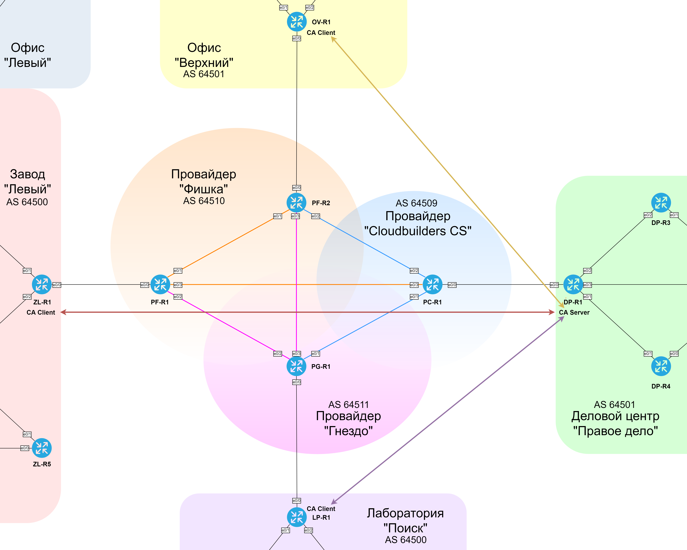

### CAS (Certificate Authority Server)

  DP-R1 - Certificate Authority Server. К нему могут подключиться только некоторые маршрутизаторы, которые получают от него сертификаты, а конкретно ZL-R1, OV-R1, LP-R1 и сам DP-R1.
  Впоследствии эти сертификаты будут использоваться для аутентификации при использовании протоколов IPsec.

### IPsec (Internet Protocol Security)

  Организована защита данных, которые передаются по каналам GRE между ZL-R1 и DP-R1, а также по каналам DMVPN между ZL-R1, OV-R1 и LP-R1. Защита использует протокол ISAKMP с аутентификацией по сертификату и протокол ESP для захиты данных.

####  Схема иерархии CA 

