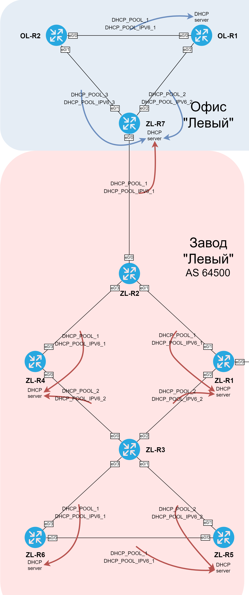
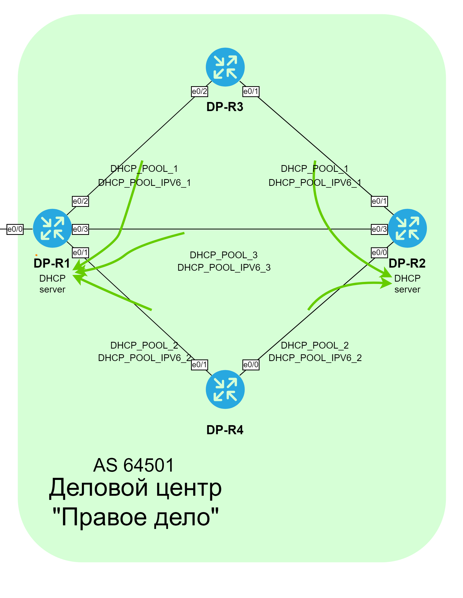
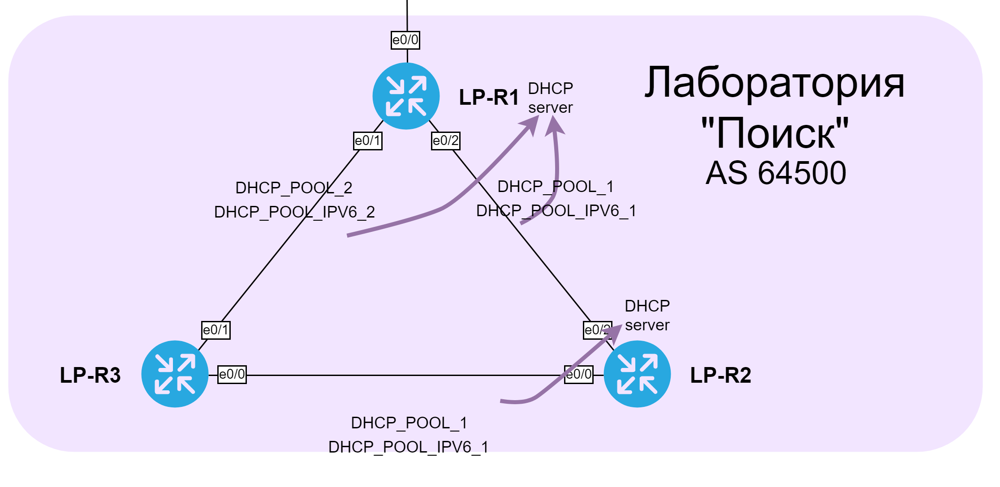
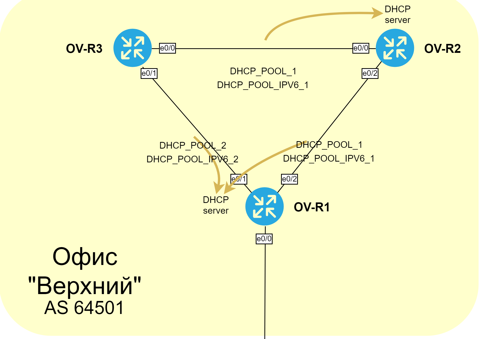

###  DHCP (Dynamic Host Configuration Protocol)

  Серверы DHCP настроены согласно схемам, приведенным ниже. Каждый DHCP сервер раздает все доступные адреса, кроме назначенных статически адресов маршрутизаторов, адресов сетей и широковещательных адресов. Также настроены DHCP relay, поэтому, если DHCP запрос был получен не сервером, то он будет перенаправлен серверу DHCP.

####  Схема серверов DHCP завода "Левый"

####  Схема серверов DHCP ДЦ "Правое дело"

####  Схема серверов DHCP лаборатории "Поиск"

####  Схема серверов DHCP офиса "Верхний"

