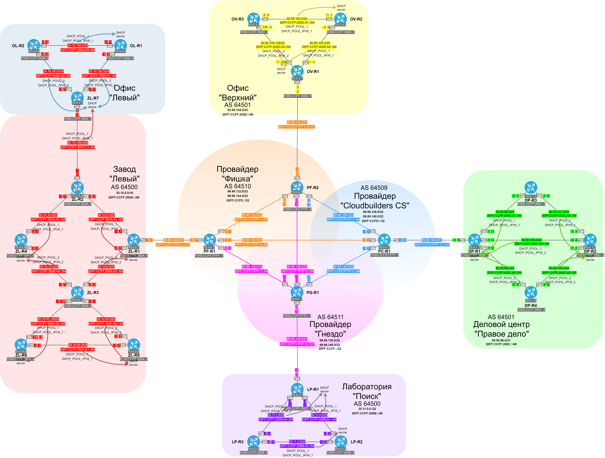

###  DHCP (Dynamic Host Configuration Protocol)

  Серверы DHCP настроены согласно схемам, приведенным ниже. Каждый DHCP сервер раздает все доступные адреса, кроме назначенных статически адресов маршрутизаторов, адресов сетей и широковещательных адресов. Также настроены DHCP relay, поэтому, если DHCP запрос был получен не сервером, то он будет перенаправлен серверу DHCP.

####  Схема серверов DHCP

####  Таблица серверов DHCP.

| Eq  | Interface | Network | Excluded | Pool |
|-----|------|---------|----------|------|
| DP-R1 | any match | 50.50.96.0/23 | 50.50.96.0-3, 50.50.97.255 | DHCP_POOL_1 |
| DP-R1 | any match | 50.50.98.0/23 | 50.50.98.0-2, 50.50.98.255 | DHCP_POOL_2 |
| DP-R1 | any match | 50.50.100.0/24 | 50.50.100.0-2, 50.50.100.255 | DHCP_POOL_3 |
| DP-R1 | e0/1 | 20FF:CCFF:200C:A1::/64 | | DHCP_POOL_IPV6_1 |
| DP-R1 | e0/2 | 20FF:CCFF:200C:A2::/64 | | DHCP_POOL_IPV6_2 |
| DP-R1 | e0/0 | 20FF:CCFF:200C:A3::/64 | | DHCP_POOL_IPV6_3 |
| DP-R2 | any match | 50.50.101.0/24 | 50.50.101.0-2, 50.50.101.255 | DHCP_POOL_1 |
| DP-R2 | any match | 50.50.102.0/24 | 50.50.102.0-2, 50.50.102.255 | DHCP_POOL_2 |
| DP-R2 | e0/1 | 20FF:CCFF:200C:A4::/64 | | DHCP_POOL_IPV6_1 |
| DP-R2 | e0/0 | 20FF:CCFF:200C:A2::/64 | | DHCP_POOL_IPV6_2 |
| LP-R1 | any match | 35.11.0.0/24 | 35.11.0.0-3, 35.11.0.255 | DHCP_POOL_1 |
| LP-R1 | any match | 35.11.1.0/24 | 35.11.1.0-2, 35.11.1.255 | DHCP_POOL_2 |
| LP-R1 | e0/2 | 20FF:CCFF:200B:A1::/64 | | DHCP_POOL_IPV6_1 |
| LP-R1 | e0/1 | 20FF:CCFF:200B:A2::/64 | | DHCP_POOL_IPV6_2 |
| LP-R2 | any match | 35.11.2.0/24 | 35.11.2.0-2, 35.11.2.255 | DHCP_POOL_1 |
| LP-R2 | e0/0 | 20FF:CCFF:200B:A3::/64 | | DHCP_POOL_IPV6_1 |
| OL-R1 | any match | 35.10.194.0/25 | 35.10.194.0-2, 35.10.194.127 | DHCP_POOL_1 |
| OL-R1 | e0/0 | 20FF:CCFF:200A:D1::/64 | | DHCP_POOL_IPV6_1 |
| OV-R1 | any match | 50.50.105.0/25 | 50.50.105.0-3, 50.50.105.127 | DHCP_POOL_1 |
| OV-R1 | any match | 50.50.105.128/25 | 50.50.105.128-130, 50.50.105.255 | DHCP_POOL_2 |
| OV-R1 | e0/2 | 20FF:CCFF:200D:A2::/64 | | DHCP_POOL_IPV6_1 |
| OV-R1 | e0/1 | 20FF:CCFF:200D:A3::/64 | | DHCP_POOL_IPV6_2 |
| OV-R2 | any match | 50.50.104.0/24 | 50.50.104.0-2, 50.50.104.255 | DHCP_POOL_1 |
| OV-R2 | e0/0 | 20FF:CCFF:200D:A1::/64 | | DHCP_POOL_IPV6_1 |
| ZL-R1 | any match | 35.10.0.0/21 | 35.10.0.0-3, 35.10.7.255 | DHCP_POOL_1 |
| ZL-R1 | any match | 35.10.8.0/23 | 35.10.8.0-2, 35.10.9.255 | DHCP_POOL_2 |
| ZL-R1 | e0/1 | 20FF:CCFF:200A:A1::/64 | | DHCP_POOL_IPV6_1 |
| ZL-R1 | e0/2 | 20FF:CCFF:200A:A2::/64 | | DHCP_POOL_IPV6_2 |
| ZL-R4 | any match | 35.10.10.0/23 | 35.10.10.0-2, 35.10.11.255 | DHCP_POOL_1 |
| ZL-R4 | any match | 35.10.12.0/24 | 35.10.12.0-2, 35.10.12.255 | DHCP_POOL_2 |
| ZL-R4 | e0/3 | 20FF:CCFF:200A:A3::/64 | | DHCP_POOL_IPV6_1 |
| ZL-R4 | e0/0 | 20FF:CCFF:200A:A4::/64 | | DHCP_POOL_IPV6_2 |
| ZL-R5 | any match | 35.10.64.0/24 | 35.10.64.0-2, 35.10.64.255 | DHCP_POOL_1 |
| ZL-R5 | any match | 35.10.65.0/25 | 35.10.65.0-2, 35.10.65.127 | DHCP_POOL_2 |
| ZL-R5 | e0/0 | 20FF:CCFF:200A:B1::/64 | | DHCP_POOL_IPV6_1 |
| ZL-R5 | e0/1 | 20FF:CCFF:200A:B4::/64 | | DHCP_POOL_IPV6_2 |
| ZL-R6 | any match | 35.10.65.128/25 | 35.10.65.128-130, 35.10.65.255 | DHCP_POOL_1 |
| ZL-R6 | e0/3 | 20FF:CCFF:200A:B3::/64 | | DHCP_POOL_IPV6_1 |
| ZL-R7 | any match | 35.10.128.0/26 | 35.10.128.0-2, 35.10.128.63 | DHCP_POOL_1 |
| ZL-R7 | any match | 35.10.192.0/24 | 35.10.192.0-2, 35.10.192.255 | DHCP_POOL_2 |
| ZL-R7 | any match | 35.10.193.0/24 | 35.10.193.0-2, 35.10.193.255 | DHCP_POOL_3 |
| ZL-R7 | e0/1 | 20FF:CCFF:200A:A1::/64 | | DHCP_POOL_IPV6_1 |
| ZL-R7 | e0/2 | 20FF:CCFF:200A:D1::/64 | | DHCP_POOL_IPV6_2 |
| ZL-R7 | e0/0 | 20FF:CCFF:200A:D2::/64 | | DHCP_POOL_IPV6_3 |

####  Таблица выделенных под DHCP пулов адресов и их настройки.

| Eq  | Pool            | Settings |
|-----|-----------------|----------|
| DP-R1 | DHCP_POOL_1 | default-router 50.50.96.1 50.50.100.1 50.50.98.1, domain-name dp.com, dns-server 50.50.96.1 50.50.100.1 50.50.98.1, lease 8 |
| DP-R1 | DHCP_POOL_2 | default-router 50.50.98.1 50.50.100.1 50.50.96.1, domain-name dp.com, dns-server 50.50.98.1 50.50.100.1 50.50.96.1, lease 8 |
| DP-R1 | DHCP_POOL_3 | default-router 50.50.100.1 50.50.96.1 50.50.98.1, domain-name dp.com, dns-server 50.50.100.1 50.50.96.1 50.50.98.1, lease 8 |
| DP-R1 | DHCP_POOL_IPV6_1 | domain-name dp.com, dns-server 20FF:CCFF:200C:A1::1, lifetime 2073600 691200, ND on e0/1 |
| DP-R1 | DHCP_POOL_IPV6_2 | domain-name dp.com, dns-server 20FF:CCFF:200C:A2::1, lifetime 2073600 691200, ND on e0/2 |
| DP-R1 | DHCP_POOL_IPV6_3 | domain-name dp.com, dns-server 20FF:CCFF:200C:A3::1, lifetime 2073600 691200, ND on e0/0 |
| DP-R2 | DHCP_POOL_1 | default-router 50.50.101.1 50.50.101.2, domain-name dp.com, dns-server 50.50.96.1 50.50.100.1 50.50.98.1, lease 8 |
| DP-R2 | DHCP_POOL_2 | default-router 50.50.102.1 50.50.102.2, domain-name dp.com, dns-server 50.50.98.1 50.50.100.1 50.50.96.1, lease 8 |
| DP-R2 | DHCP_POOL_IPV6_1 | domain-name dp.com, dns-server 20FF:CCFF:200C:A3::1, lifetime 2073600 691200, ND on e0/1 |
| DP-R2 | DHCP_POOL_IPV6_2 | domain-name dp.com, dns-server 20FF:CCFF:200C:A3::1, lifetime 2073600 691200, ND on e0/0 |
| LP-R1 | DHCP_POOL_1 | default-router 35.11.0.1 35.11.0.2, domain-name lp.com, dns-server 35.11.0.1 35.11.1.1, lease 8 |
| LP-R1 | DHCP_POOL_2 | default-router 35.11.1.1 35.11.1.2, domain-name lp.com, dns-server 35.11.1.1 35.11.0.1 50.50.96.1, lease 8 |
| LP-R1 | DHCP_POOL_IPV6_1 | domain-name lp.com, dns-server 20FF:CCFF:200B:A1::1, lifetime 2073600 691200, ND on e0/2 |
| LP-R1 | DHCP_POOL_IPV6_2 | domain-name lp.com, dns-server 20FF:CCFF:200B:A2::1, lifetime 2073600 691200, ND on e0/1 |
| LP-R2 | DHCP_POOL_1 | default-router 35.11.2.1 35.11.2.2, domain-name lp.com, dns-server 35.11.2.1 35.11.2.2, lease 8 |
| LP-R2 | DHCP_POOL_IPV6_1 | domain-name lp.com, dns-server 20FF:CCFF:200B:A1::1, lifetime 2073600 691200, ND on e0/0 |
| OL-R1 | DHCP_POOL_1 | default-router 35.10.194.1 35.10.194.2, domain-name ol.com, dns-server 35.10.192.1 35.10.193.1, lease 8 |
| OL-R1 | DHCP_POOL_IPV6_1 | domain-name ol.com, dns-server 20FF:CCFF:200A:D1::1, lifetime 2073600 691200, ND on e0/0 |
| OV-R1 | DHCP_POOL_1 | default-router 50.50.105.1 50.50.105.129, domain-name ov.com, dns-server 50.50.105.1 50.50.105.129, lease 8 |
| OV-R1 | DHCP_POOL_2 | default-router 50.50.105.129 50.50.105.1, domain-name ov.com, dns-server 50.50.105.129 50.50.105.1, lease 8 |
| OV-R1 | DHCP_POOL_IPV6_1 | domain-name ov.com, dns-server 20FF:CCFF:200D:A2::1, lifetime 2073600 691200, ND on e0/2 |
| OV-R1 | DHCP_POOL_IPV6_2 | domain-name ov.com, dns-server 20FF:CCFF:200D:A3::1, lifetime 2073600 691200, ND on e0/1 |
| OV-R2 | DHCP_POOL_1 | default-router 50.50.105.1 50.50.105.129, domain-name ov.com, dns-server 50.50.104.1 50.50.104.2, lease 8 |
| OV-R2 | DHCP_POOL_IPV6_1 | domain-name ov.com, dns-server 20FF:CCFF:200D:A1::1, lifetime 2073600 691200, ND on e0/0 |
| ZL-R1 | DHCP_POOL_1 | default-router 35.10.0.1 35.10.8.1, domain-name zl.com, dns-server 35.10.0.1 35.10.8.1, lease 8 |
| ZL-R1 | DHCP_POOL_2 | default-router 35.10.8.1 35.10.0.1, domain-name zl.com, dns-server 35.10.8.1 35.10.0.1, lease 8 |
| ZL-R1 | DHCP_POOL_IPV6_1 | domain-name zl.com, dns-server 20FF:CCFF:200A:A1::1, lifetime 2073600 691200, ND on e0/1 |
| ZL-R1 | DHCP_POOL_IPV6_2 | domain-name zl.com, dns-server 20FF:CCFF:200A:A2::1, lifetime 2073600 691200, ND on e0/2 |
| ZL-R4 | DHCP_POOL_1 | default-router 35.10.12.2 35.10.12.1, domain-name zl.com, dns-server 35.10.8.1 35.10.0.1, lease 8 |
| ZL-R4 | DHCP_POOL_2 | default-router 35.10.12.2 35.10.12.1, domain-name zl.com, dns-server 35.10.8.1 35.10.0.1, lease 8 |
| ZL-R4 | DHCP_POOL_IPV6_1 | domain-name zl.com, dns-server 20FF:CCFF:200A:A1::1, lifetime 2073600 691200, ND on e0/3 |
| ZL-R4 | DHCP_POOL_IPV6_2 | domain-name zl.com, dns-server 20FF:CCFF:200A:A2::1, lifetime 2073600 691200, ND on e0/0 |
| ZL-R5 | DHCP_POOL_1 | default-router 35.10.64.1 35.10.64.2, domain-name zl.com, dns-server 35.10.8.1 35.10.0.1, lease 8 |
| ZL-R5 | DHCP_POOL_2 | default-router 35.10.65.1 35.10.65.2, domain-name zl.com, dns-server 35.10.8.1 35.10.0.1, lease 8 |
| ZL-R5 | DHCP_POOL_IPV6_1 | domain-name zl.com, dns-server 20FF:CCFF:200A:A2::1, lifetime 2073600 691200, ND on e0/0 |
| ZL-R5 | DHCP_POOL_IPV6_2 | domain-name zl.com, dns-server 20FF:CCFF:200A:A2::1, lifetime 2073600 691200, ND on e0/1 |
| ZL-R6 | DHCP_POOL_1 | default-router 35.10.65.129 35.10.65.130, domain-name zl.com, dns-server 35.10.8.1 35.10.0.1, lease 8 |
| ZL-R6 | DHCP_POOL_IPV6_1 | domain-name zl.com, dns-server 20FF:CCFF:200A:A2::1, lifetime 2073600 691200, ND on e0/3 |
| ZL-R7 | DHCP_POOL_1 | default-router 35.10.128.1 35.10.128.2, domain-name zl.com, dns-server 35.10.0.1 35.10.8.1, lease 8 |
| ZL-R7 | DHCP_POOL_2 | default-router 35.10.192.1 35.10.192.2, domain-name ol.com, dns-server 35.10.192.1 35.10.193.1, lease 8 |
| ZL-R7 | DHCP_POOL_3 | default-router 35.10.193.1 35.10.193.2, domain-name ol.com, dns-server 35.10.193.1 35.10.192.1, lease 8 |
| ZL-R7 | DHCP_POOL_IPV6_1 | domain-name zl.com, dns-server 20FF:CCFF:200A:A1::1, lifetime 2073600 691200, ND on e0/0 |
| ZL-R7 | DHCP_POOL_IPV6_2 | domain-name ol.com, dns-server 20FF:CCFF:200A:D1::1, lifetime 2073600 691200, ND on e0/2 |
| ZL-R7 | DHCP_POOL_IPV6_3 | domain-name ol.com, dns-server 20FF:CCFF:200A:D2::1, lifetime 2073600 691200, ND on e0/1 |

####  Таблица DHCP relay.

| Eq  | Interface | DHCP server IP | DHCP server Eq |
|-----|-----------|----------------|----------------|
| DP-R2 | e0/3 | 50.50.100.1 | DP-R1 |
| DP-R2 | e0/3 | FE80::1 | DP-R1 |
| DP-R3 | e0/1 | 50.50.101.1 | DP-R2 |
| DP-R3 | e0/1 | FE80::1 | DP-R2 |
| DP-R3 | e0/2 | 50.50.96.1 | DP-R1 |
| DP-R3 | e0/2 | FE80::1 | DP-R1 |
| DP-R4 | e0/0 | 50.50.102.1 | DP-R2 |
| DP-R4 | e0/0 | FE80::1 | DP-R2 |
| DP-R4 | e0/1 | 50.50.98.1 | DP-R1 |
| DP-R4 | e0/1 | FE80::1 | DP-R1 |
| LP-R2 | e0/2 | 35.11.0.1 | LP-R1 |
| LP-R2 | e0/2 | FE80::1 | LP-R1 |
| LP-R3 | e0/0 | 35.11.2.1 | LP-R2 |
| LP-R3 | e0/0 | FE80::1 | LP-R2 |
| LP-R3 | e0/1 | 35.11.1.1 | LP-R1 |
| LP-R3 | e0/1 | FE80::1 | LP-R1 |
| OL-R1 | e0/2 | 35.10.192.1 | ZL-R7 |
| OL-R1 | e0/2 | FE80::1 | ZL-R7 |
| OL-R2 | e0/0 | 35.10.194.1 | OL-R1 |
| OL-R2 | e0/0 | FE80::1 | OL-R1 |
| OL-R2 | e0/1 | 35.10.193.1 | ZL-R7 |
| OL-R2 | e0/1 | FE80::1 | ZL-R7 |
| OV-R2 | e0/2 | 50.50.105.1 | OV-R1 |
| OV-R2 | e0/2 | FE80::1 | OV-R1 |
| OV-R3 | e0/0 | 50.50.104.1 | OV-R2 |
| OV-R3 | e0/0 | FE80::1 | OV-R2 |
| OV-R3 | e0/1 | 50.50.105.129 | OV-R1 |
| OV-R3 | e0/1 | FE80::1 | OV-R1 |
| ZL-R2 | e0/0 | 35.10.128.2 | ZL-R7 |
| ZL-R2 | e0/0 | FE80::2 | ZL-R7 |
| ZL-R2 | e0/1 | 35.10.0.1 | ZL-R1 |
| ZL-R2 | e0/1 | FE80::1 | ZL-R1 |
| ZL-R2 | e0/3 | 35.10.10.2 | ZL-R4 |
| ZL-R2 | e0/3 | FE80::2 | ZL-R4 |
| ZL-R3 | e0/0 | 35.10.12.2 | ZL-R4 |
| ZL-R3 | e0/0 | FE80::2 | ZL-R4 |
| ZL-R3 | e0/1 | 35.10.65.2 | ZL-R5 |
| ZL-R3 | e0/1 | FE80::2 | ZL-R5 |
| ZL-R3 | e0/2 | 35.10.8.1 | ZL-R1 |
| ZL-R3 | e0/2 | FE80::1 | ZL-R1 |
| ZL-R3 | e0/3 | 35.10.65.130 | ZL-R6 |
| ZL-R3 | e0/3 | FE80::2 | ZL-R6 |
| ZL-R6 | e0/0 | 35.10.64.1 | ZL-R5 |
| ZL-R6 | e0/0 | FE80::1 | ZL-R5 |
