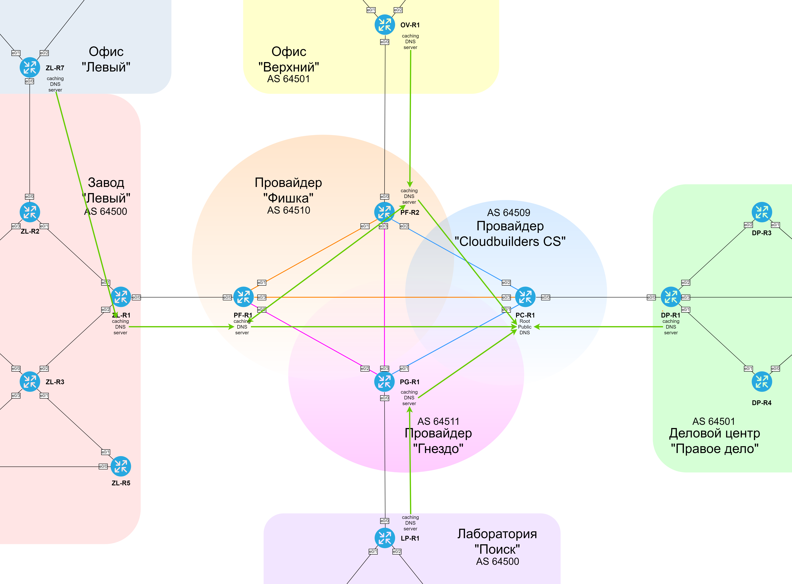

###  DNS (Domain Name System)

  Исходим из того, что PC-R1 является публичным DNS-сервером, к нему подключаются кеширующие DNS-серверы (провайдеры и офис ДЦ "Правое дело"), которые в свою очередь являются DNS-серверами для соответствующих сайтов.
  
| Equip | Role | Site | Domain name |
|-------|------|------|-------------|
| PC-R1 | Public DNS | Cloudbuilders CS ISP | test.com |
| PG-R1 | Caching DNS | Гнездо ISP | pg.com |
| PF-R1 | Caching DNS | Фишка ISP | pf.com |
| PF-R2 | Caching DNS | Фишка ISP | pf.com |
| ZL-R1 | Caching DNS | Завод "Левый" | zl.com |
| DP-R1 | Caching DNS | ДЦ "Правое дело" | dp.com |
| ZL-R7 | Caching DNS | Офис "Левый" | ol.com |
| OV-R1 | Caching DNS | Офис "Верхний" | ov.com |
| LP-R1 | Caching DNS | Лаборатория "Поиск" | lp.com |

  [DNS server на PC-R1](../configs/PC-R1#L151-L162)
  [DNS server на ZL-R1](../configs/ZL-R1#L300-L306)

###  Схема иерархии DNS 

