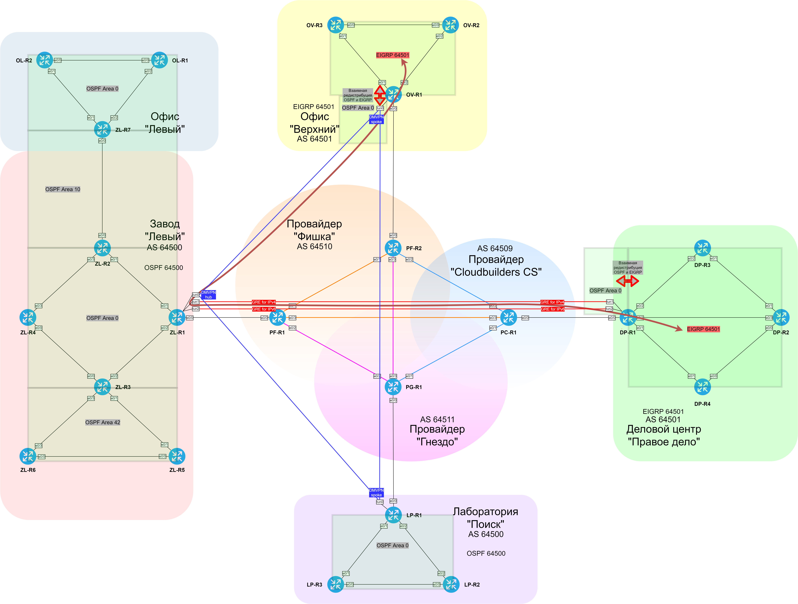

### EIGRP (Enhanced Interior Gateway Routing Protocol)

  Настроен EIGRP, т.ч между офисами через DMVPN/GRE с использованием суммаризации.
  Router-ID IPv4 address-family присваивается совпадающим c Loopback. (**10.0.{номер офиса}.{номер маршрутизатора}**).
  Router-ID IPv6 address-family присваивается исходя из логики: **6.0.{номер офиса}.{номер маршрутизатора}**.

  | Office | Number | Equip |
  |--------|--------|-------|
  | ДЦ "Правое дело" | 1 | DP* |
  | Офис "Верхний" | 3 | OV* |

  Скорректирована статическая маршрутизация в сторону приоритета протокола EIGRP.
  Настроена редистрибуция OSPFv2+OSPFv3 в EIGRP и наоборот.
  Настроена аутентификация по паролю в MD5.

  [Настройка на DP-R1](../configs/DP-R1#L96-L221)

###  Схема доменa EIGRP c указанием точек редистрибуции OSPF-EIGRP

