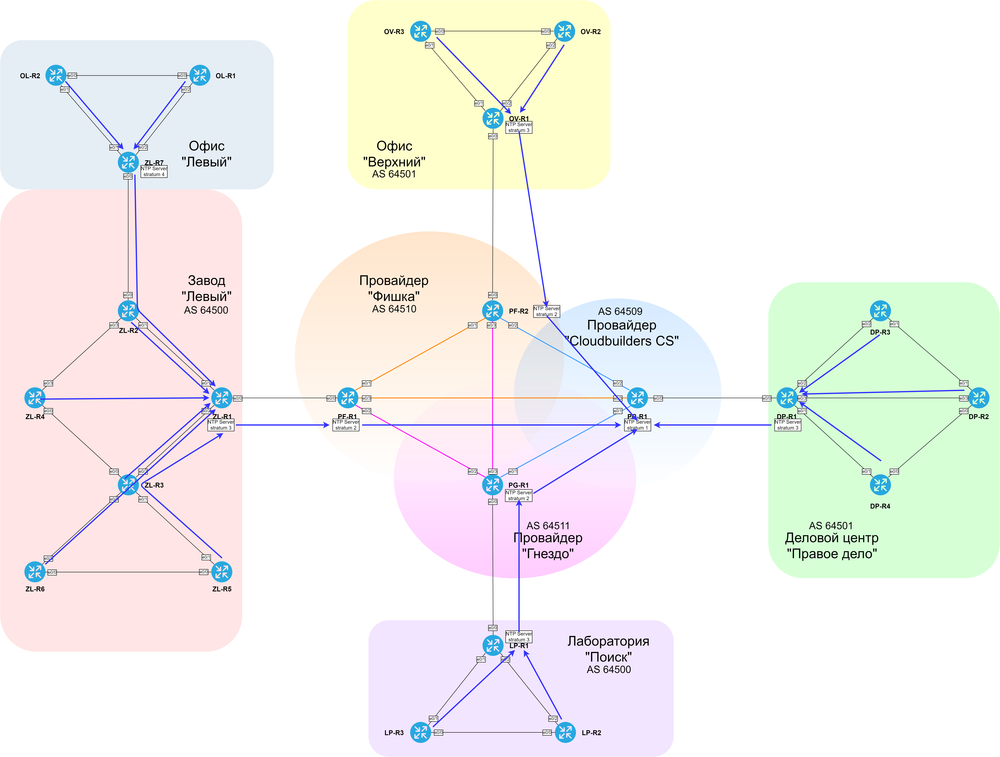

### NTP (Network Time Protocol)

  Исходим из того, что PC-R1 является NTP stratum 1, к нему подключаются клиенты (провайдеры и офис ДЦ "Правое дело"), которые в свою очередь являются серверами для остальных офисов.
  NTP stratum 1 и провайдеров позволяют подключаться любому желающему, в то время как офисные серверы NTP - только клиентам из адресного пространства соответствующего сайта.

  [NTP server на PC-R1](../configs/PC-R1#L125-L149)
  [NTP server/client на ZL-R1](../configs/ZL-R1#L262-L298)

###  Схема иерархии NTP 

