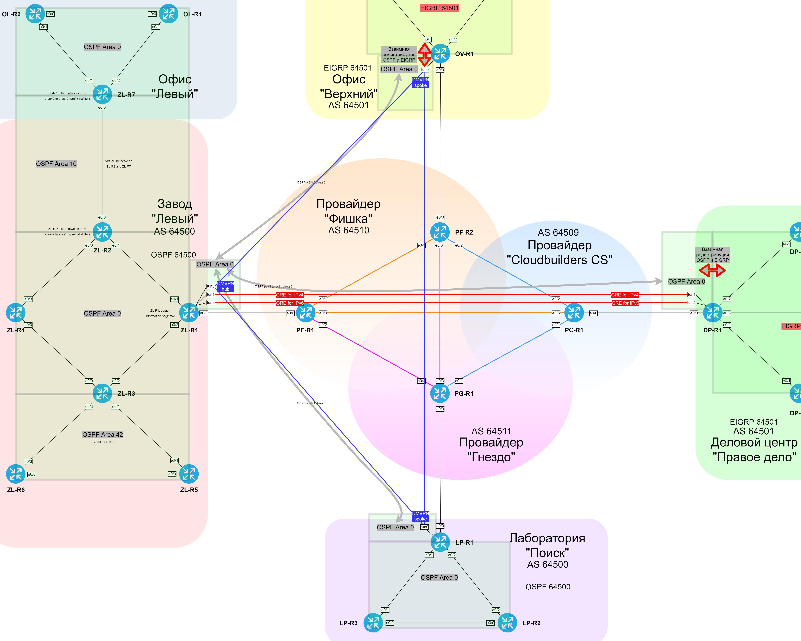

### OSPF (Open Shortest Path First)

#### OSPFv2

  Router-ID OSPFv2 присваивается совпадающим c Loopback. (**10.0.{номер офиса}.{номер маршрутизатора}**).

  | Office | Number | Equip |
  |--------|--------|-------|
  | Завод "Левый" | 0 | ZL* |
  | ДЦ "Правое дело" | 1 | DP* |
  | Лаборатория "Поиск" | 2 | LP* |
  | Офис "Верхний" | 3 | OV* |

  В зоне 0 Для минимальной скорости обнаружения неполадок используется технология Fast Hello. В остальных зонах таймеры оптимизированы до значений 3/12.
  В зоне NBMA между ZL-R1, OV-R1 и LP-R1 таймеры 20/60 и ручное указание соседей. Также на ZL-R1 настроен приоритет при выборах. В зоне point-to-point между ZL-R1 и DP-R1 таймеры 20/60.
  Включена парольная аутентификация в режиме MD5.
  Неиспользуемые интерфейсы переведены в режим Passive.

  Трафик от ZL-R7 до ZL-R1 должен уходить через ZL-R5. Для этого на ZL-R7 e0/3 и ZL-R5 e0/0 цены интерфейсов установлены в 201.

  Зона 42 знает только маршрут по-умолчанию (totally stub). На ZL-R2 и ZL-R7 настроена фильтрация маршрутной информации так, что зона 10 не знает о зоне 42 (фильтр LSA type 3). ZL-R1 распространяет информацию о маршруте по-умолчанию.

#### OSPFv3

  Router-ID OSPFv3 присваивается исходя из логики: **6.0.{номер офиса}.{номер маршрутизатора}**.

  | Office | Number | Equip |
  |--------|--------|-------|
  | Завод "Левый" | 0 | ZL* |
  | ДЦ "Правое дело" | 1 | DP* |
  | Лаборатория "Поиск" | 2 | LP* |
  | Офис "Верхний" | 3 | OV* |

  В зоне 0 для минимальной скорости обнаружения неполадок используются
  таймеры 1/4, т.к. Fast Hello не поддерживается. В остальных зонах таймеры оптимизированы до значений 3/12.
  В зоне NBMA между ZL-R1, OV-R1 и LP-R1 таймеры 20/60 и ручное указание соседей. Также на ZL-R1 настроен приоритет при выборах. В зоне point-to-point между ZL-R1 и DP-R1 таймеры 20/60.
  На незащищённых интерфейсах включена аутентификация с использованием IPSec и ключом в виде MD5.
  Неиспользуемые интерфейсы переведены в режим Passive.

  Трафик от ZL-R7 до ZL-R1 должен уходить через ZL-R5. Для этого на ZL-R7 e0/3 и ZL-R5 e0/0 цены интерфейсов установлены в 201.

  Зона 42 знает только маршрут по-умолчанию (totally stub). На ZL-R2 и ZL-R7 настроена фильтрация маршрутной информации так, что зона 10 не знает о зоне 42 (фильтр LSA type 3). ZL-R1 распространяет информацию о маршруте по-умолчанию.

#### Примеры

  [Пример area0 на ZL-R1](../configs/ZL-R1#L148-L168)
  [Пример interfaces на ZL-R1](../configs/ZL-R1#L7-L128)

  [Пример filter на ZL-R2](../configs/ZL-R2#L75-L105)

  [Пример totally stub на ZL-R3](../configs/ZL-R3#L96)
  [Пример totally stub на ZL-R6](../configs/ZL-R6#L79)

  [Пример cost increase на ZL-R6](../configs/ZL-R6#L56-L57)

  [Пример virtual-link на ZL-R2](../configs/ZL-R2#L95)
  [Пример virtual-link на ZL-R7](../configs/ZL-R7#L95)

###  Схема зон OSPF с учетом PtP/NBMA и отметками о фильтрации

