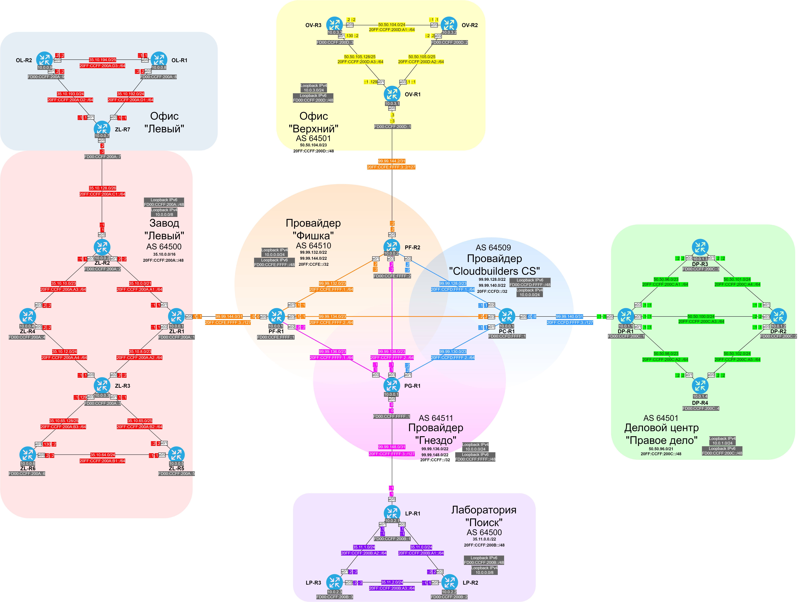
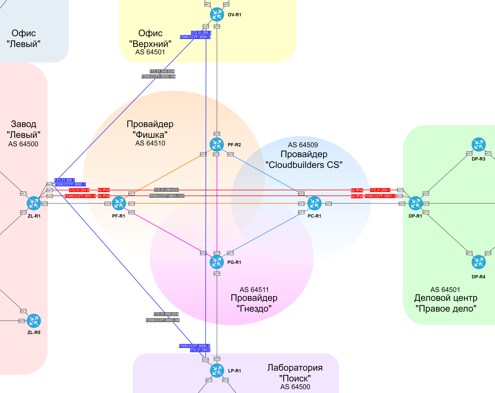

####  Схема назначенных IP адесов.

####  Схема назначенных IP адесов для VPN-туннелей.

####  Таблица назначенных сетевых адресов на интерфейсах маршрутизаторов.

| Equip | Port | AddrTyp | Address | Network | Description |
|-------|------|---------|---------|---------|-------------|
| ZL-R1 | e0/0 | IPv4 | 99.99.144.1 | 99.99.144.0/31 | to ISP |
| ZL-R1 | e0/0 | IPv6 | 20FF:CCFE:FFFF:3::1 | 20FF:CCFE:FFFF:3::/127 | to ISP |   
| ZL-R1 | e0/0 | IPv6 LL | FE80::2 | FE80::/10 | link-local |
| ZL-R1 | e0/1 | IPv4 | 35.10.0.1 | 35.10.0.0/21 | to ZL-R2 |
| ZL-R1 | e0/1 | IPv6 | 20FF:CCFF:200A:A1::1 | 20FF:CCFF:200A:A1::/64 | to ISP |   
| ZL-R1 | e0/1 | IPv6 LL | FE80::1 | FE80::/10 | link-local |
| ZL-R1 | e0/2 | IPv4 | 35.10.8.1 | 35.10.8.0/23 | to ISP |
| ZL-R1 | e0/2 | IPv6 | 20FF:CCFF:200A:A2::1 | 20FF:CCFF:200A:A2::/64 | to ISP |   
| ZL-R1 | e0/2 | IPv6 LL | FE80::1 | FE80::/10 | link-local |
| ZL-R1 | Loopback64500 | IPv4 | 10.0.0.1 | 10.0.0.1/32 | for iBGP |
| ZL-R1 | Loopback64500 | IPv6 | FD00:CCFF:200A::1 | FD00:CCFF:200A::/128 | for iBGP |
| ZL-R1 | Loopback64500 | IPv6 LL | FE80::1 | FE80::/10 | link-local |
| ZL-R1 | tunnel0 | IPv4 | 172.31.255.1 | 172.31.255.0/24 | DMVPN hub |
| ZL-R1 | tunnel0 | IPv6 | FD00:CCFF:3000::1 | FD00:CCFF:3000::/48 | DMVPN hub |
| ZL-R1 | tunnel0 | IPv6 LL | FE80::1  | FE80::/10 | link-local |
| ZL-R1 | tunnel1 | IPv4 | 172.31.254.0 | 172.31.254.0/31 | GRE IPv4 |
| ZL-R1 | tunnel2 | IPv6 | FD00:CCFF:3001::0 | FD00:CCFF:3001::/127 | GRE IPv6 |
| ZL-R1 | tunnel2 | IPv6 LL | FE80::1  | FE80::/10 | GRE IPv6 |
| PF-R1 | e0/0 | IPv4 | 99.99.144.0 | 99.99.144.0/31 | to ZL-R1 |
| PF-R1 | e0/0 | IPv6 | 20FF:CCFE:FFFF:3::0 | 20FF:CCFE:FFFF:3::/127 | to ZL-R1 |   
| PF-R1 | e0/0 | IPv6 LL | FE80::1 | FE80::/10 | link-local |
| PF-R1 | e0/1 | IPv4 | 99.99.132.1 | 99.99.132.0/23 | to PF-R2 |
| PF-R1 | e0/1 | IPv6 | 20FF:CCFE:FFFF:1::1 | 20FF:CCFE:FFFF:1::/64 | to PF-R2 |   
| PF-R1 | e0/1 | IPv6 LL | FE80::1 | FE80::/10 | link-local |
| PF-R1 | e0/2 | IPv4 | 99.99.136.2 | 99.99.136.0/23 | to PG-R1 |
| PF-R1 | e0/2 | IPv6 | 20FF:CCFF:FFFF:1::2 | 20FF:CCFF:FFFF:1::/64 | to PG-R1 |   
| PF-R1 | e0/2 | IPv6 LL | FE80::2 | FE80::/10 | link-local |
| PF-R1 | e0/3 | IPv4 | 99.99.134.1 | 99.99.134.0/23 | to PF-R2 |
| PF-R1 | e0/3 | IPv6 | 20FF:CCFE:FFFF:2::1 | 20FF:CCFE:FFFF:2::/64 | to PC-R1 |   
| PF-R1 | e0/3 | IPv6 LL | FE80::1 | FE80::/10 | link-local |
| PF-R1 | Loopback64510 | IPv4 | 10.0.0.1 | 10.0.0.1/32 | for iBGP |
| PF-R1 | Loopback64510 | IPv6 | FD00:CCFE:FFFF::1 | FD00:CCFD:FFFF::/128 | for iBGP |
| PF-R1 | Loopback64510 | IPv6 LL | FE80::1 | FE80::/10 | link-local |
| PF-R2 | e0/0 | IPv4 | 99.99.144.2 | 99.99.144.2/31 | to OV-R1 |
| PF-R2 | e0/0 | IPv6 | 20FF:CCFE:FFFF:3::2 | 20FF:CCFE:FFFF:3::2/127 | to OV-R1 |   
| PF-R2 | e0/0 | IPv6 LL | FE80::1 | FE80::/10 | link-local |
| PF-R2 | e0/1 | IPv4 | 99.99.132.2 | 99.99.132.0/23 | to PF-R1 |
| PF-R2 | e0/1 | IPv6 | 20FF:CCFE:FFFF:1::2 | 20FF:CCFE:FFFF:1::/64 | to PF-R1 |   
| PF-R2 | e0/1 | IPv6 LL | FE80::2 | FE80::/10 | link-local |
| PF-R2 | e0/2 | IPv4 | 99.99.128.2 | 99.99.128.0/23 | to PC-R1 |
| PF-R2 | e0/2 | IPv6 | 20FF:CCFD:FFFF:1::2 | 20FF:CCFD:FFFF:1::/64 | to PC-R1 |   
| PF-R2 | e0/2 | IPv6 LL | FE80::2 | FE80::/10 | link-local |
| PF-R2 | e0/3 | IPv4 | 99.99.138.2 | 99.99.138.0/23 | to PG-R1 |
| PF-R2 | e0/3 | IPv6 | 20FF:CCFF:FFFF:2::2 | 20FF:CCFF:FFFF:2::/64 | to PC-R1 |   
| PF-R2 | e0/3 | IPv6 LL | FE80::2 | FE80::/10 | link-local |
| PF-R2 | Loopback64510 | IPv4 | 10.0.0.2 | 10.0.0.2/32 | for iBGP |
| PF-R2 | Loopback64510 | IPv6 | FD00:CCFE:FFFF::2 | FD00:CCFD:FFFF::/128 | for iBGP |
| PF-R2 | Loopback64510 | IPv6 LL | FE80::2 | FE80::/10 | link-local |
| PC-R1 | e0/0 | IPv4 | 99.99.140.0 | 99.99.140.0/31 | to DP-R1 |
| PC-R1 | e0/0 | IPv6 | 20FF:CCFD:FFFF:3::0 | 20FF:CCFD:FFFF:3::/127 | to DP-R1 |
| PC-R1 | e0/0 | IPv6 LL | FE80::1 | FE80::/10 | link-local |
| PC-R1 | e0/1 | IPv4 | 99.99.130.1 | 99.99.130.0/23 | to PG-R1 |
| PC-R1 | e0/1 | IPv6 | 20FF:CCFD:FFFF:2::1 | 20FF:CCFD:FFFF:2::/64 | to PG-R1 |
| PC-R1 | e0/1 | IPv6 LL | FE80::1 | FE80::/10 | link-local |
| PC-R1 | e0/2 | IPv4 | 99.99.128.1 | 99.99.128.0/23 | to PF-R2 |
| PC-R1 | e0/2 | IPv6 | 20FF:CCFD:FFFF:1::1 | 20FF:CCFD:FFFF:1::/64 | to PF-R2 |
| PC-R1 | e0/2 | IPv6 LL | FE80::1 | FE80::/10 | link-local |
| PC-R1 | e0/3 | IPv4 | 99.99.134.2 | 99.99.134.0/23 | to PF-R1 |
| PC-R1 | e0/3 | IPv6 | 20FF:CCFE:FFFF:2::2 | 20FF:CCFE:FFFF:2::/64 | to PF-R1 |
| PC-R1 | e0/3 | IPv6 LL | FE80::2 | FE80::/10 | link-local |
| PC-R1 | Loopback64509 | IPv4 | 10.0.0.1 | 10.0.0.1/32 | loopback |
| PC-R1 | Loopback64509 | IPv6 | FD00:CCFD:FFFF::1 | FD00:CCFD:FFFF::/128 | loopback |
| PC-R1 | Loopback64509 | IPv6 LL | FE80::1 | FE80::/10 | link-local |
| PG-R1 | e0/0 | IPv4 | 99.99.148.0 | 99.99.148.0/31 | to LP-R1 |
| PG-R1 | e0/0 | IPv6 | 20FF:CCFF:FFFF:3::0 | 20FF:CCFF:FFFF:3::/127 | to LP-R1 |
| PG-R1 | e0/0 | IPv6 LL | FE80::1 | FE80::/10 | link-local |
| PG-R1 | e0/1 | IPv4 | 99.99.130.2 | 99.99.130.0/23 | to PC-R1 |
| PG-R1 | e0/1 | IPv6 | 20FF:CCFD:FFFF:2::2 | 20FF:CCFD:FFFF:2::/64 | to PC-R1 |
| PG-R1 | e0/1 | IPv6 LL | FE80::2 | FE80::/10 | link-local |
| PG-R1 | e0/2 | IPv4 | 99.99.136.1 | 99.99.136.0/23 | to PF-R1 |
| PG-R1 | e0/2 | IPv6 | 20FF:CCFF:FFFF:1::1 | 20FF:CCFF:FFFF:1::/64 | to PF-R1 |
| PG-R1 | e0/2 | IPv6 LL | FE80::1 | FE80::/10 | link-local |
| PG-R1 | e0/2 | IPv4 | 99.99.138.1 | 99.99.138.0/23 | to PF-R2 |
| PG-R1 | e0/2 | IPv6 | 20FF:CCFF:FFFF:2::1 | 20FF:CCFF:FFFF:2::/64 | to PF-R2 |
| PG-R1 | e0/2 | IPv6 LL | FE80::1 | FE80::/10 | link-local |
| PG-R1 | Loopback64511 | IPv4 | 10.0.0.1 | 10.0.0.1/32 | loopback |
| PG-R1 | Loopback64511 | IPv6 | FD00:CCFF:FFFF::1 | FD00:CCFF:FFFF::/128 | loopback |
| PG-R1 | Loopback64511 | IPv6 LL | FE80::1 | FE80::/10 | link-local |
| DP-R1 | e0/0 | IPv4 | 99.99.140.1 | 99.99.140.0/31 | to PC-R1 |
| DP-R1 | e0/0 | IPv6 | 20FF:CCFD:FFFF:3::1 | 20FF:CCFD:FFFF:3::/127 | to PC-R1 |
| DP-R1 | e0/0 | IPv6 LL | Fe80::1 | FE80::/10 | link-local |
| DP-R1 | e0/1 | IPv4 | 50.50.98.1 | 50.50.98.0/23 | to DP-R4 |
| DP-R1 | e0/1 | IPv6 | 20FF:CCFF:200C:A2::1 | 20FF:CCFF:200C:A2::/64 | to DP-R4 |
| DP-R1 | e0/1 | IPv6 LL | FE80::1 | FE80::/10 | link-local |
| DP-R1 | e0/2 | IPv4 | 50.50.96.1 | 50.50.96.0/23 | to DP-R4 |
| DP-R1 | e0/2 | IPv6 | 20FF:CCFF:200C:A1::1 | 20FF:CCFF:200C:A1::/64 | to DP-R2 |
| DP-R1 | e0/2 | IPv6 LL | FE80::1 | FE80::/10 | link-local |
| DP-R1 | e0/3 | IPv4 | 50.50.100.1 | 50.50.100.0/24 | to DP-R3 |
| DP-R1 | e0/3 | IPv6 | 20FF:CCFF:200C:A3::1 | 20FF:CCFF:200C:A3::/64 | to DP-R3 |
| DP-R1 | e0/3 | IPv6 LL | FE80::1 | FE80::/10 | link-local |
| DP-R1 | Loopback64501 | IPv4 | 10.0.1.1 | 10.0.1.1/32 | for iBGP |
| DP-R1 | Loopback64501 | IPv6 | FD00:CCFF:200C::1 | FD00:CCFF:200C::/128 | for iBGP |
| DP-R1 | Loopback64501 | IPv6 LL | FE80::1 | FE80::/10 | link-local |
| DP-R1 | tunnel1 | IPv4 | 172.31.254.1 | 172.31.254.0/31 | GRE IPv4 |
| DP-R1 | tunnel2 | IPv6 | FD00:CCFF:3001::1 | FD00:CCFF:3001::/127 | GRE IPv6 |
| DP-R1 | tunnel2 | IPv6 LL | FE80::2  | FE80::/10 | GRE IPv6 |
| LP-R1 | e0/0 | IPv4 | 99.99.148.1 | 99.99.148/31 | to PG-R1 |
| LP-R1 | e0/0 | IPv6 | 20FF:CCFF:FFFF:3::1 | 20FF:CCFF:FFFF:3::/127 | to PG-R1 |
| LP-R1 | e0/0 | IPv6 LL | FE80::2 | FE80::/10 | link-local |
| LP-R1 | e0/1 | IPv4 | 35.11.1.1 | 35.11.1.0/24 | to LP-R3 |
| LP-R1 | e0/1 | IPv6 | 20FF:CCFF:200B:A2::1 | 20FF:CCFF:200B:A2::/64 | to LP-R3 |
| LP-R1 | e0/1 | IPv6 LL | FE80::1 | FE80::/10 | link-local |
| LP-R1 | e0/2 | IPv4 | 35.11.0.1 | 35.11.0.0/24 | to LP-R2 |
| LP-R1 | e0/2 | IPv6 | 20FF:CCFF:200B:A1::1 | 20FF:CCFF:200B:A1::/64 | to LP-R2 |
| LP-R1 | e0/2 | IPv6 LL | FE80::1 | FE80::/10 | link-local |
| LP-R1 | Loopback64500 | IPv4 | 10.0.2.1 | 10.0.2.1/32 | loopback |
| LP-R1 | Loopback64500 | IPv6 | FD00:CCFF:200B::1 | FD00:CCFF:200B::/128 | loopback |
| LP-R1 | Loopback64500 | IPv6 LL | FE80::1 | FE80::/10 | link-local |
| LP-R1 | tunnel0 | IPv4 | 172.31.255.2 | 172.31.255.0/24 | DMVPN spoke |
| LP-R1 | tunnel0 | IPv6 | FD00:CCFF:3000::2 | FD00:CCFF:3000::/48 | DMVPN spoke |
| LP-R1 | tunnel0 | IPv6 LL | FE80::2  | FE80::/10 | link-local |
| OV-R1 | e0/0 | IPv4 | 99.99.144.3 | 99.99.144.2/31 | to PF-R2 |
| OV-R1 | e0/0 | IPv6 | 20FF:CCFE:FFFF:3::3 | 20FF:CCFE:FFFF:3::/127 | to PF-R2 |
| OV-R1 | e0/0 | IPv6 LL | FE80::2 | FE80::/10 | link-local |
| OV-R1 | e0/1 | IPv4 | 50.50.105.129 | 50.50.105.128/25 | to OV-R3 |
| OV-R1 | e0/1 | IPv6 | 20FF:CCFF:200D:A3::1 | 20FF:CCFF:200D:A3::/64 | to OV-R3 |
| OV-R1 | e0/1 | IPv6 LL | FE80::1 | FE80::/10 | link-local |
| OV-R1 | e0/2 | IPv4 | 50.50.105.1 | 50.50.105.0/25 | to OV-R2 |
| OV-R1 | e0/2 | IPv6 | 20FF:CCFF:200D:A2::1 | 20FF:CCFF:200D:A2::/64 | to OV-R2 |
| OV-R1 | e0/2 | IPv6 LL | FE80::1 | FE80::/10 | link-local |
| OV-R1 | Loopback64501 | IPv4 | 10.0.3.1 | 10.0.3.1/32 | loopback |
| OV-R1 | Loopback64501 | IPv6 | FD00:CCFF:200D::1 | FD00:CCFF:200D::/128 | loopback |
| OV-R1 | Loopback64501 | IPv6 LL | FE80::1 | FE80::/10 | link-local |
| OV-R1 | tunnel0 | IPv4 | 172.31.255.3 | 172.31.255.0/24 | DMVPN spoke |
| OV-R1 | tunnel0 | IPv6 | FD00:CCFF:3000::3 | FD00:CCFF:3000::/48 | DMVPN spoke |
| OV-R1 | tunnel0 | IPv6 LL | FE80::3  | FE80::/10 | link-local |
| OV-R2 | e0/0 | IPv4 | 50.50.104.1 | 50.50.104.0/24 | to OV-R3 |
| OV-R2 | e0/0 | IPv6 | 20FF:CCFF:200D:A1::1 | 20FF:CCFF:200D:A1::/64 | to OV-R3 |
| OV-R2 | e0/0 | IPv6 LL | FE80::1 | FE80::/10 | loopback |
| OV-R2 | e0/2 | IPv4 | 50.50.105.2 | 50.50.105.0/25 | to OV-R1 |
| OV-R2 | e0/2 | IPv6 | 20FF:CCFF:200D:A2::2 | 20FF:CCFF:200D:A2::/64 | to OV-R1 |
| OV-R2 | e0/2 | IPv6 LL | FE80::2 | FE80::/10 | loopback |
| OV-R2 | Loopback64501 | IPv4 | 10.0.3.2 | 10.0.3.2/32 | loopback |
| OV-R2 | Loopback64501 | IPv6 | FD00:CCFF:200D::2 | FD00:CCFF:200D::/128 | loopback |
| OV-R2 | Loopback64501 | IPv6 LL | FE80::2 | FE80::/10 | link-local |
| OV-R3 | e0/0 | IPv4 | 50.50.104.2 | 50.50.104.0/24 | to OV-R2 |
| OV-R3 | e0/0 | IPv6 | 20FF:CCFF:200D:A1::2 | 20FF:CCFF:200D:A1::/64 | to OV-R2 |
| OV-R3 | e0/0 | IPv6 LL | FE80::2 | FE80::/10 | loopback |
| OV-R3 | e0/1 | IPv4 | 50.50.105.130 | 50.50.105.128/25 | to OV-R1 |
| OV-R3 | e0/1 | IPv6 | 20FF:CCFF:200D:A3::2 | 20FF:CCFF:200D:A3::/64 | to OV-R1 |
| OV-R3 | e0/1 | IPv6 LL | FE80::2 | FE80::/10 | loopback |
| OV-R3 | Loopback64501 | IPv4 | 10.0.3.3 | 10.0.3.3/32 | loopback |
| OV-R3 | Loopback64501 | IPv6 | FD00:CCFF:200D::3 | FD00:CCFF:200D::/128 | loopback |
| OV-R3 | Loopback64501 | IPv6 LL | FE80::3 | FE80::/10 | link-local |
| LP-R2 | e0/0 | IPv4 | 35.11.2.1 | 35.11.2.0/24 | to LP-R3 |
| LP-R2 | e0/0 | IPv6 | 20FF:CCFF:200B:A3::1 | 20FF:CCFF:200B:A3::/64 | to LP-R3 |
| LP-R2 | e0/0 | IPv6 LL | FE80::1 | FE80::/10 | link-local |
| LP-R2 | e0/2 | IPv4 | 35.11.0.2 | 35.11.0.0/24 | to LP-R1 |
| LP-R2 | e0/2 | IPv6 | 20FF:CCFF:200B:A1::2 | 20FF:CCFF:200B:A1::/64 | to LP-R1 |
| LP-R2 | e0/2 | IPv6 LL | FE80::2 | FE80::/10 | link-local |
| LP-R2 | Loopback64500 | IPv4 | 10.0.2.2 | 10.0.2.2/32 | loopback |
| LP-R2 | Loopback64500 | IPv6 | FD00:CCFF:200B::2 | FD00:CCFF:200B::/128 | loopback |
| LP-R2 | Loopback64500 | IPv6 LL | FE80::2 | FE80::/10 | link-local |
| LP-R3 | e0/0 | IPv4 | 35.11.2.2 | 35.11.2.0/24 | to LP-R2 |
| LP-R3 | e0/0 | IPv6 | 20FF:CCFF:200B:A3::2 | 20FF:CCFF:200B:A3::/64 | to LP-R2 |
| LP-R3 | e0/0 | IPv6 LL | FE80::2 | FE80::/10 | link-local |
| LP-R3 | e0/1 | IPv4 | 35.11.1.2 | 35.11.1.0/24 | to LP-R1 |
| LP-R3 | e0/1 | IPv6 | 20FF:CCFF:200B:A2::2 | 20FF:CCFF:200B:A2::/64 | to LP-R1 |
| LP-R3 | e0/1 | IPv6 LL | FE80::2 | FE80::/10 | link-local |
| LP-R3 | Loopback64500 | IPv4 | 10.0.2.3 | 10.0.2.3/32 | loopback |
| LP-R3 | Loopback64500 | IPv6 | FD00:CCFF:200B::3 | FD00:CCFF:200B::/128 | loopback |
| LP-R3 | Loopback64500 | IPv6 LL | FE80::3 | FE80::/10 | link-local |
| DP-R2 | e0/0 | IPv4 | 50.50.102.1 | 50.50.102.0/24 | to DP-R4 |
| DP-R2 | e0/0 | IPv6 | 20FF:CCFF:200C:A5::1 | 20FF:CCFF:200C:A5::/64 | to DP-R4 |
| DP-R2 | e0/0 | IPV6 LL | FE80::1 | FE80::/10 | link-local |
| DP-R2 | e0/1 | IPv4 | 50.50.101.1 | 50.50.101.0/24 | to DP-R3 |
| DP-R2 | e0/1 | IPv6 | 20FF:CCFF:200C:A4::1 | 20FF:CCFF:200C:A4::/64 | to DP-R3 |
| DP-R2 | e0/1 | IPV6 LL | FE80::1 | FE80::/10 | link-local |
| DP-R2 | e0/3 | IPv4 | 50.50.100.2 | 50.50.100.0/24 | to DP-R1 |
| DP-R2 | e0/3 | IPv6 | 20FF:CCFF:200C:A3::2 | 20FF:CCFF:200C:A3::/64 | to DP-R1 |
| DP-R2 | e0/3 | IPV6 LL | FE80::2 | FE80::/10 | link-local |
| DP-R2 | Loopback64501 | IPv4 | 10.0.1.2 | 10.0.1.2/32 | for iBGP |
| DP-R2 | Loopback64501 | IPv6 | FD00:CCFF:200C::2 | FD00:CCFF:200C::/128 | for iBGP |
| DP-R2 | Loopback64501 | IPv6 LL | FE80::2 | FE80::/10 | link-local |
| DP-R3 | e0/1 | IPv4 | 50.50.101.2 | 50.50.101.0/24 | to DP-R2 |
| DP-R3 | e0/1 | IPv6 | 20FF:CCFF:200C:A4::2 | 20FF:CCFF:200C:A4::/64 | to DP-R2 |
| DP-R3 | e0/1 | IPV6 LL | FE80::2 | FE80::/10 | link-local |
| DP-R3 | e0/2 | IPv4 | 50.50.96.2 | 50.50.96.0/23 | to DP-R1 |
| DP-R3 | e0/2 | IPv6 | 20FF:CCFF:200C:A1::2 | 20FF:CCFF:200C:A1::/64 | to DP-R1 |
| DP-R3 | e0/2 | IPv6 LL | FE80::2 | FE80::/10 | link-local |
| DP-R3 | Loopback64501 | IPv4 | 10.0.1.3 | 10.0.1.3/32 | for iBGP |
| DP-R3 | Loopback64501 | IPv6 | FD00:CCFF:200C::3 | FD00:CCFF:200C::/128 | for iBGP |
| DP-R3 | Loopback64501 | IPv6 LL | FE80::3 | FE80::/10 | link-local |
| DP-R4 | e0/0 | IPv4 | 50.50.102.2 | 50.50.102.0/24 | to DP-R2 |
| DP-R4 | e0/0 | IPv6 | 20FF:CCFF:200C:A5::2 | 20FF:CCFF:200C:A5::/64 | to DP-R2 |
| DP-R4 | e0/0 | IPV6 LL | FE80::2 | FE80::/10 | link-local |
| DP-R4 | e0/1 | IPv4 | 50.50.98.2 | 50.50.98.0/23 | to DP-R1 |
| DP-R4 | e0/1 | IPv6 | 20FF:CCFF:200C:A2::2 | 20FF:CCFF:200C:A2::/64 | to DP-R1 |
| DP-R4 | e0/1 | IPv6 LL | FE80::2 | FE80::/10 | link-local |
| DP-R4 | Loopback64501 | IPv4 | 10.0.1.4 | 10.0.1.4/32 | for iBGP |
| DP-R4 | Loopback64501 | IPv6 | FD00:CCFF:200C::4 | FD00:CCFF:200C::/128 | for iBGP |
| DP-R4 | Loopback64501 | IPv6 LL | FE80::4 | FE80::/10 | link-local |
| ZL-R2 | e0/0 | IPv4 | 35.10.128.1 | 35.10.128.0/26 | to ZL-R7 |
| ZL-R2 | e0/0 | IPv6 | 20FF:CCFF:200A:C1::1 | 20FF:CCFF:200A:C1::/64 | to ZL-R7 |
| ZL-R2 | e0/0 | IPv6 LL | FE80::1 | FE80::/10 | link-local |
| ZL-R2 | e0/1 | IPv4 | 35.10.0.2 | 35.10.0.2/21 | to ZL-R1 |
| ZL-R2 | e0/1 | IPv6 | 20FF:CCFF:200A:A1::2 | 20FF:CCFF:200A:A1::/64 | to ZL-R1 |
| ZL-R2 | e0/1 | IPv6 LL | FE80::2 | FE80::/10 | link-local |
| ZL-R2 | e0/3 | IPv4 | 35.10.10.1 | 35.10.10.0/23 | to ZL-R4 |
| ZL-R2 | e0/3 | IPv6 | 20FF:CCFF:200A:A3::1 | 20FF:CCFF:200A:A3::/64 | to ZL-R4 |
| ZL-R2 | e0/3 | IPv6 LL | FE80::1 | FE80::/10 | link-local |
| ZL-R2 | Loopback64500 | IPv4 | 10.0.0.2 | 10.0.0.2/32 | for iBGP |
| ZL-R2 | Loopback64500 | IPv6 | FD00:CCFF:200A::2 | FD00:CCFF:200A::/128 | for iBGP |
| ZL-R2 | Loopback64500 | IPv6 LL | FE80::2 | FE80::/10 | link-local |
| ZL-R3 | e0/0 | IPv4 | 35.10.12.1 | 35.10.12.0/24 | to ZL-R4 |
| ZL-R3 | e0/0 | IPv4 | 20FF:CCFF:200A:A4::1 | 20FF:CCFF:200A:A4::/64 | to ZL-R4 |
| ZL-R3 | e0/0 | IPv4 LL | FE80::1 | FE80::/10 | link-local |
| ZL-R3 | e0/1 | IPv4 | 35.10.65.1 | 35.10.65.0/25 | to ZL-R5 |
| ZL-R3 | e0/1 | IPv4 | 20FF:CCFF:200A:B2::1 | 20FF:CCFF:200A:B2::/64 | to ZL-R5 |
| ZL-R3 | e0/1 | IPv4 LL | FE80::1 | FE80::/10 | link-local |
| ZL-R3 | e0/2 | IPv4 | 35.10.8.2 | 35.10.8.0/23 | to ZL-R1 |
| ZL-R3 | e0/2 | IPv4 | 20FF:CCFF:200A:A2::2| 20FF:CCFF:200A:A2::/64 | to ZL-R1 |
| ZL-R3 | e0/2 | IPv4 LL | FE80::2 | FE80::/10 | link-local |
| ZL-R3 | e0/3 | IPv4 | 35.10.65.129 | 35.10.65.128/25 | to ZL-R6 |
| ZL-R3 | e0/3 | IPv4 | 20FF:CCFF:200A:B3::1 | 20FF:CCFF:200A:B3::/64 | to ZL-R6 |
| ZL-R3 | e0/3 | IPv4 LL | FE80::1 | FE80::/10 | link-local |
| ZL-R3 | Loopback64500 | IPv4 | 10.0.0.3 | 10.0.0.3/32 | for iBGP |
| ZL-R3 | Loopback64500 | IPv6 | FD00:CCFF:200A::3 | FD00:CCFF:200A::/128 | for iBGP |
| ZL-R3 | Loopback64500 | IPv6 LL | FE80::3 | FE80::/10 | link-local |
| ZL-R4 | e0/0 | IPv4 | 35.10.12.2 | 35.10.12.0/24 | to ZL-R3 |
| ZL-R4 | e0/0 | IPv4 | 20FF:CCFF:200A:A4::2 | 20FF:CCFF:200A:A4::/64 | to ZL-R3 |
| ZL-R4 | e0/0 | IPv4 LL | FE80::2 | FE80::/10 | link-local |
| ZL-R4 | e0/3 | IPv4 | 35.10.10.2 | 35.10.10.0/23 | to ZL-R2 |
| ZL-R4 | e0/3 | IPv6 | 20FF:CCFF:200A:A3::2 | 20FF:CCFF:200A:A3::/64 | to ZL-R2 |
| ZL-R4 | e0/3 | IPv6 LL | FE80::2 | FE80::/10 | link-local |
| ZL-R4 | Loopback64500 | IPv4 | 10.0.0.4 | 10.0.0.4/32 | for iBGP |
| ZL-R4 | Loopback64500 | IPv6 | FD00:CCFF:200A::4 | FD00:CCFF:200A::/128 | for iBGP |
| ZL-R4 | Loopback64500 | IPv6 LL | FE80::4 | FE80::/10 | link-local |
| ZL-R5 | e0/0 | IPv4 | 35.10.64.1 | 35.10.64.0/24 | to ZL-R6 |
| ZL-R5 | e0/0 | IPv4 | 20FF:CCFF:200A:B1::1 | 20FF:CCFF:200A:B1::/64 | to ZL-R6 |
| ZL-R5 | e0/0 | IPv4 LL | FE80::1 | FE80::/10 | link-local |
| ZL-R5 | e0/1 | IPv4 | 35.10.65.2 | 35.10.65.0/25 | to ZL-R3 |
| ZL-R5 | e0/1 | IPv6 | 20FF:CCFF:200A:B2::2 | 20FF:CCFF:200A:B2::/64 | to ZL-R3 |
| ZL-R5 | e0/1 | IPv6 LL | FE80::2 | FE80::/10 | link-local |
| ZL-R5 | Loopback64500 | IPv4 | 10.0.0.5 | 10.0.0.5/32 | for iBGP |
| ZL-R5 | Loopback64500 | IPv6 | FD00:CCFF:200A::5 | FD00:CCFF:200A::/128 | for iBGP |
| ZL-R5 | Loopback64500 | IPv6 LL | FE80::5 | FE80::/10 | link-local |
| ZL-R6 | e0/0 | IPv4 | 35.10.64.2 | 35.10.64.0/24 | to ZL-R5 |
| ZL-R6 | e0/0 | IPv4 | 20FF:CCFF:200A:B1::2 | 20FF:CCFF:200A:B1::/64 | to ZL-R5 |
| ZL-R6 | e0/0 | IPv4 LL | FE80::2 | FE80::/10 | link-local |
| ZL-R6 | e0/3 | IPv4 | 35.10.65.130 | 35.10.65.128/25 | to ZL-R6 |
| ZL-R6 | e0/3 | IPv4 | 20FF:CCFF:200A:B3::2 | 20FF:CCFF:200A:B3::/64 | to ZL-R6 |
| ZL-R6 | e0/3 | IPv4 LL | FE80::2 | FE80::/10 | link-local |
| ZL-R6 | Loopback64500 | IPv4 | 10.0.0.6 | 10.0.0.6/32 | for iBGP |
| ZL-R6 | Loopback64500 | IPv6 | FD00:CCFF:200A::6 | FD00:CCFF:200A::/128 | for iBGP |
| ZL-R6 | Loopback64500 | IPv6 LL | FE80::6 | FE80::/10 | link-local |
| ZL-R7 | e0/0 | IPv4 | 35.10.128.2 | 35.10.128.0/26 | to ZL-R2 |
| ZL-R7 | e0/0 | IPv6 | 20FF:CCFF:200A:C1::2 | 20FF:CCFF:200A:C1::/64 | to ZL-R2 |
| ZL-R7 | e0/0 | IPv6 LL | FE80::2 | FE80::/10 | link-local |
| ZL-R7 | e0/1 | IPv4 | 35.10.193.1 | 35.10.193.0/24 | to OL-R2 |
| ZL-R7 | e0/1 | IPv6 | 20FF:CCFF:200A:D2::1 | 20FF:CCFF:200A:D2::/64 | to OL-R2 |
| ZL-R7 | e0/1 | IPv6 LL | FE80::1 | FE80::/10 | link-local |
| ZL-R7 | e0/2 | IPv4 | 35.10.192.1 | 35.10.192.0/24 | to OL-R1 |
| ZL-R7 | e0/2 | IPv6 | 20FF:CCFF:200A:D1::1 | 20FF:CCFF:200A:D1::/64 | to OL-R1 |
| ZL-R7 | e0/2 | IPv6 LL | FE80::1 | FE80::/10 | link-local |
| ZL-R7 | Loopback64500 | IPv4 | 10.0.0.7 | 10.0.0.7/32 | for iBGP |
| ZL-R7 | Loopback64500 | IPv6 | FD00:CCFF:200A::7 | FD00:CCFF:200A::/128 | for iBGP |
| ZL-R7 | Loopback64500 | IPv6 LL | FE80::7 | FE80::/10 | link-local |
| OL-R1 | e0/0 | IPv4 | 35.10.194.1 | 35.10.194.0/25 | to OL-R2 |
| OL-R1 | e0/0 | IPv6 | 20FF:CCFF:200A:D3::1 | 20FF:CCFF:200A:D3::/64 | to OL-R2 |
| OL-R1 | e0/0 | IPv6 LL | FE80::1 | FE80::/10 | link-local |
| OL-R1 | e0/2 | IPv4 | 35.10.192.2 | 35.10.192.0/24 | to ZL-R7 |
| OL-R1 | e0/2 | IPv6 | 20FF:CCFF:200A:D1::2 | 20FF:CCFF:200A:D1::/64 | to ZL-R7 |
| OL-R1 | e0/2 | IPv6 LL | FE80::2 | FE80::/10 | link-local |
| OL-R1 | Loopback64500 | IPv4 | 10.0.0.8 | 10.0.0.8/32 | loopback |
| OL-R1 | Loopback64500 | IPv6 | FD00:CCFF:200A::8 | FD00:CCFF:200A::/128 | loopback |
| OL-R1 | Loopback64500 | IPv6 LL | FE80::8 | FE80::/10 | link-local |
| OL-R2 | e0/0 | IPv4 | 35.10.194.2 | 35.10.194.0/25 | to OL-R1 |
| OL-R2 | e0/0 | IPv6 | 20FF:CCFF:200A:D3::2 | 20FF:CCFF:200A:D3::/64 | to OL-R1 |
| OL-R2 | e0/0 | IPv6 LL | FE80::2 | FE80::/10 | link-local |
| OL-R2 | e0/1 | IPv4 | 35.10.193.2 | 35.10.193.0/24 | to ZL-R7 |
| OL-R2 | e0/1 | IPv6 | 20FF:CCFF:200A:D2::2 | 20FF:CCFF:200A:D2::/64 | to ZL-R7 |
| OL-R2 | e0/1 | IPv6 LL | FE80::2 | FE80::/10 | link-local |
| OL-R2 | Loopback64500 | IPv4 | 10.0.0.9 | 10.0.0.9/32 | loopback |
| OL-R2 | Loopback64500 | IPv6 | FD00:CCFF:200A::9 | FD00:CCFF:200A::/128 | loopback |
| OL-R2 | Loopback64500 | IPv6 LL | FE80::9 | FE80::/10 | link-local |