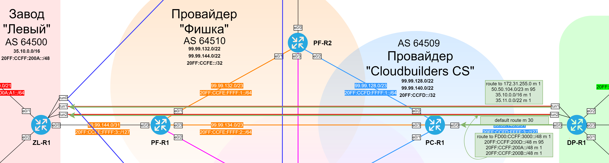
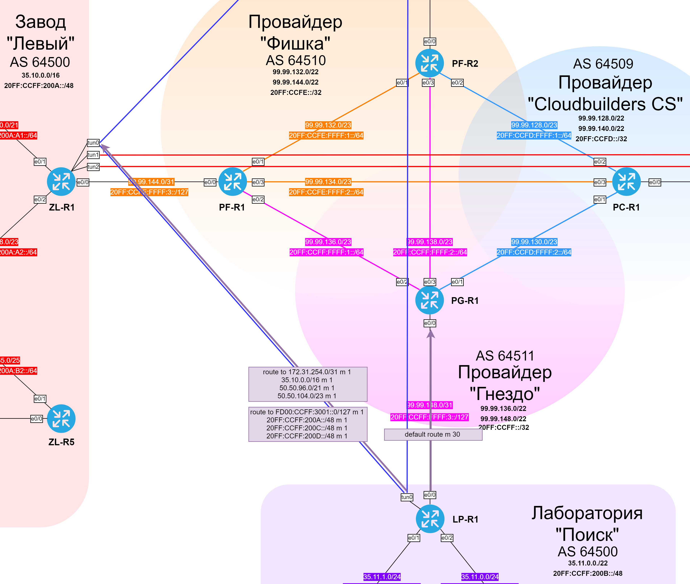
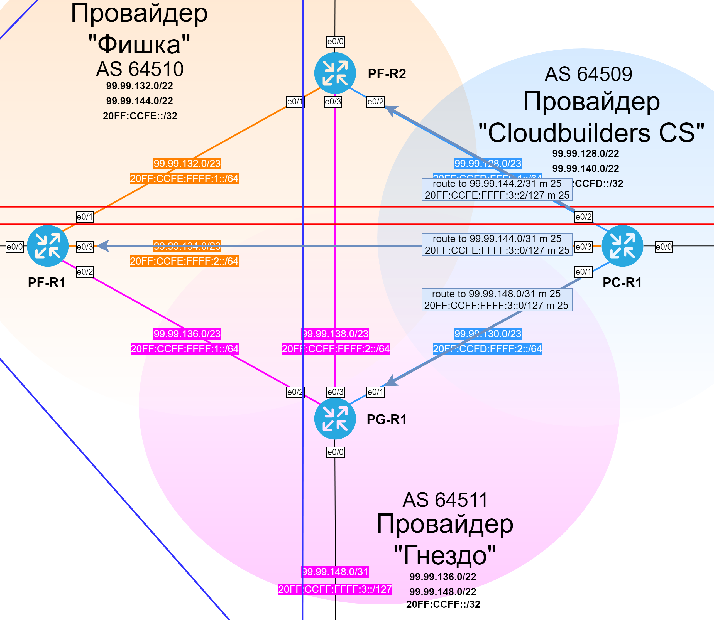
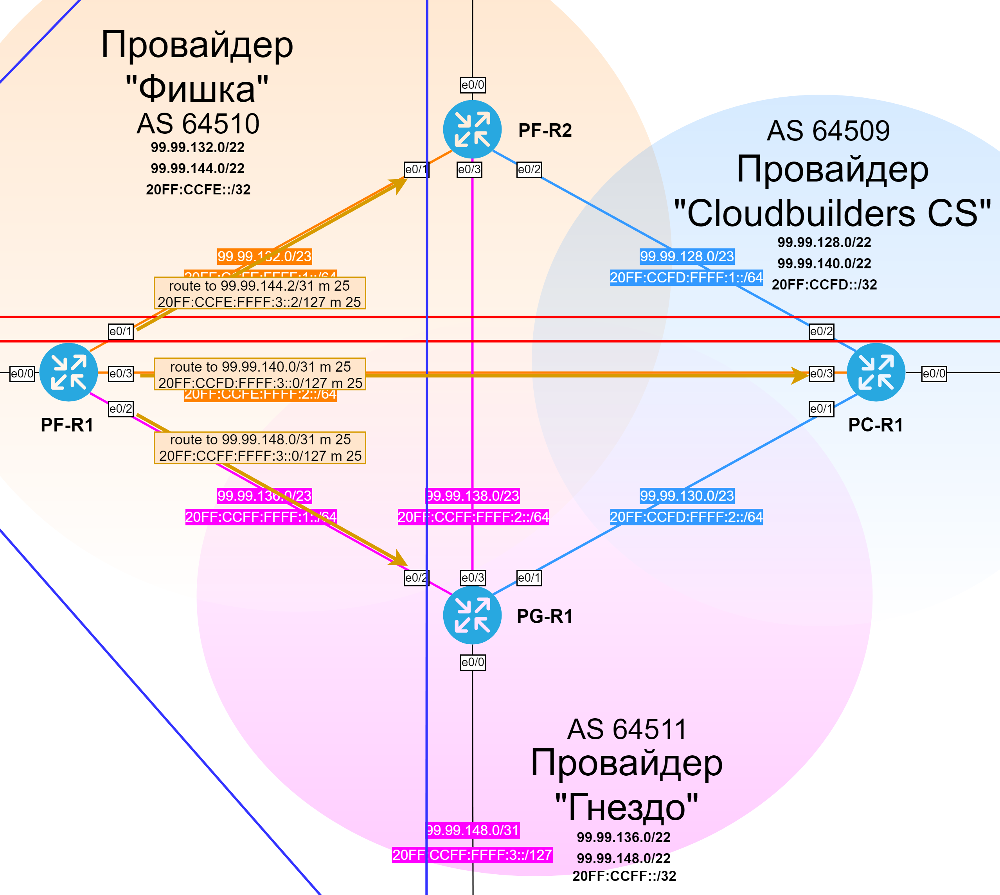
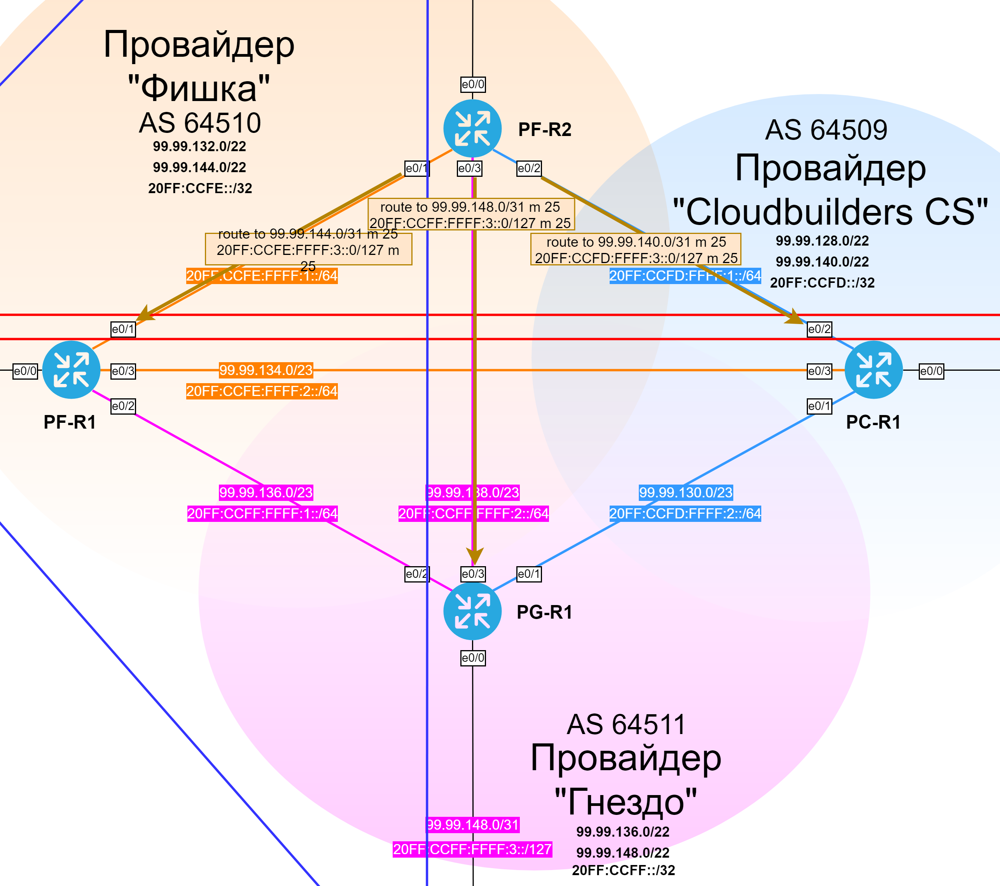
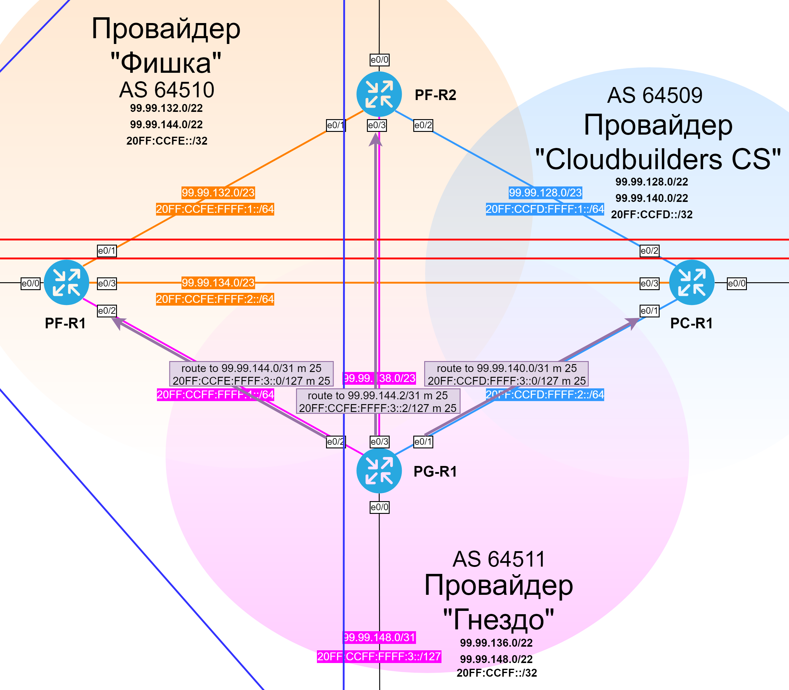
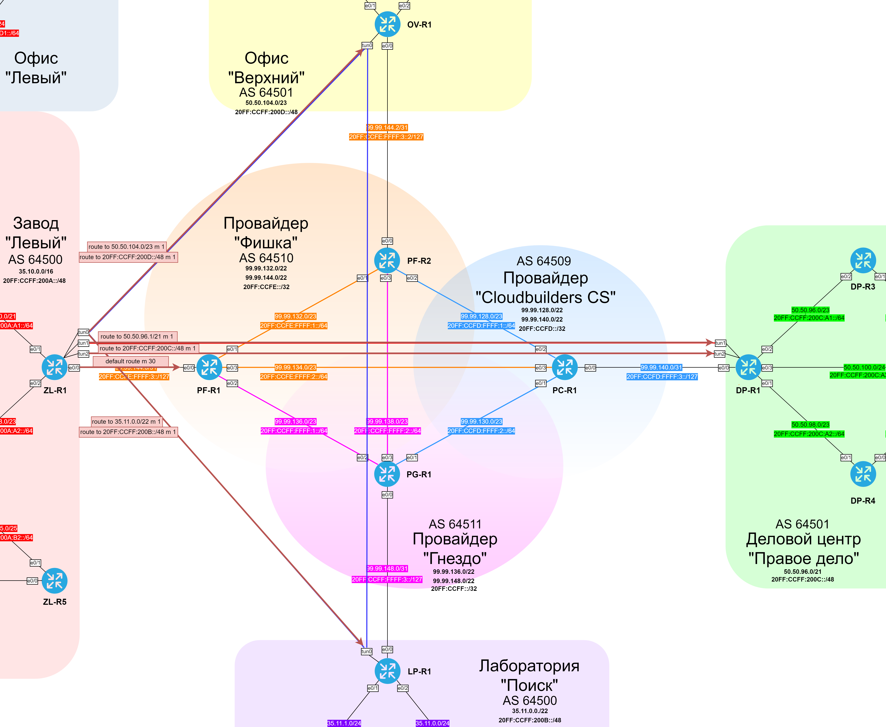
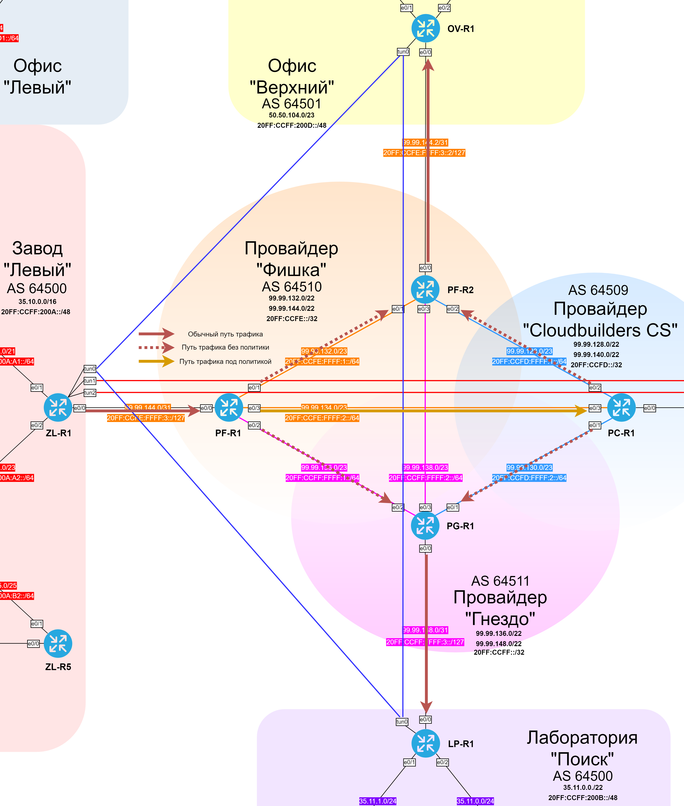
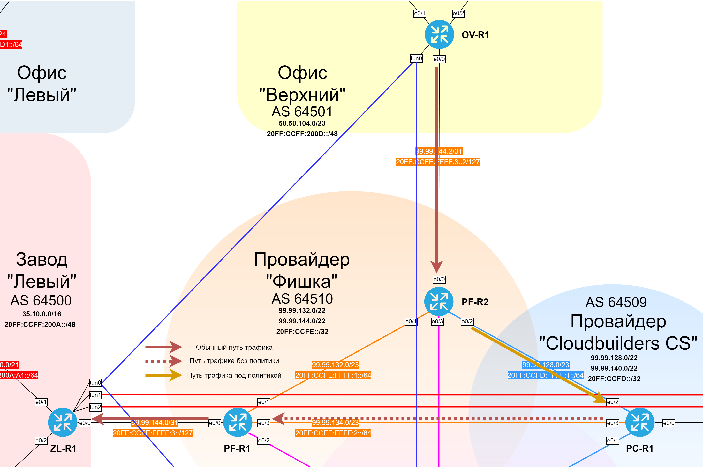

### Таблица статических маршрутов.

| Eq  | Proto |Dst network | Next-hop | Metric | Comment |
|-----|-------|------------|----------|--------|---------|
| DP-R1 | IPv4 | 0.0.0.0/0 | 99.99.140.0 | 30 | to ISP |
| DP-R1 | IPv6 | ::/0 | 20FF:CCFD:FFFF:3::0 | 30 | to ISP |
| DP-R1 | IPv4 | 172.31.255.0/24 | 172.31.254.0 | 1 | to DMVPN net through GRE tunnel |
| DP-R1 | IPv4 | 50.50.104.0/23 | 172.31.254.0 | 95 | to OV-R1 through GRE tunnel |
| DP-R1 | IPv4 | 35.10.0.0/16 | 172.31.254.0 | 1 | to ZL-R1 through GRE tunnel |
| DP-R1 | IPv4 | 35.11.0.0/22 | 72.31.254.0 | 1 | to LP-R1 through GRE tunnel |
| DP-R1 | IPv6 | FD00:CCFF:3000::/48 | FD00:CCFF:3001::0 | 1 | to DMVPN net through GRE tunnel |
| DP-R1 | IPv6 | 20FF:CCFF:200D::/48 | FD00:CCFF:3001::0 | 95 | to OV-R1 through GRE tunnel |
| DP-R1 | IPv6 | 20FF:CCFF:200A::/48 | FD00:CCFF:3001::0 | 1 | to ZL-R1 through GRE tunnel |
| DP-R1 | IPv6 | 20FF:CCFF:200B::/48 | FD00:CCFF:3001::0 | 1 | to LP-R1 through GRE tunnel |
| LP-R1 | IPv4 | 0.0.0.0/0 | 99.99.148.0 | 30 | to ISP |
| LP-R1 | IPv6 | ::/0 | 20FF:CCFF:FFFF:3::0 | 30 | to ISP |
| LP-R1 | IPv4 | 172.31.254.0/31 | 172.31.255.1 | 1 | to GRE tunnel networks through DMVPN |
| LP-R1 | IPv4 | 35.10.0.0/16 | 172.31.255.1 | 1 | to ZL-R1 through DMVPN |
| LP-R1 | IPv4 | 50.50.96.0/21 | 172.31.255.1 | 1 | to DP-R1 through DMVPN |
| LP-R1 | IPv4 | 50.50.104.0/23 | 172.31.255.1 | 1 | to OV-R1 through DMVPN |
| LP-R1 | IPv6 | FD00:CCFF:3001::/127 | FE00:CCFF:3000::1 | 1 | to GRE tunnel networks through DMVPN |
| LP-R1 | IPv6 | 20FF:CCFF:200A::/48 | FE00:CCFF:3000::1 | 1 | to ZL-R1 through DMVPN |
| LP-R1 | IPv6 | 20FF:CCFF:200C::/48 | FE00:CCFF:3000::1 | 1 | to DP-R1 through DMVPN |
| LP-R1 | IPv6 | 20FF:CCFF:200D::/48 | FE00:CCFF:3000::1 | 1 | to OV-R1 through DMVPN |
| OV-R1 | IPv4 | 0.0.0.0/0 | 99.99.144.2 | 30 | to ISP |
| OV-R1 | IPv6 | ::/0 | 20FF:CCFE:FFFF:3::2 | 30 | to ISP |
| OV-R1 | IPv4 | 172.31.254.0/24 | 172.31.255.1 | 1 | to GRE tunnel networks through DMVPN |
| OV-R1 | IPv6 | FD00:CCFF:3001::/127 | FE00:CCFF:3000::1 | 1 | to GRE tunnel networks through DMVPN |
| OV-R1 | IPv4 | 35.10.0.0/16 | 172.31.255.1 | 1 | to ZL-R1 through DMVPN |
| OV-R1 | IPv4 | 50.50.96.0/21 | 172.31.255.1 | 95 | to DP-R1 through DMVPN |
| OV-R1 | IPv4 | 35.11.0.0/22 | 172.31.255.1 | 1 | to LP-R1 through DMVPN |
| OV-R1 | IPv6 | 20FF:CCFF:200A::/48 | FE00:CCFF:3000::1 | 1 | to ZL-R1 through DMVPN |
| OV-R1 | IPv6 | 20FF:CCFF:200C::/48 | FE00:CCFF:3000::1 | 95 | to DP-R1 through DMVPN |
| OV-R1 | IPv6 | 20FF:CCFF:200B::/48 | FE00:CCFF:3000::1 | 1 | to LP-R1 through DMVPN |
| OV-R2 | IPv4 | 0.0.0.0/0 | 50.50.105.1 | 1 | to OV-R1 |
| OV-R2 | IPv6 | ::/0 | 20FF:CCFF:200D:A2::1 | 1 | to OV-R1 |
| OV-R2 | IPv4 | 0.0.0.0/0 | 50.50.105.129 | 1 | to OV-R1 |
| OV-R2 | IPv6 | ::/0 | 20FF:CCFF:200D:A3::1 | 1 | to OV-R1 |
| PC-R1 | IPv4 | 99.99.144.2/31 | 99.99.128.2 | 25 | to OV-R1 through PF-R2 |
| PC-R1 | IPv4 | 99.99.144.0/31 | 99.99.134.1 | 25 | to ZL-R1 through PF-R1 |
| PC-R1 | IPv4 | 99.99.148.0/31 | 99.99.130.2 | 25 | to LP-R1 through PG-R1 |
| PC-R1 | IPv6 | 20FF:CCFE:FFFF:3::2/127 | 20FF:CCFD:FFFF:1::2 | 25 | to OV-R1 through PF-R2 |
| PC-R1 | IPv6 | 20FF:CCFE:FFFF:3::/127 | 20FF:CCFE:FFFF:2::1 | 25 | to ZL-R1 through PF-R1 |
| PC-R1 | IPv6 | 20FF:CCFF:FFFF:3::/127 | 20FF:CCFD:FFFF:2::2 | 25 | to LP-R1 through PG-R1 |
| PF-R1 | IPv4 | 99.99.144.2/31 | 99.99.132.2 | 25 | to OV-R1 through PF-R2 |
| PF-R1 | IPv4 | 99.99.140.0/31 | 99.99.134.2 | 25 | to DP-R1 through PC-R1 |
| PF-R1 | IPv4 | 99.99.148.0/31 | 99.99.136.1 | 25 | to LP-R1 through PG-R1 |
| PF-R1 | IPv6 | 20FF:CCFE:FFFF:3::2/127 | 20FF:CCFE:FFFF:1::2 | 25 | to OV-R1 through PF-R2 |
| PF-R1 | IPv6 | 20FF:CCFD:FFFF:3::/127 | 20FF:CCFE:FFFF:2::2 | 25 | to DP-R1 through PC-R1 |
| PF-R1 | IPv6 | 20FF:CCFF:FFFF:3::/127 | 20FF:CCFF:FFFF:1::1 | 25 | to LP-R1 through PG-R1 |
| PF-R2 | IPv4 | 99.99.144.0/31 | 99.99.132.1 | 25 | to ZL-R1 through PF-R1 |
| PF-R2 | IPv4 | 99.99.148.0/31 | 99.99.138.1 | 25 | to LP-R1 through PG-R1 |
| PF-R2 | IPv4 | 99.99.140.0/31 | 99.99.128.1 | 25 | to DP-R1 through PC-R1 |
| PF-R2 | IPv6 | 20FF:CCFE:FFFF:3::/127 | 20FF:CCFE:FFFF:1::1 | 25 | to ZL-R1 through PF-R1 |
| PF-R2 | IPv6 | 20FF:CCFF:FFFF:3::/127 | 20FF:CCFF:FFFF:2::1 | 25 | to LP-R1 through PG-R1 |
| PF-R2 | IPv6 | 20FF:CCFD:FFFF:3::/127 | 20FF:CCFD:FFFF:1::1 | 25 | to DP-R1 through PC-R1 |
| PG-R1 | IPv4 | 99.99.144.0/31 | 99.99.136.2 | 25 | to ZL-R1 through PF-R1 |
| PG-R1 | IPv4 | 99.99.144.2/31 | 99.99.138.2 | 25 | to OV-R1 through PF-R2 |
| PG-R1 | IPv4 | 99.99.140.0/31 | 99.99.130.1 | 25 | to DP-R1 through PC-R1 |
| PG-R1 | IPv6 | 20FF:CCFE:FFFF:3::/127 | 20FF:CCFF:FFFF:1::2 | 25 | to ZL-R1 through PF-R1 |
| PG-R1 | IPv6 | 20FF:CCFE:FFFF:3::2/127 | 20FF:CCFF:FFFF:2::2 | 25 | to OV-R1 through PF-R2 |
| PG-R1 | IPv6 | 20FF:CCFD:FFFF:3::/127 | 20FF:CCFD:FFFF:2::1 | 25 | to DP-R1 through PC-R1 |
| ZL-R1 | IPv4 | 0.0.0.0/0 | 99.99.144.0 | 30 | to ISP |
| ZL-R1 | IPv6 | ::/0 | 20FF:CCFE:FFFF:3::0 | 30 | to ISP |
| ZL-R1 | IPv4 | 50.50.104.0/23 | 172.31.255.2 | 1 | to OV-R1 through DMVPN |
| ZL-R1 | IPv4 | 50.50.96.0/21 | 172.31.254.1 | 1 | to DP-R1 through GRE tunnel |
| ZL-R1 | IPv4 | 35.11.0.0/22 | 172.31.255.3 | 1 | to LP-R1 through DMVPN |
| ZL-R1 | IPv6 | 20FF:CCFF:200D::/48 | FD00:CCFF:3000::2 | 1 | to OV-R1 through DMVPN |
| ZL-R1 | IPv6 | 20FF:CCFF:200C::/48 | FD00:CCFF:3001::1 | 1 | to R9 through GRE tunnel |
| ZL-R1 | IPv6 | 20FF:CCFF:200B::/48 | FD00:CCFF:3000::3 | 1 | to LP-R1 through DMVPN |

### Графические схемы статических маршрутов
#### DP-R1

#### LP-R1

#### OV-R1, OV-R2, OV-R3

#### PC-R1

#### PF-R1

#### PF-R2

#### PG-R1

#### ZL-R1

### Маршрутизация на основе политик (PBR)

| Eq  | Policy | Next-hop |
|-----|--------|----------|
| PF-R1 | Traffic IPv4 from ZL-R1 to OV-R1 send to PC-R1 | 99.99.134.2 |
| PF-R1 | Traffic IPv6 from ZL-R1 to OV-R1 send to PC-R1 | 20FF:CCFE:FFFF:2::2 |
| PF-R1 | Traffic IPv4 from ZL-R1 to LP-R1 send to PC-R1 | 99.99.134.2 |
| PF-R1 | Traffic IPv6 from ZL-R1 to LP-R1 send to PC-R1 | 20FF:CCFE:FFFF:2::2 |
| PF-R2 | Traffic IPv4 from OV-R1 to ZL-R1 send to PC-R1 | 99.99.128.1 |
| PF-R2 | Traffic IPv6 from OV-R1 to ZL-R1 send to PC-R1 | 20FF:CCFD:FFFF:1::1 | 

### Графические схемы PBR

#### PF-R1

#### PF-R2

