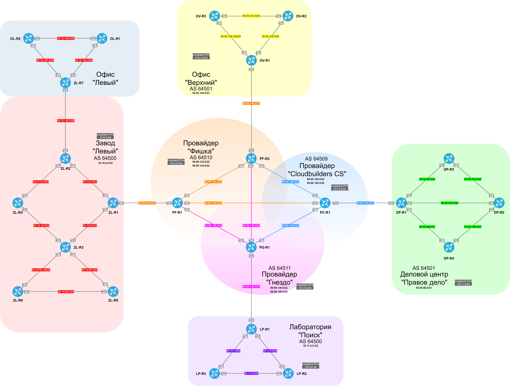

#### Таблица используемых подсетей IPv4.

| ASN | Summary IPv4 | Network IPv4 | Local summ | Site | Equip |
|-------|--------------|--------------|--------------|--------|------------------|
| 64500 | 35.10.0.0/16 | 35.10.0.0/21 | 35.10.0.0/18 | Завод "Левый" | ZL-R1 <> ZL-R2 |
| 64500 | 35.10.0.0/16 | 35.10.8.0/23 | 35.10.0.0/18 | Завод "Левый" | ZL-R1 <> ZL-R3 |
| 64500 | 35.10.0.0/16 | 35.10.10.0/23 | 35.10.0.0/18 | Завод "Левый" | ZL-R2 <> ZL-R4 |
| 64500 | 35.10.0.0/16 | 35.10.12.0/24 | 35.10.0.0/18 | Завод "Левый" | ZL-R3 <> ZL-R4 |
| 64500 | 35.10.0.0/16 | 35.10.64.0/24 | 35.10.0.0/18 | Завод "Левый" | ZL-R5 <> ZL-R6 |
| 64500 | 35.10.0.0/16 | 35.10.65.0/25 | 35.10.0.0/18 | Завод "Левый" | ZL-R3 <> ZL-R5 |
| 64500 | 35.10.0.0/16 | 35.10.65.128/21 | 35.10.0.0/18 | Завод "Левый" | ZL-R3 <> ZL-R6 |
| 64500 | 35.10.0.0/16 | 35.10.128.0/26 | 35.10.128.0/18 | Завод "Левый" | ZL-R2 <> ZL-R7 |
| 64500 | 35.10.0.0/16 | 35.10.192.0/24 | 35.10.192.0/18 | Офис "Левый" | ZL-R7 <> OL-R1 |
| 64500 | 35.10.0.0/16 | 35.10.193.0/24 | 35.10.192.0/18 | Офис "Левый" | ZL-R7 <> OL-R2 |
| 64500 | 35.10.0.0/16 | 35.10.194.0/25 | 35.10.192.0/18 | Офис "Левый" | OL-R1 <> OL-R2 |
| 64500 | 35.11.0.0/22 | 35.11.0.0/24 | | Лаборатория "Поиск" | LP-R1 <> LP-R2 |
| 64500 | 35.11.0.0/22 | 35.11.1.0/24 | | Лаборатория "Поиск" | LP-R1 <> LP-R3 |
| 64500 | 35.11.0.0/22 | 35.11.2.0/24 | | Лаборатория "Поиск" | LP-R2 <> LP-R3 |
| 64501 | 50.50.96.0/21 | 50.50.96.0/23 | | ДЦ "Правое дело" | DP-R1 <> DP-R3 |
| 64501 | 50.50.96.0/21 | 50.50.98.0/23 | | ДЦ "Правое дело" | DP-R1 <> DP-R4 |
| 64501 | 50.50.96.0/21 | 50.50.100.0/24 | | ДЦ "Правое дело" | DP-R1 <> DP-R2 |
| 64501 | 50.50.96.0/21 | 50.50.101.0/24 | | ДЦ "Правое дело" | DP-R2 <> DP-R3 |
| 64501 | 50.50.96.0/21 | 50.50.102.0/24 | | ДЦ "Правое дело" | DP-R2 <> DP-R4 |
| 64501 | 50.50.104.0/23 | 50.50.104.0/24 | | Офис "Верхний" | OV-R2 <> DP-R3 |
| 64501 | 50.50.104.0/23 | 50.50.105.0/25 | | Офис "Верхний" | OV-R1 <> DP-R2 |
| 64501 | 50.50.104.0/23 | 50.50.105.128/25 | | Офис "Верхний" | OV-R1 <> DP-R3 |
| 64509 | 99.99.128.0/22 | 99.99.128.0/23 | | Cloudbuilders CS ISP | PC-R1 <> PF-R2 |
| 64509 | 99.99.128.0/22 | 99.99.130.0/23 | | Cloudbuilders CS ISP | PC-R1 <> PG-R1 |
| 64509 | 99.99.140.0/22 | 99.99.140.0/31 | | Cloudbuilders CS ISP clients | PC-R1 <> DP-R1 |
| 64510 | 99.99.132.0/22 | 99.99.132.0/23 | | Фишка ISP | PF-R1 <> PF-R2 | 
| 64510 | 99.99.132.0/22 | 99.99.134.0/23 | | Фишка ISP | PF-R1 <> PC-R1 |
| 64510 | 99.99.144.0/22 | 99.99.144.0/31 | | Фишка ISP clients | PF-R1 <> ZL-R1 | 
| 64510 | 99.99.144.0/22 | 99.99.144.2/31 | | Фишка ISP clients | PF-R2 <> OV-R1 | 
| 64511 | 99.99.136.0/22 | 99.99.136.0/23 | | Гнездо ISP | PG-R1 <> PF-R1 |
| 64511 | 99.99.136.0/22 | 99.99.138.0/23 | | Гнездо ISP | PG-R1 <> PF-R2 |
| 64511 | 99.99.148.0/22 | 99.99.148.0/31 | | Гнездо ISP clients | PG-R1 <> LP-R1 |

#### Таблица приватных сетей IPv4, их местоположение и назначение.

| Network IPv4 | Site & Description |
|--------------|--------------------|
| 10.0.0.0/8   | Используем везде для loopback, маршрутизируется только в пределах каждой AS |
| 172.31.255.0/24 | Для сети DMVPN. Hub на заводе "Левый" (ZL-R1), Spoke: Лаборатория "Поиск" (LP-R1), Офис "Верхний" (OV-R1) |
| 172.31.254.0/31 | Для GRE-туннеля между заводом "Левый" (ZL-R1) и ДЦ "Правое дело" (DP-R1) |

#### Схема сетей IPv4 и их местоположение.

