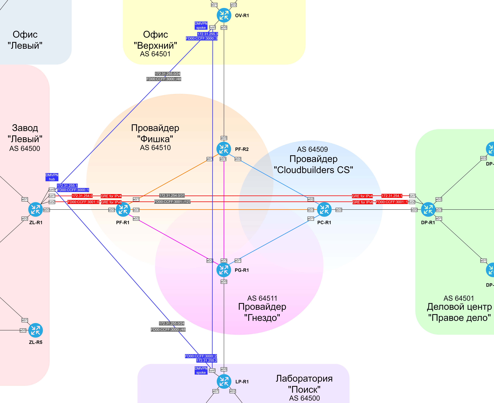

#### GRE

Между ZL-R1 и DP-R1 подняты два GRE тоннеля: для IPv4 и для IPv6.

  [GRE на ZL-R1](../configs/ZL-R1#L99-L128)
  [GRE на DP-R1](../configs/DP-R1#L56-L81)

| Network IPv6 | Site & Description |
|--------------|--------------------|
| 172.31.254.0/31 | Для GRE-туннеля между заводом "Левый" (ZL-R1) и ДЦ "Правое дело" (DP-R1) |
| FD00:CCFF:3001::/127 | Для GRE-туннеля между заводом "Левый" (ZL-R1) и ДЦ "Правое дело" (DP-R1) |

| Equip | Port | AddrTyp | Address | Network | Description |
|-------|------|---------|---------|---------|-------------|
| ZL-R1 | tunnel1 | IPv4 | 172.31.254.0 | 172.31.254.0/31 | GRE IPv4 |
| ZL-R1 | tunnel2 | IPv6 | FD00:CCFF:3001::0 | FD00:CCFF:3001::/127 | GRE IPv6 |
| ZL-R1 | tunnel2 | IPv6 LL | FE80::1  | FE80::/10 | GRE IPv6 |
| DP-R1 | tunnel1 | IPv4 | 172.31.254.1 | 172.31.254.0/31 | GRE IPv4 |
| DP-R1 | tunnel2 | IPv6 | FD00:CCFF:3001::1 | FD00:CCFF:3001::/127 | GRE IPv6 |
| DP-R1 | tunnel2 | IPv6 LL | FE80::2  | FE80::/10 | GRE IPv6 |

| Equip | Proto | Dst net | Next-hop | M | Comment |
|-------|-------|---------|----------|---|---------|
| DP-R1 | IPv4 | 172.31.255.0/24 | 172.31.254.0 | 1 | to DMVPN net through GRE tunnel |
| DP-R1 | IPv4 | 50.50.104.0/23 | 172.31.254.0 | 95 | to OV-R1 through GRE tunnel |
| DP-R1 | IPv4 | 35.10.0.0/16 | 172.31.254.0 | 1 | to ZL-R1 through GRE tunnel |
| DP-R1 | IPv4 | 35.11.0.0/22 | 72.31.254.0 | 1 | to LP-R1 through GRE tunnel |
| DP-R1 | IPv6 | FD00:CCFF:3000::/48 | FD00:CCFF:3001::0 | 1 | to DMVPN net through GRE tunnel |
| DP-R1 | IPv6 | 20FF:CCFF:200D::/48 | FD00:CCFF:3001::0 | 95 | to OV-R1 through GRE tunnel |
| DP-R1 | IPv6 | 20FF:CCFF:200A::/48 | FD00:CCFF:3001::0 | 1 | to ZL-R1 through GRE tunnel |
| DP-R1 | IPv6 | 20FF:CCFF:200B::/48 | FD00:CCFF:3001::0 | 1 | to LP-R1 through GRE tunnel |
| ZL-R1 | IPv4 | 50.50.96.0/21 | 172.31.254.1 | 1 | to DP-R1 through GRE tunnel |
| ZL-R1 | IPv6 | 20FF:CCFF:200C::/48 | FD00:CCFF:3001::1 | 1 | to R9 through GRE tunnel |

#### DMVPN

Между ZL-R1, OV-R1 и LP-R1 поднят DMVPN в 3-ей фазе, где ZL-R1 - hub, а OV-R1 и LP-R1 - spoke.

  [DMVPN hub на ZL-R1](../configs/ZL-R1#L67-L97)
  [DMVPN spoke на OV-R1](../configs/OV-R1#L81-L117)
  [DMVPN spoke на LP-R1](../configs/LP-R1#L67-L103)

| Network IPv6 | Site & Description |
|--------------|--------------------|
| 172.31.255.0/24 | Для сети DMVPN. Hub на заводе "Левый" (ZL-R1), Spoke: Лаборатория "Поиск" (LP-R1), Офис "Верхний" (OV-R1) |
| FD00:CCFF:3000::/48 | Для сети DMVPN. Hub на заводе "Левый" (ZL-R1), Spoke: Лаборатория "Поиск" (LP-R1), Офис "Верхний" (OV-R1) |

| Equip | Port | AddrTyp | Address | Network | Description |
|-------|------|---------|---------|---------|-------------|
| ZL-R1 | tunnel0 | IPv4 | 172.31.255.1 | 172.31.255.0/24 | DMVPN hub |
| ZL-R1 | tunnel0 | IPv6 | FD00:CCFF:3000::1 | FD00:CCFF:3000::/48 | DMVPN hub |
| ZL-R1 | tunnel0 | IPv6 LL | FE80::1  | FE80::/10 | link-local |
| LP-R1 | tunnel0 | IPv4 | 172.31.255.2 | 172.31.255.0/24 | DMVPN spoke |
| LP-R1 | tunnel0 | IPv6 | FD00:CCFF:3000::2 | FD00:CCFF:3000::/48 | DMVPN spoke |
| LP-R1 | tunnel0 | IPv6 LL | FE80::2  | FE80::/10 | link-local |
| OV-R1 | tunnel0 | IPv4 | 172.31.255.3 | 172.31.255.0/24 | DMVPN spoke |
| OV-R1 | tunnel0 | IPv6 | FD00:CCFF:3000::3 | FD00:CCFF:3000::/48 | DMVPN spoke |
| OV-R1 | tunnel0 | IPv6 LL | FE80::3  | FE80::/10 | link-local |

| Equip | Proto | Dst net | Next-hop | M | Comment |
|-------|-------|---------|----------|---|---------|
| LP-R1 | IPv4 | 172.31.254.0/31 | 172.31.255.1 | 1 | to GRE tunnel networks through DMVPN |
| LP-R1 | IPv4 | 35.10.0.0/16 | 172.31.255.1 | 1 | to ZL-R1 through DMVPN |
| LP-R1 | IPv4 | 50.50.96.0/21 | 172.31.255.1 | 1 | to DP-R1 through DMVPN |
| LP-R1 | IPv4 | 50.50.104.0/23 | 172.31.255.1 | 1 | to OV-R1 through DMVPN |
| LP-R1 | IPv6 | FD00:CCFF:3001::/127 | FE00:CCFF:3000::1 | 1 | to GRE tunnel networks through DMVPN |
| LP-R1 | IPv6 | 20FF:CCFF:200A::/48 | FE00:CCFF:3000::1 | 1 | to ZL-R1 through DMVPN |
| LP-R1 | IPv6 | 20FF:CCFF:200C::/48 | FE00:CCFF:3000::1 | 1 | to DP-R1 through DMVPN |
| LP-R1 | IPv6 | 20FF:CCFF:200D::/48 | FE00:CCFF:3000::1 | 1 | to OV-R1 through DMVPN |
| OV-R1 | IPv4 | 172.31.254.0/24 | 172.31.255.1 | 1 | to GRE tunnel networks through DMVPN |
| OV-R1 | IPv6 | FD00:CCFF:3001::/127 | FE00:CCFF:3000::1 | 1 | to GRE tunnel networks through DMVPN |
| OV-R1 | IPv4 | 35.10.0.0/16 | 172.31.255.1 | 1 | to ZL-R1 through DMVPN |
| OV-R1 | IPv4 | 50.50.96.0/21 | 172.31.255.1 | 95 | to DP-R1 through DMVPN |
| OV-R1 | IPv4 | 35.11.0.0/22 | 172.31.255.1 | 1 | to LP-R1 through DMVPN |
| OV-R1 | IPv6 | 20FF:CCFF:200A::/48 | FE00:CCFF:3000::1 | 1 | to ZL-R1 through DMVPN |
| OV-R1 | IPv6 | 20FF:CCFF:200C::/48 | FE00:CCFF:3000::1 | 95 | to DP-R1 through DMVPN |
| OV-R1 | IPv6 | 20FF:CCFF:200B::/48 | FE00:CCFF:3000::1 | 1 | to LP-R1 through DMVPN |
| ZL-R1 | IPv4 | 50.50.104.0/23 | 172.31.255.2 | 1 | to OV-R1 through DMVPN |
| ZL-R1 | IPv4 | 35.11.0.0/22 | 172.31.255.3 | 1 | to LP-R1 through DMVPN |
| ZL-R1 | IPv6 | 20FF:CCFF:200D::/48 | FD00:CCFF:3000::2 | 1 | to OV-R1 through DMVPN |
| ZL-R1 | IPv6 | 20FF:CCFF:200B::/48 | FD00:CCFF:3000::3 | 1 | to LP-R1 through DMVPN |

#### Графическая схема туннелей.

