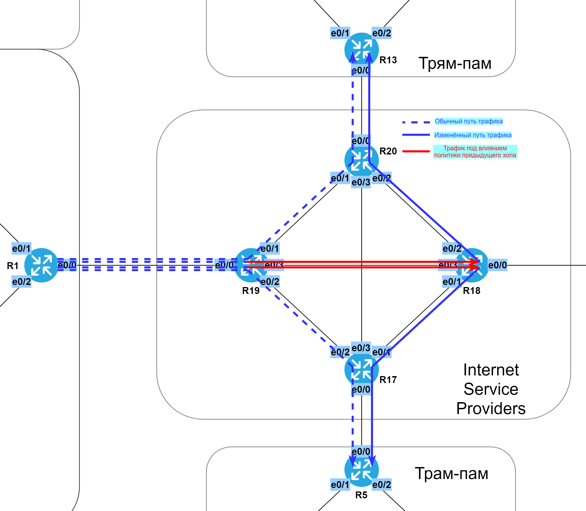

# Статическая маршрутизация. Policy-based routing & IP SLA.

###  Задание:

  1. Настроить статические маршруты так, чтобы маршрутизаторы R1, R5, R9 и R13 стали доступны между собой;
  2. На маршрутизаторе R19 необходимо настроить политику маршрутизации так, чтобы пакеты до R13 ходили через R18-R20;
  3. На маршрутизаторе R19 необходимо настроить политику маршрутизации так, чтобы пакет до R5 ходили через R18-R17;
  4. Разобраться в технологии IP SLA и настроить политику маршрутизации на основе мониторинга каналов. При отключении линка R19-R18, маршруты должны пойти между R19-R20 и R19-R17;
  5. Задокументировать все изменения.


###  Решение:

  1. [Задокументируем требуемые изменения в статической маршрутизации](lab02#1-%D0%B7%D0%B0%D0%B4%D0%BE%D0%BA%D1%83%D0%BC%D0%B5%D0%BD%D1%82%D0%B8%D1%80%D1%83%D0%B5%D0%BC-%D1%82%D1%80%D0%B5%D0%B1%D1%83%D0%B5%D0%BC%D1%8B%D0%B5-%D0%B8%D0%B7%D0%BC%D0%B5%D0%BD%D0%B5%D0%BD%D0%B8%D1%8F-%D0%B2-%D1%81%D1%82%D0%B0%D1%82%D0%B8%D1%87%D0%B5%D1%81%D0%BA%D0%BE%D0%B9-%D0%BC%D0%B0%D1%80%D1%88%D1%80%D1%83%D1%82%D0%B8%D0%B7%D0%B0%D1%86%D0%B8%D0%B8)
     - [Пример настройки статического маршрута;](lab02#%D0%BF%D1%80%D0%B8%D0%BC%D0%B5%D1%80-%D0%BD%D0%B0%D1%81%D1%82%D1%80%D0%BE%D0%B9%D0%BA%D0%B8-%D1%81%D1%82%D0%B0%D1%82%D0%B8%D1%87%D0%B5%D1%81%D0%BA%D0%BE%D0%B3%D0%BE-%D0%BC%D0%B0%D1%80%D1%88%D1%80%D1%83%D1%82%D0%B0)
     - [Просмотр настроенных статических маршрутов.](lab02#%D0%BF%D1%80%D0%BE%D1%81%D0%BC%D0%BE%D1%82%D1%80-%D0%BD%D0%B0%D1%81%D1%82%D1%80%D0%BE%D0%B5%D0%BD%D0%BD%D1%8B%D1%85-%D1%81%D1%82%D0%B0%D1%82%D0%B8%D1%87%D0%B5%D1%81%D0%BA%D0%B8%D1%85-%D0%BC%D0%B0%D1%80%D1%88%D1%80%D1%83%D1%82%D0%BE%D0%B2)
  2. [Маршрутизация на основе политик (Policy-based routing)](lab02#2-%D0%BC%D0%B0%D1%80%D1%88%D1%80%D1%83%D1%82%D0%B8%D0%B7%D0%B0%D1%86%D0%B8%D1%8F-%D0%BD%D0%B0-%D0%BE%D1%81%D0%BD%D0%BE%D0%B2%D0%B5-%D0%BF%D0%BE%D0%BB%D0%B8%D1%82%D0%B8%D0%BA-policy-based-routing)
     - [Графическая схема PBR по заданию;](lab02#%D0%B3%D1%80%D0%B0%D1%84%D0%B8%D1%87%D0%B5%D1%81%D0%BA%D0%B0%D1%8F-%D1%81%D1%85%D0%B5%D0%BC%D0%B0-pbr-%D0%BF%D0%BE-%D0%B7%D0%B0%D0%B4%D0%B0%D0%BD%D0%B8%D1%8E)
     - [Пример настройки PBR;](lab02#%D0%BF%D1%80%D0%B8%D0%BC%D0%B5%D1%80-%D0%BD%D0%B0%D1%81%D1%82%D1%80%D0%BE%D0%B9%D0%BA%D0%B8-pbr)
     - [Просмотр настроек и результатов работы PBR.](lab02#%D0%BF%D1%80%D0%BE%D1%81%D0%BC%D0%BE%D1%82%D1%80-%D0%BD%D0%B0%D1%81%D1%82%D1%80%D0%BE%D0%B5%D0%BA-%D0%B8-%D1%80%D0%B5%D0%B7%D1%83%D0%BB%D1%8C%D1%82%D0%B0%D1%82%D0%BE%D0%B2-%D1%80%D0%B0%D0%B1%D0%BE%D1%82%D1%8B-pbr)
  3. [IP SLA](lab02#3-ip-sla)
     - [Пример настройки PBR с SLA;](lab02#%D0%BF%D1%80%D0%B8%D0%BC%D0%B5%D1%80-%D0%BD%D0%B0%D1%81%D1%82%D1%80%D0%BE%D0%B9%D0%BA%D0%B8-pbr-%D1%81-sla)
     - [Просмотр настроек и результатов работы SLA.](lab02#%D0%BF%D1%80%D0%BE%D1%81%D0%BC%D0%BE%D1%82%D1%80-%D0%BD%D0%B0%D1%81%D1%82%D1%80%D0%BE%D0%B5%D0%BA-%D0%B8-%D1%80%D0%B5%D0%B7%D1%83%D0%BB%D1%8C%D1%82%D0%B0%D1%82%D0%BE%D0%B2-%D1%80%D0%B0%D0%B1%D0%BE%D1%82%D1%8B-sla)
  4. [Конфигурационные файлы](configs/)


###  1. Задокументируем требуемые изменения в статической маршрутизации.


  Таблица статических маршрутов.

| Eq  | Prot | Destination              | Gateway                | M | Comment (name)                       |
|-----|------|--------------------------|------------------------|---|--------------------------------------|
| R1  | IPv4 | 0.0.0.0/0                | 172.16.19.1            | 1 | to R19 (ISP)                         |
| R1  | IPv6 | ::/0                     | 20FF:CCFF:1000:19::1   | 1 | to R19 (ISP)                         |
| R5  | IPv4 | 0.0.0.0/0                | 172.16.17.1            | 1 | to R17 (ISP)                         |
| R5  | IPv6 | ::/0                     | 20FF:CCFF:1000:17::1   | 1 | to R17 (ISP)                         |
| R9  | IPv4 | 0.0.0.0/0                | 172.16.18.1            | 1 | to R18 (ISP)                         |
| R9  | IPv6 | ::/0                     | 20FF:CCFF:1000:18::1   | 1 | to R18 (ISP)                         |
| R13 | IPv4 | 0.0.0.0/0                | 172.16.20.1            | 1 | to R20 (ISP)                         |
| R13 | IPv6 | ::/0                     | 20FF:CCFF:1000:20::1   | 1 | to R20 (ISP)                         |
| R17 | IPv4 | 172.16.18.0/29           | 90.90.129.18/24        | 1 | to R18                               |
| R17 | IPv4 | 172.16.19.0/30           | 90.90.128.19/24        | 1 | to R19                               |
| R17 | IPv4 | 172.16.20.0/30           | 90.90.131.20/25        | 1 | to R20                               |
| R17 | IPv6 | 20FF:CCFF:1000:18::/64   | 20FF:CCFF:FFFF:2::18   | 1 | to R18                               |
| R17 | IPv6 | 20FF:CCFF:1000:19::/64   | 20FF:CCFF:FFFF:1::19   | 1 | to R19                               |
| R17 | IPv6 | 20FF:CCFF:1000:20::/64   | 20FF:CCFF:FFFF:5::20   | 1 | to R20                               |
| R18 | IPv4 | 172.16.17.0/30           | 90.90.129.17/24        | 1 | to R17                               |
| R18 | IPv4 | 172.16.19.0/30           | 90.90.131.130/25       | 1 | to R19                               |
| R18 | IPv4 | 172.16.20.0/30           | 90.90.130.20/25        | 1 | to R20                               |
| R18 | IPv6 | 20FF:CCFF:1000:17::/64   | 20FF:CCFF:FFFF:2::17   | 1 | to R17                               |
| R18 | IPv6 | 20FF:CCFF:1000:19::/64   | 20FF:CCFF:FFFF:6::19   | 1 | to R19                               |
| R18 | IPv6 | 20FF:CCFF:1000:20::/64   | 20FF:CCFF:FFFF:3::20   | 1 | to R20                               |
| R19 | IPv4 | 172.16.17.0/30           | 90.90.128.17/24        | 1 | to R17                               |
| R19 | IPv4 | 172.16.18.0/29           | 90.90.131.129/25       | 1 | to R18                               |
| R19 | IPv4 | 172.16.20.0/30           | 90.90.130.130/25       | 1 | to R20                               |
| R19 | IPv6 | 20FF:CCFF:1000:17::/64   | 20FF:CCFF:FFFF:1::17   | 1 | to R17                               |
| R19 | IPv6 | 20FF:CCFF:1000:18::/64   | 20FF:CCFF:FFFF:6::18   | 1 | to R18                               |
| R19 | IPv6 | 20FF:CCFF:1000:20::/64   | 20FF:CCFF:FFFF:4::20   | 1 | to R20                               |
| R20 | IPv4 | 172.16.17.0/30           | 90.90.131.17/25        | 1 | to R17                               |
| R20 | IPv4 | 172.16.18.0/29           | 90.90.130.18/25        | 1 | to R18                               |
| R20 | IPv4 | 172.16.19.0/30           | 90.90.130.129/25       | 1 | to R19                               |
| R20 | IPv6 | 20FF:CCFF:1000:17::/64   | 20FF:CCFF:FFFF:5::17   | 1 | to R17                               |
| R20 | IPv6 | 20FF:CCFF:1000:18::/64   | 20FF:CCFF:FFFF:3::18   | 1 | to R18                               |
| R20 | IPv6 | 20FF:CCFF:1000:19::/64   | 20FF:CCFF:FFFF:4::19   | 1 | to R19                               |

###  Графическая схема статических маршрутов:


### Пример настройки статического маршрута

```
conf t
 ip route 0.0.0.0 0.0.0.0 172.16.19.1 1 name "to R19 (ISP)"
 ipv6 route ::/0 20FF:CCFF:1000:19::1 1 name "to R19 (ISP)"
 exit
```

### Просмотр настроенных статических маршрутов

```
show ip route static
show ipv6 route static
```

Полные файлы изменений приведены [здесь](configs/).

###  2. Маршрутизация на основе политик (Policy-based routing).

Маршрутизация на основе политик (policy based routing, PBR) позволяет маршрутизировать трафик на основании заданных политик,
 тогда как в обычной маршрутизации, только IP-адрес получателя определяет каким образом будет передан пакет. 

###  Графическая схема PBR по заданию:



Суть настройки в данном случае сводится к созданию корректного access-list,
 привязке его к соответствующему route-map, который впоследствии навешивается на интерфейс.   

###  Пример настройки PBR

```
conf t
 ip access-list extended ACL_PBR_TO_R13
  permit ip any host 172.16.20.2
  deny ip any any
  exit
!
 route-map PBR_TO_R13_AND_R5 permit 10
  match ip address ACL_PBR_TO_R13
  set ip next-hop 90.90.131.129
  exit
!
 interface e0/0
  ip policy route-map PBR_TO_R13_AND_R5
  exit
 exit
```

###  Просмотр настроек и результатов работы PBR

```
show access-lists
show route-map
show ip policy
show ipv6 policy
```

###  3. IP SLA

Суть в привязке тестов IP SLA к route-map. Применяется route-map или нет теперь будет зависеть от результатов тестирования.

###  Пример настройки PBR с IP SLA

```
conf t
 ip access-list extended ACL_PBR_TO_R13
  permit ip any host 172.16.20.2
  deny ip any any
  exit
!
 ip sla 1
  icmp-echo 90.90.131.129 source-interface e0/3
  threshold 1000
  timeout 1500
  frequency 3
  exit
 ip sla schedule 1 life forever start-time now
!
 track 100 ip sla 1 reachability
  delay down 10 up 5
  exit
!
 route-map PBR_TO_R13_AND_R5 permit 10
  match ip address ACL_PBR_TO_R13
  set ip next-hop 90.90.131.129
  set ip next-hop verify-availability 90.90.131.129 1 track 100
  exit
!
 interface e0/0
  ip policy route-map PBR_TO_R13_AND_R5
  exit
 exit
```

###  Просмотр настроек и результатов работы IP SLA

```
sh run | s sla
sh ip sla summary
sh ip sla statistics
```

Файл изменений на R19 [здесь](configs/R19).

