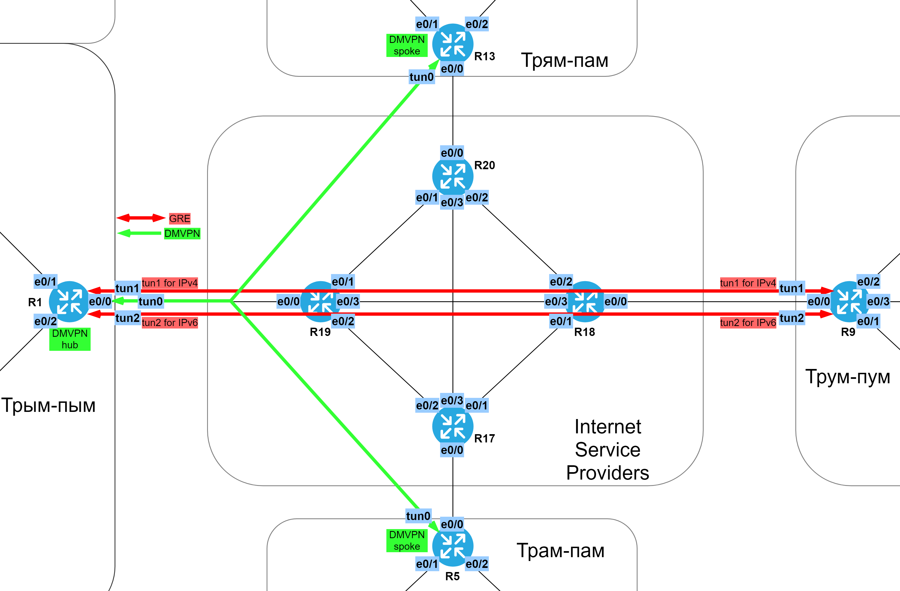
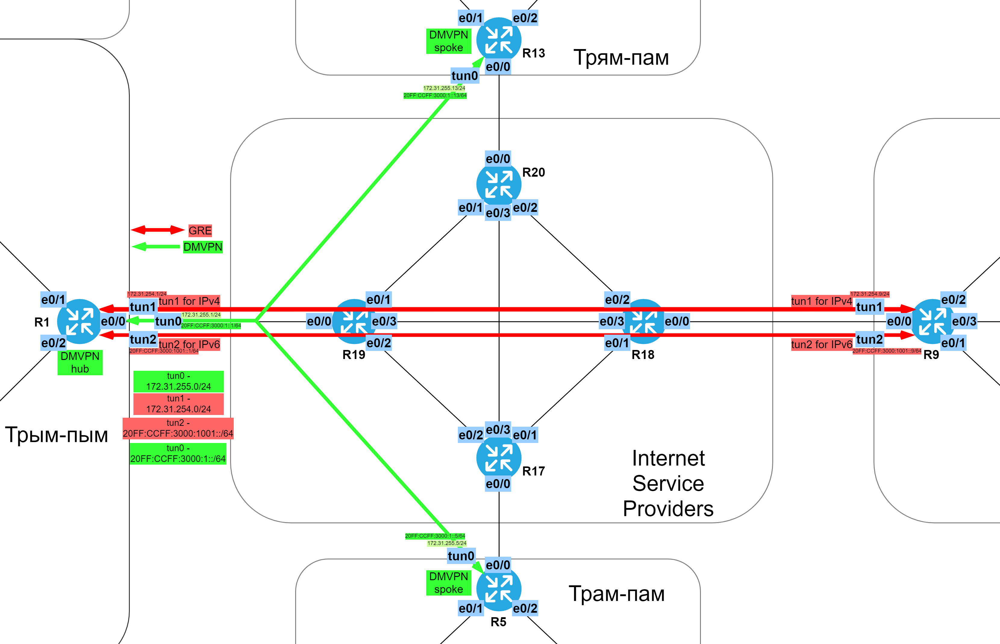

# GRE и базовый DMVPN.

###  Задание:

  1. Настроить DMVPN между пограничными маршрутизаторами (R1; R5; R13). Центром должен стать R1;
  2. Настроить GRE между R1 и R9;
  3. Добавить статические маршруты между офисами через VPN;
  4. Задокументировать все изменения.

###  Решение:

  DMVPN во 2й фазе (IPv4+IPv6 поверх IPv4) и 2 туннеля GRE (IPv4 и IPv6 отдельно).
  Все файлы изменений приведены [здесь](configs/).

  Графическая схема каналов VPN:

  Таблица VPN сетей.

| Network IPv4     | Summary net    | Network IPv6             | Summary net         | Description   |
|-----------------:|:---------------|-------------------------:|:--------------------|:-------------:|
| 172.31.255.0/24  | not used       | 20FF:CCFF:3000:1::/64    | not used            | DMVPN network |
| 172.31.254.0/24  | not used       | 20FF:CCFF:3000:1001::/64 | not used            | GRE tun net   |

  Графическая схема сетей и адресов VPN:

  Таблица сетевых адресов на tun-интерфейсах маршрутизаторов.

| Equip | Port | AddrTyp | Address                   | Network                  | Description     |
|-------|------|---------|---------------------------|--------------------------|-----------------|
| R1    | tun0 | IPv4    | 172.31.255.1/24           | 172.31.255.0/24          | DMVPN hub       |
| R1    | tun0 | IPv6    | 20FF:CCFF:3000:1::1/64    | 20FF:CCFF:3000:1::/64    | DMVPN hub       |
| R1    | tun0 | IPv6 LL | FE80::1                   | FE80::/10                | link-local tun0 |
| R1    | tun1 | IPv4    | 172.31.254.1/24           | 172.31.254.0/24          | GRE tun to R9   |
| R1    | tun2 | IPv6    | 20FF:CCFF:3000:1001::1/64 | 20FF:CCFF:3000:1001::/64 | GRE tun to R9   |
| R1    | tun2 | IPv6 LL | FE80::1                   | FE80::/10                | link-local tun2 |
| R5    | tun0 | IPv4    | 172.31.255.5/24           | 172.31.255.0/24          | DMVPN to R1     |
| R5    | tun0 | IPv6    | 20FF:CCFF:3000:1::5/64    | 20FF:CCFF:3000:1::/64    | DMVPN to R1     |
| R5    | tun0 | IPv6 LL | FE80::5                   | FE80::/10                | link-local tun0 |
| R9    | tun1 | IPv4    | 172.31.254.9/24           | 172.31.254.0/24          | GRE tun1 to R1  |
| R9    | tun2 | IPv6    | 20FF:CCFF:3000:1001::9/64 | 20FF:CCFF:3000:1001::/64 | GRE tun2 to R1  |
| R9    | tun2 | IPv6 LL | FE80::9                   | FE80::/10                | link-local tun2 |
| R13   | tun0 | IPv4    | 172.31.255.13/24          | 172.31.255.0/24          | DMVPN to R1     |
| R13   | tun0 | IPv6    | 20FF:CCFF:3000:1::13/64   | 20FF:CCFF:3000:1::/64    | DMVPN to R1     |
| R13   | tun0 | IPv6 LL | FE80::13                  | FE80::/10                | link-local tun0 |

  Графическая схема статических маршрутов через VPN:

  Таблица статических маршрутов с суммаризацией для VPN.

| Eq  | Prot | Destination              | Gateway                | M | Comment (name)                       |
|-----|------|--------------------------|------------------------|---|--------------------------------------|
| R1  | IPv4 | 50.50.104.0/23           | 172.31.255.5           | 1 | to R5 through dmvpn                  |
| R1  | IPv4 | 50.50.96.0/21            | 172.31.254.9           | 1 | to R9 through gre tunnel             |
| R1  | IPv4 | 35.11.0.0/16             | 172.31.255.13          | 1 | to R13 through dmvpn                 |
| R1  | IPv6 | 20FF:CCFF:200B::/48      | 20FF:CCFF:3000:1::5    | 1 | to R5 through dmvpn                  |
| R1  | IPv6 | 20FF:CCFF:200A::/48      | 20FF:CCFF:3000:1001::9 | 1 | to R9 through gre tunnel             |
| R1  | IPv6 | 20FF:CCFF:200D::/48      | 20FF:CCFF:3000:1::13   | 1 | to R13 through dmvpn                 |
| R5  | IPv4 | 172.31.254.0/24          | 172.31.255.1           | 1 | to gre tunnel networks through dmvpn |
| R5  | IPv4 | 35.10.0.0/16             | 172.31.255.1           | 1 | to R1 through dmvpn                  |
| R5  | IPv4 | 50.50.96.0/21            | 172.31.255.1           | 1 | to R9 through dmvpn                  |
| R5  | IPv4 | 35.11.0.0/16             | 172.31.255.1           | 1 | to R13 through dmvpn                 |
| R5  | IPv6 | 20FF:CCFF:3000:1001::/64 | 20FF:CCFF:3000:1::1    | 1 | to gre tunnel networks through dmvpn |
| R5  | IPv6 | 20FF:CCFF:200C::/48      | 20FF:CCFF:3000:1::1    | 1 | to R1 through dmvpn                  |
| R5  | IPv6 | 20FF:CCFF:200A::/48      | 20FF:CCFF:3000:1::1    | 1 | to R9 through dmvpn                  |
| R5  | IPv6 | 20FF:CCFF:200D::/48      | 20FF:CCFF:3000:1::1    | 1 | to R13 through dmvpn                 |
| R9  | IPv4 | 172.31.255.0/24          | 172.31.254.1           | 1 | to dmvpn network through gre tunnel  |
| R9  | IPv4 | 50.50.104.0/23           | 172.31.254.1           | 1 | to R5 through gre tunnel             |
| R9  | IPv4 | 35.10.0.0/16             | 172.31.254.1           | 1 | to R1 through gre tunnel             |
| R9  | IPv4 | 35.11.0.0/16             | 172.31.254.1           | 1 | to R13 through gre tunnel            |
| R9  | IPv6 | 20FF:CCFF:3000:1::/64    | 20FF:CCFF:3000:1001::1 | 1 | to dmvpn network through gre tunnel  |
| R9  | IPv6 | 20FF:CCFF:200B::/48      | 20FF:CCFF:3000:1001::1 | 1 | to R5 through gre tunnel             |
| R9  | IPv6 | 20FF:CCFF:200C::/48      | 20FF:CCFF:3000:1001::1 | 1 | to R1 through gre tunnel             |
| R9  | IPv6 | 20FF:CCFF:200D::/48      | 20FF:CCFF:3000:1001::1 | 1 | to R13 through gre tunnel            |
| R13 | IPv4 | 172.31.254.0/24          | 172.31.255.1           | 1 | to gre tunnel networks through dmvpn |
| R13 | IPv4 | 50.50.104.0/23           | 172.31.255.1           | 1 | to R5 through dmvpn                  |
| R13 | IPv4 | 50.50.96.0/21            | 172.31.255.1           | 1 | to R9 through dmvpn                  |
| R13 | IPv4 | 35.10.0.0/16             | 172.31.255.1           | 1 | to R1 through dmvpn                  |
| R13 | IPv6 | 20FF:CCFF:3000:1001::/64 | 20FF:CCFF:3000:1::1    | 1 | to gre tunnel networks through dmvpn |
| R13 | IPv6 | 20FF:CCFF:200B::/48      | 20FF:CCFF:3000:1::1    | 1 | to R5 through dmvpn                  |
| R13 | IPv6 | 20FF:CCFF:200A::/48      | 20FF:CCFF:3000:1::1    | 1 | to R9 through dmvpn                  |
| R13 | IPv6 | 20FF:CCFF:200C::/48      | 20FF:CCFF:3000:1::1    | 1 | to R1 through dmvpn                  |