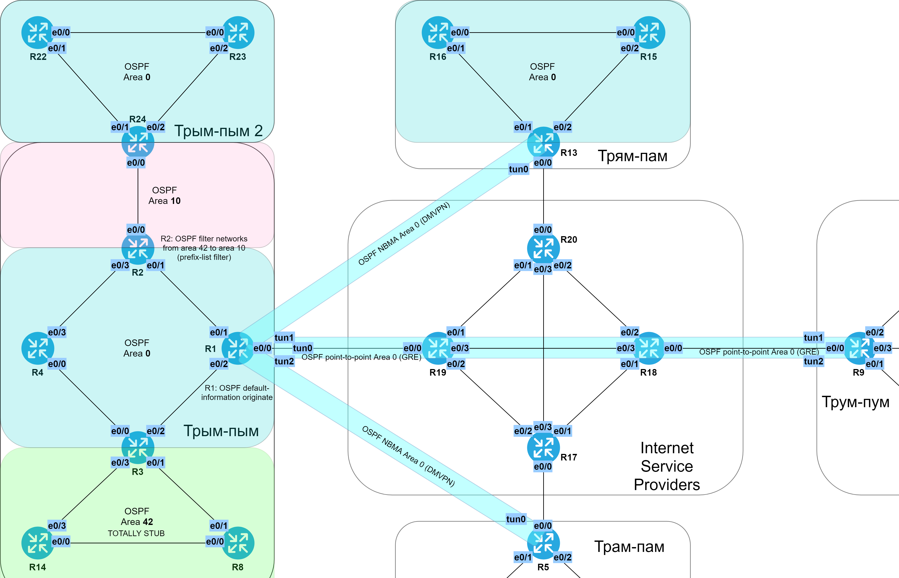

# Фильтрация в OSPF

###  Задание:

  1. Настроить OSPF на R3 так, чтобы зона 42 знала только маршрут по-умолчанию;
  2. Настроить OSPF так, чтобы в зону 10 не попадали маршруты из зоны 42. Из зоны 0 все маршруты должны быть известны;
  3. Все маршрутизаторы в OSPF должны быть доступны между собой;
  4. Задокументировать все изменения.


###  Решение:

  Для того, чтобы зона 42 знала только маршрут по-умолчанию, нужно сделать её totally stub:

```
R3:
conf t
 router ospf 10
  area 42 stub no-summary
  exit
 exit

R8:
conf t
 router ospf 10
  area 42 stub
  exit
 exit

R14:
conf t
 router ospf 10
  area 42 stub
  exit
 exit
```

  Для того, чтобы в зону 10 не попадали маршруты из зоны 42, а из зоны 0 все маршруты были известны, нужно на R2 (и на R24 на всякий случай) отфильтровать приходящие LSA type 3:

```
conf t
 ip prefix-list FILTER-area42to10 deny 35.10.64.0/24
 ip prefix-list FILTER-area42to10 deny 35.10.65.0/25
 ip prefix-list FILTER-area42to10 deny 35.10.65.128/27
 ip prefix-list FILTER-area42to10 permit 0.0.0.0/0 le 32
 router ospf 10
  area 10 filter-list prefix FILTER-area42to10 in
  exit
 exit
```

  Для выполнения условия доступности всех маршрутизаторов между собой можно 
  распространить средствами OSPF маршрут по-умолчанию. Для этого подходит маршрутизатор
  R1, как граничащий с внешними сетями и находящийся в зоне 0 (маршрутизация на R5, R9, R13 не сломается, т.к. там есть приоритетный статический маршрут):

```
conf t
 router ospf 10
  default-information originate
  exit
 exit
```

Все файлы изменений приведены [здесь](configs/).

###  Схема зон OSPF с учетом PtP/NBMA и отметками о фильтрации


