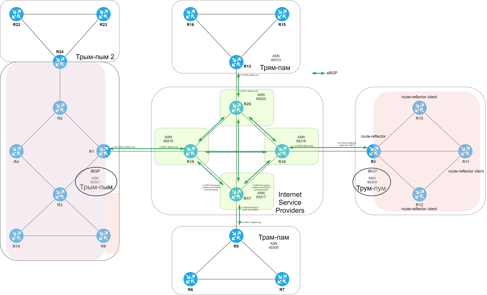

# iBGP

###  Задание:

  1. Настроить iBGP на всех маршрутизаторах "Трым-пым". Все маршрутизаторы должны анонсировать подключенные к ним префиксы;
  2. Настроить iBGP на всех маршрутизаторах "Трум-пум". Все маршрутизаторы должны анонсировать подключенные к ним префиксы;
  3. Задокументируете все изменения.

###  Решение:

  Для стабильной работы iBGP на каждом маршрутизаторе, где будет использоваться iBGP поднимем Loopback-интерфейсы, распространим их через имеющиеся протоколы IGP, после чего настроим iBGP.
  Адреса для Loopback возьмем из служебного адресного пространства исходя из логики: **10.0.0.{номер маршрутизатора}/32** для IPv4 и **FC00::{номер маршрутизатора}/128** для IPv6.
  Для офиса "Трум-пум" iBGP настроим используя route-reflector. Также не забудем про peer-group и учтём то, что делали в предыдущих заданиях.

  Все файлы изменений приведены [здесь](configs/).

  "Трым-пым": [R1](configs/R1), [R2](configs/R2), [R3](configs/R3), [R4](configs/R4), [R8](configs/R8), [R14](configs/R14), [R24](configs/R24). 
  "Трум-пум": [R9](configs/R9), [R10](configs/R10), [R11](configs/R9), [R12](configs/R9).

###  Схема iBGP

