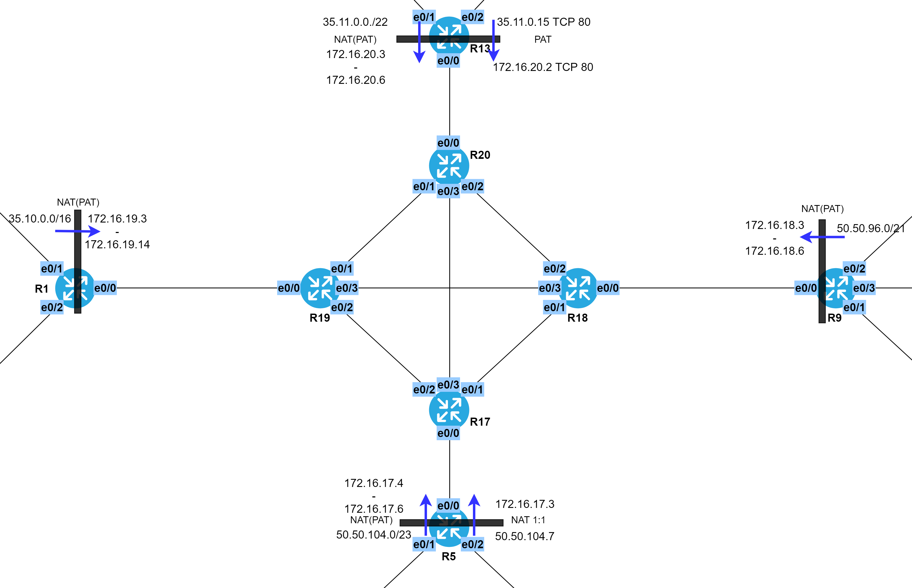
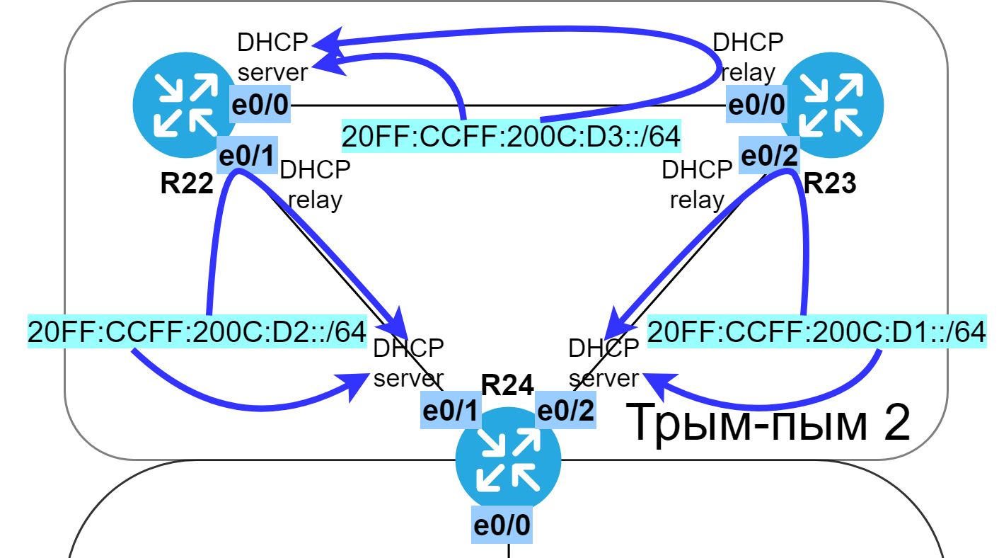

# NAT и DHCP

###  Задание:

1. На всех пограничных маршрутизаторах (R1; R5; R9; R13) настроить NAT(PAT);
2. На маршрутизаторе R13 пробросить порт 80 до маршрутизатора R15;
3. На маршрутизаторе R5 настроить статический NAT для R7;
4. На маршрутизаторе R24 настроить DHCP сервер для офиса "Трым-пым_2". Маршрутизатор R22 получает IP-адрес от DHCP сервера. Адрес должен быть зарезервирован;
5. Задокументировать все изменения, произведенные в лабораторном стенде.

###  Решение:

  Все файлы изменений приведены [здесь](configs/).

  Таблица трансляции.

| Eq  | Inside address | Inside port | Outside address | Outside port | Type |
|-----|----------------|-------------|-----------------|--------------|------|
| R1  | 35.10.0.0/16 | any | 172.16.19.3 - 172.16.19.14 | any | NAT overload |
| R5  | 50.50.104.0/23 | any | 172.16.17.4 - 172.16.17.6 | any | NAT overload |
| R5  | 50.50.104.7 | any | 172.16.17.3 | any | NAT static |
| R9  | 50.50.96.0/21 | any | 172.16.18.3 - 172.16.18.6 | any | NAT overload |
| R13 | 35.11.0.0/16 | any | 172.16.20.3 - 172.16.20.6 | any | NAT overload |
| R13 | 35.11.0.15 | tcp 80 | 172.16.20.2 | tcp 80 | NAT static |

###  Схема NAT

  Таблица серверов DHCP.

| Eq  | Interface | Network | Excluded | Pool |
|-----|------|---------|----------|------|
| R24 | any match  | 35.10.192.0/24 | 35.10.192.1, 35.10.192.24 | DHCP_POOL_LAN_1 |
| R24 | any match  | 35.10.193.0/24 | 35.10.193.24 | DHCP_POOL_LAN_2 |
| R24 | any match  | 35.10.194.0/25 | 35.10.194.22, 192.168.194.23 | DHCP_POOL_LAN_3 |
| R24 | e0/1 | 20FF:CCFF:200C:D1::/64 | | DHCP_POOL_IPV6_LAN_1_STATEFUL |
| R24 | e0/2 | 20FF:CCFF:200C:D2::/64 | | DHCP_POOL_IPV6_LAN_2_STATEFUL |
| R22 | e0/0 | 20FF:CCFF:200C:D3::/64 | | DHCP_POOL_IPV6_LAN_3_STATEFUL |

  Таблица выделенных под DHCP пулов адресов и их настройки.

| Eq  | Pool            | Settings |
|-----|-----------------|----------|
| R24 | DHCP_POOL_LAN_1 | default-router 35.10.192.24 |
| R24 | DHCP_POOL_LAN_2 | default-router 35.10.193.24 |
| R24 | DHCP_POOL_LAN_3 | default-router 35.10.194.22 |
| R24 | DHCP_POOL_IPV6_LAN_1_STATEFUL | ND on e0/1 |
| R24 | DHCP_POOL_IPV6_LAN_1_STATEFUL | ND on e0/2 |
| R22 | DHCP_POOL_IPV6_LAN_3_STATEFUL | ND on e0/0 |

  Таблица DHCP relay.

| Eq  | Interface | DHCP server IP | DHCP server Eq |
|-----|-----------|---------------|--------------|
| R22 | e0/0 | 35.10.192.24 | R24 |
| R22 | e0/1 | 35.10.192.24 | R24 |
| R22 | e0/1 | FE80::24 | R24 |
| R23 | e0/0 | 35.10.193.24 | R24 |
| R23 | e0/0 | FE80::22 | R22 |
| R23 | e0/2 | 35.10.193.24 | R24 |
| R23 | e0/2 | FE80::24 | R24 |

###  Схема DHCPv4

###  Схема DHCPv6

  Таблица DHCP клиентов.

| Eq  | Interface | Proto | DHCP static mapping | Client-name | Client-ID |
|-----|-----------|-------|---------------------|-------------|-----------|
| R22 | e0/1 | IPv4 | yes, see below | R22 | 0063.6973.636f.2d61.6162.622e.6363.3031.2e36.3031.302d.4574.302f.31 |
| R22 | e0/1 | IPv6 | no | R22 | 0063.6973.636f.2d61.6162.622e.6363.3031.2e36.3031.302d.4574.302f.31 |

  Таблица статических привязок.

| Eq  | Pool | Client-name | Client-ID | Settings |
|-----|------|-------------|-----------|----------|
| R24 | DHCP_POOL_LAN_SPECIAL | R22 | 0063.6973.636f.2d61.6162.622e.6363.3031.2e36.3031.302d.4574.302f.31 | host 35.10.192.22 |
