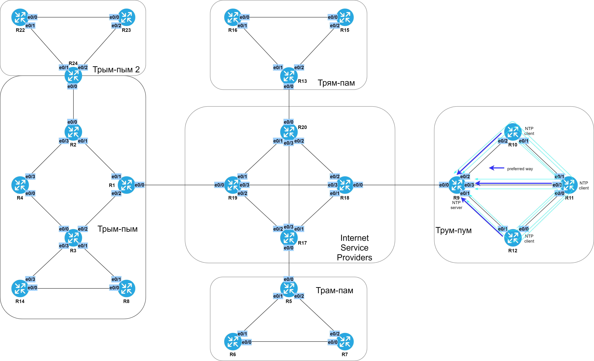

# AAA и NTP

###  Задание:

  1. На маршрутизаторах R15 и R16 настроить 3 учетные записи: 1 - с полным доступом, 2 - обычный   пользователь, 3 - может изменять description на интерфейсах;
  2. Настроить NTP сервер на R9;
  3. Настроить клиентов NTP на R10, R11, R12 к серверу NTP R9;
  4. Настроить логирование событий на R9 в консоль с критичностью 3;
  5. Настроить логирование событий на R9 в буфер с размером буфера равным 35500 байт;
  6. Настроить логирование событий не выше уровня 6 в facility local1 на R9 с отправкой на syslog сервер;
  7. Задокументировать все изменения, произведенные на лабораторном стенде.

###  Решение:

  Все файлы изменений приведены [здесь](configs/).

  Таблица учетных записей

| Username | Password | Privilege |
|----------|----------|-----------|
| admin | adminpassword | 15 |
| support | supppass | 1 |
| descedit | editdescnow | 2 |

  Таблица уровней привилегий

| Privilege | Comment |
|-----------|---------|
| 1 | low level, standard |
| 2 | priv 1 + allowed to edit the description on interfaces |
| 15 | full access |

  Таблица NTP

| Eq  | Server? | Client? | Client to |
|-----|---------|---------|-----------|
| R9  | yes | no | |
| R10 | no | yes | R9 |
| R11 | no | yes | R9 |
| R12 | no | yes | R9 |

###  Схема NTP

