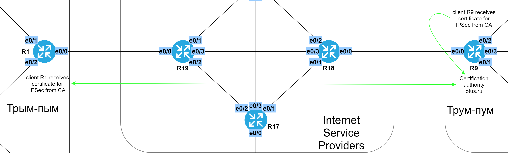

# IPSec. GRE over IPSec

###  Задание:

  1. На маршрутизаторе R9 настроить удостоверяющий центр;
  2. На маршрутизаторах R1 и R9 настроить IPSec с аутентификацией через сертификаты;
  3. IPsec работает поверх протокола GRE;
  4. Добавление IPSec не ломает работу протоколов маршрутизации;
  5. Задокументировать все изменения.


###  Решение:

  Для начала синхронизируем время через NTP: настроим клиент NTP на R1 и разрешим на сервере R9 подключение клиента к нему.

###  Схема NTP


  Теперь приступим к созданию CA на R9:
   - Зададим имя домена;
   - Включим сервер HTTP для выдачи сертификатов и защитим его: разрешим доступ только нужным хостам по IPv4 и запретим вообще для IPv6, но так, чтобы сквозной трафик проходил (вообще, имеет смысл CA держать отдельно);
   - Сгенерируем ключевую пару для корневого сертификата;
   - Включим сервер PKI (Public Key Infrastructure);


  Т.к. R9 нужно использовать IPSec, то, соответственно, нужно получить клиентский сертификат от CA, который на нём же и установлен. Процедура такая:
   - Генерируем ключевую пару, которую будем использовать для IPSec;
   - Создаем точку доверия (trust point) и указываем себя самого;
   - Подтверждаем, что мы доверяем этому CA;
   - Запрашиваем себе сертификат.


  Аналогичная процедура требуется на R1: 
   - Зададим имя домена;
   - Генерируем ключевую пару, которую будем использовать для IPSec;
   - Создаем точку доверия (trust point) и указываем себя самого;
   - Подтверждаем, что мы доверяем этому CA;
   - Запрашиваем себе сертификат.
  

  Сейчас у сервера PKI на R9 в очереди два запроса на выдачу сертификатов.
   - Подтвердим запросы на сертификаты, например, командой ```crypto pki server R9 grant all```;
   - Дождемся, пока ответы на запросы дойдут обратно.

  
  Теперь можно настраивать IPSec:
   - Зададим политику ISAKMP, в частности, включим проверку подлинности по сертификатам;
   - Зададим политику шифрования IPSec;
   - Применим защиту навесив нужный профиль IPSec на интерфейсы.


  Все файлы изменений приведены [здесь](configs/).

###  Схема получения сертификатов для IPSec


