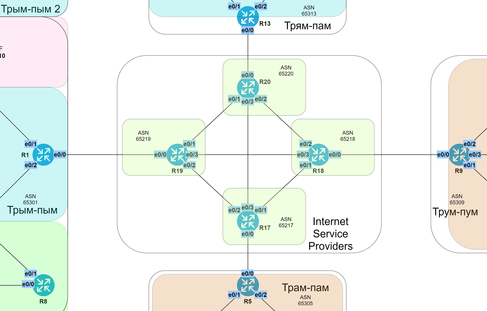

# Основы BGP

###  Задание:

  1. Настроить BGP на всех маршрутизаторах ISP. Все маршрутизаторы должны анонсировать подключенные к ним префиксы;
  2. Настроить BGP на пограничных маршрутизаторах всех офисов;
  3. Задокументировать все изменения.

###  Решение:
  
  Задокументируем номера автономных систем.

| Eq  | ASN   | Office   | Comment       |
|-----|-------|----------|---------------|
| R1  | 65301 | Трым-пым | Enterprise AS |
| R5  | 65305 | Трам-пам | Enterprise AS | 
| R9  | 65309 | Трум-пум | Enterprise AS |
| R13 | 65313 | Трям-пам | Enterprise AS |
| R17 | 65217 | ISP      | ISP AS        |
| R18 | 65218 | ISP      | ISP AS        |
| R19 | 65219 | ISP      | ISP AS        |
| R20 | 65220 | ISP      | ISP AS        |

  Таблица соединений с соседями по BGP

| ASN    | Eq  | Nbr ASN | Neighbor IP          | 
|:-------|:----|:--------|:---------------------|
| 65301  | R1  | 65219   | 172.16.19.1          | 
| 65301  | R1  | 65219   | 20FF:CCFF:1000:19::1 |
| 65305  | R5  | 65217   | 172.16.17.1          | 
| 65305  | R5  | 65217   | 20FF:CCFF:1000:17::1 |
| 65309  | R9  | 65218   | 172.16.18.1          | 
| 65309  | R9  | 65218   | 20FF:CCFF:1000:18::1 |
| 65313  | R13 | 65220   | 172.16.20.1          | 
| 65313  | R13 | 65220   | 20FF:CCFF:1000:20::1 |
| 65217  | R17 | 65305   | 172.16.17.2          |
| 65217  | R17 | 65219   | 90.90.128.19         |
| 65217  | R17 | 65218   | 90.90.129.18         |
| 65217  | R17 | 65220   | 90.90.131.20         |
| 65217  | R17 | 65305   | 20FF:CCFF:1000:17::2 |
| 65217  | R17 | 65219   | 20FF:CCFF:FFFF:1::19 |
| 65217  | R17 | 65218   | 20FF:CCFF:FFFF:2::18 |
| 65217  | R17 | 65220   | 20FF:CCFF:FFFF:5::20 |
| 65218  | R18 | 65309   | 172.16.19.2          |
| 65218  | R18 | 65219   | 90.90.131.130        |
| 65218  | R18 | 65217   | 90.90.129.17         |
| 65218  | R18 | 65220   | 90.90.130.20         |
| 65218  | R18 | 65309   | 20FF:CCFF:1000:18::2 |
| 65218  | R18 | 65219   | 20FF:CCFF:FFFF:6::19 |
| 65218  | R18 | 65217   | 20FF:CCFF:FFFF:2::17 |
| 65218  | R18 | 65220   | 20FF:CCFF:FFFF:3::20 |
| 65219  | R19 | 65301   | 172.16.19.2          |
| 65219  | R19 | 65217   | 90.90.128.17         |
| 65219  | R19 | 65218   | 90.90.131.129        |
| 65219  | R19 | 65220   | 90.90.130.130        |
| 65219  | R19 | 65301   | 20FF:CCFF:1000:19::2 |
| 65219  | R19 | 65217   | 20FF:CCFF:FFFF:1::17 |
| 65219  | R19 | 65218   | 20FF:CCFF:FFFF:6::18 |
| 65219  | R19 | 65220   | 20FF:CCFF:FFFF:4::20 |
| 65220  | R20 | 65313   | 172.16.20.2          |
| 65220  | R20 | 65219   | 90.90.130.129        |
| 65220  | R20 | 65218   | 90.90.130.18         |
| 65220  | R20 | 65217   | 90.90.131.17         |
| 65220  | R20 | 65313   | 20FF:CCFF:1000:20::2 |
| 65220  | R20 | 65219   | 20FF:CCFF:FFFF:4::19 |
| 65220  | R20 | 65218   | 20FF:CCFF:FFFF:3::18 |
| 65220  | R20 | 65217   | 20FF:CCFF:FFFF:5::17 |

  Все файлы изменений приведены [здесь](configs/).

###  Схема принадлежности ASN

